# Introdução e conceitos  -  Versão para Iniciantes

Este material é uma versão didática do conteúdo técnico da Parte 1 dos slides de Fenômenos de Transporte. Aqui você encontra as mesmas ideias, mas explicadas com linguagem do dia a dia, analogias do cotidiano e tradução das fórmulas para português claro. As fórmulas originais foram mantidas para referência, mas sempre acompanhadas de explicação. Ideal para quem está começando do zero, sem formação prévia em física avançada.

---

## Slide 1

> **Em linguagem simples:** Nesta parte do curso vamos conhecer o que é um fluido, como estudá-lo e quais são suas propriedades mais importantes. Pense em fluidos como tudo que "flui": água, ar, óleo. Vamos falar de viscosidade (o quão "grosso" ou "fino" é o fluido), compressibilidade (o quanto ele pode ser espremido), velocidade do som e tensão superficial (por que a água forma gotas e bolhas).

* O que é um fluido e as formas de analisá-lo e descrevê-lo
* Propriedades importantes dos fluidos:
    * **Viscosidade**  -  mede a resistência ao escoamento (como mel vs. água)
    * **Módulo de compressibilidade**  -  mede o quanto o volume muda quando apertamos o fluido
    * **Velocidade do som**  -  quão rápido uma perturbação se espalha no fluido
    * **Tensão superficial**  -  força que mantém a superfície da água "esticada"

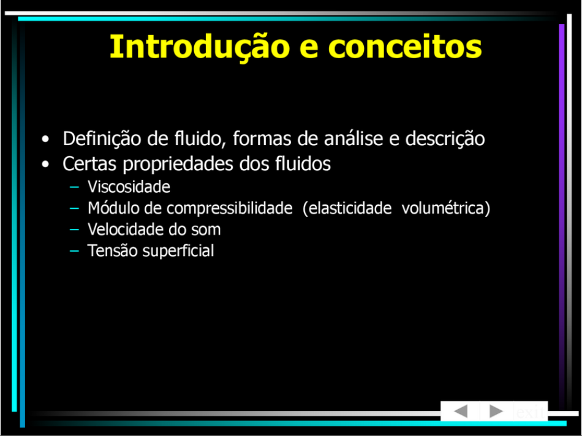

---

## Slide 2  -  O que é um fluido?

> **Em linguagem simples:** Um fluido é qualquer substância que continua se deformando quando você empurra ou puxa de lado  -  como água ou ar. Um sólido, em contraste, mantém a forma. Materiais como pasta de dente ou piche são especiais: às vezes parecem sólidos e só fluem quando a força é grande o suficiente.

* Um **fluido** é uma substância que se deforma continuamente quando recebe uma força de "empurrar de lado" (tensão de cisalhamento). Nos fluidos newtonianos (os mais comuns), qualquer empurrão lateral, por menor que seja, faz o fluido escorrer.

**Fig. 1.1** Diferença entre sólido e líquido quando uma força de cisalhamento é aplicada.

(a) Sólido ou fluido  -  (b) Sólido ou fluido  -  (c) Somente fluido  -  (d) Somente fluido

* Materiais como pastas, piche e alguns cremes **não** entram na mecânica dos fluidos clássica porque podem se comportar como sólido com forças pequenas e só fluir quando a força passa de um certo limite.

**Analogia:** Água num copo escorre se você inclinar o copo (fluido). Gelatina firme mantém a forma até você cortar ou esmagar com força (comportamento intermediário, fora do escopo clássico).

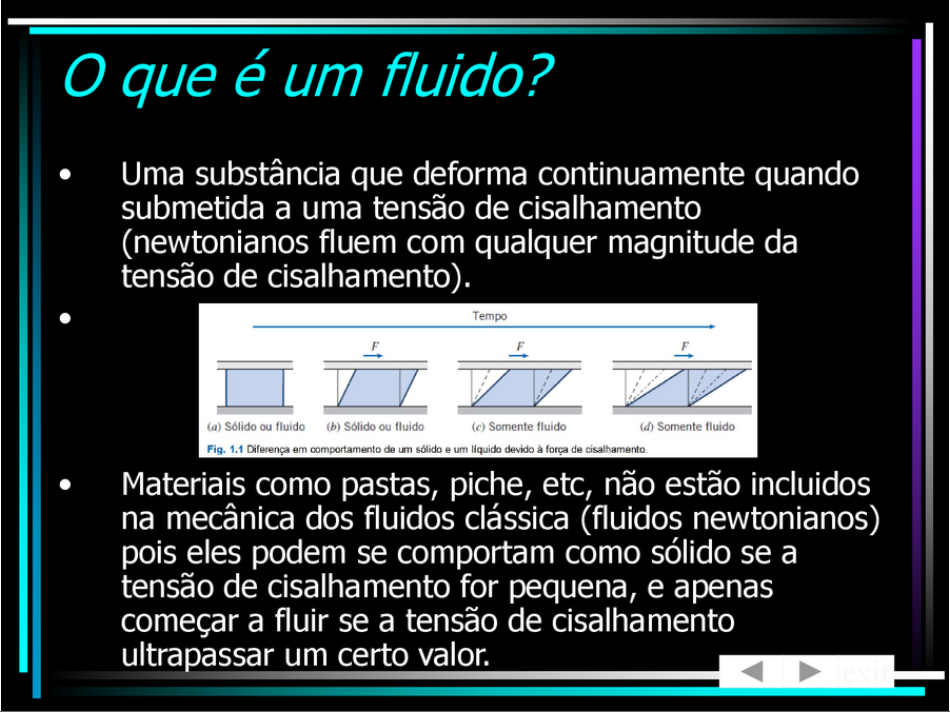

---

## Slide 3  -  Por que estudar mecânica dos fluidos?

> **Em linguagem simples:** A mecânica dos fluidos explica como líquidos e gases se comportam  -  parados ou em movimento. Ela serve para problemas enormes (petróleo em oleodutos) e minúsculos (sangue em capilares). Com ela entendemos por que aviões voam, bolas de golfe têm superfície rugosa e foguetes funcionam no espaço vazio.

A **mecânica dos fluidos** estuda o comportamento de líquidos e gases em repouso e em movimento. O campo é vasto: vai do sangue em vasos capilares (diâmetros de poucos micrômetros) até petróleo em oleodutos gigantes (ex.: Alasca  -  1,2 m de diâmetro e ~1300 km de comprimento).

Com esses princípios explicamos, por exemplo:
* Por que aviões com formato aerodinâmico e superfície lisa voam com mais eficiência
* Por que bolas de golfe precisam de superfície rugosa
* Como modelos simples respondem perguntas como:

* Como um foguete gera empuxo no espaço, sem ar para "empurrar"?
* Por que o barulho de um avião supersônico só chega depois que ele passou?
* Por que um rio corre rápido mesmo com declive quase imperceptível?
* Como testes em modelo reduzido de avião ajudam a projetar o avião real?
* Por que a água na torneira às vezes parece lisa e às vezes rugosa?
* Quanto combustível se economiza melhorando a aerodinâmica de carros e caminhões?

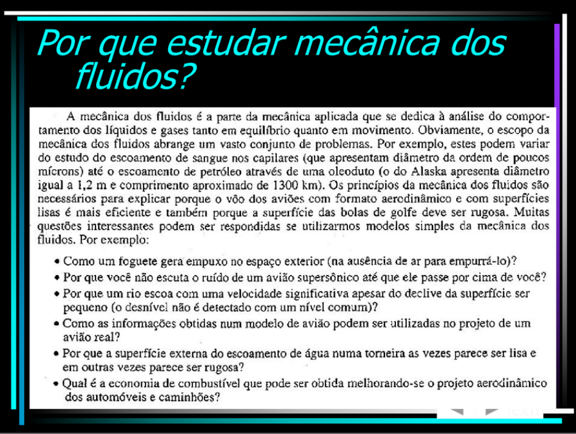

---

## Slide 4  -  Formulação Diferencial vs Formulação Integral

> **Em linguagem simples:** Existem duas maneiras de aplicar as leis da física aos fluidos. Uma olha pedacinhos minúsculos do fluido (diferencial); a outra olha uma região inteira ou um objeto completo (integral). É como analisar gota a gota de chuva ou o volume total que caiu no telhado.

* As leis básicas podem ser escritas de duas formas:
    * **Formulação diferencial**  -  aplica as leis a pedaços infinitamente pequenos do fluido
    * **Formulação integral**  -  aplica as leis a uma região ou volume inteiro
* **Sistema**  -  um conjunto com massa fixa (como uma bolha fechada que você acompanha)
* **Volume de controle**  -  uma região no espaço por onde a massa pode entrar, sair e ficar (como uma janela imaginária num rio)

**Analogia:** Sistema = seguir uma mala na esteira do aeroporto. Volume de controle = ficar parado na porta e contar quantas malas entram e saem.

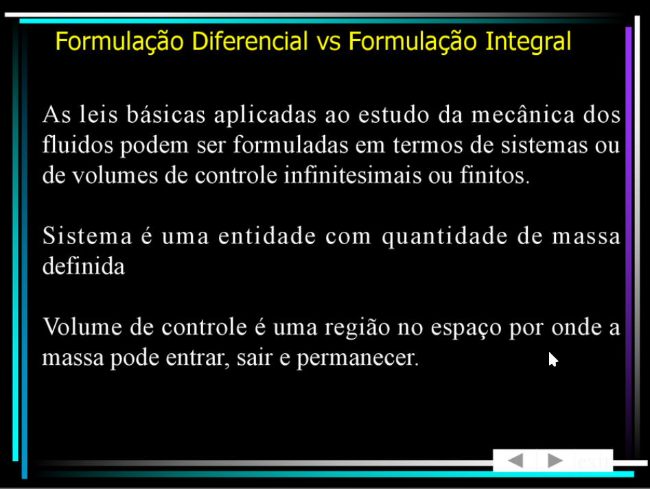

---

## Slide 5  -  Formulação Diferencial vs Formulação Integral

> **Em linguagem simples:** A abordagem diferencial mostra os detalhes finos  -  por exemplo, como a pressão varia em cada ponto da asa. A abordagem integral responde perguntas do tipo "quanto a asa inteira sustenta?". Cada uma serve para um tipo de pergunta.

* A **formulação diferencial** resolve equações que descrevem o comportamento detalhado do escoamento  -  por exemplo, a distribuição de pressão em cada ponto de uma superfície.
* A **formulação integral** é melhor quando queremos o comportamento global de um dispositivo  -  por exemplo, a sustentação total que uma asa produz.

**Analogia:** Diferencial = zoom no mapa de trânsito, rua por rua. Integral = "quantos carros passaram pela ponte hoje?".

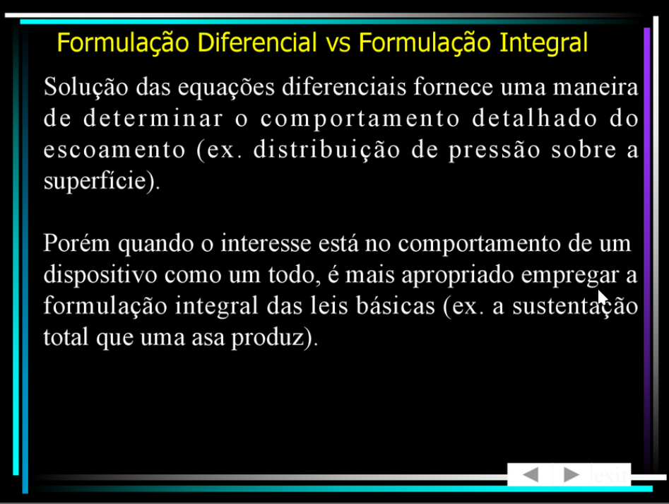

---

## Slide 6  -  Propriedades dos fluidos

> **Em linguagem simples:** Em geral, tratamos o fluido como um "meio contínuo"  -  como se pressão e velocidade variassem suavemente de ponto a ponto, sem buracos. Isso funciona bem na maioria dos casos, mas falha em gases muito rarefeitos (quase vácuo), onde as moléculas estão tão espaçadas que essa simplificação não vale.

Na mecânica dos fluidos, assumimos que propriedades como pressão e velocidade variam de forma contínua no fluido. Isso é a **hipótese do meio contínuo**.

Essa hipótese **deixa de valer** em gases muito rarefeitos  -  quando o caminho livre médio das moléculas (distância que uma molécula percorre antes de colidir com outra) fica comparável ao tamanho do problema que estamos estudando.

**Analogia:** Em uma multidão densa, você pode falar de "fluxo de pessoas" como contínuo. Com pouquíssimas pessoas num estádio enorme, cada indivíduo importa e o modelo contínuo não funciona.

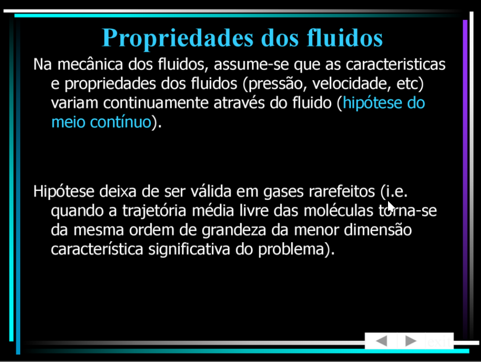

---

## Slide 7  -  Viscosidade

> **Em linguagem simples:** Viscosidade é o que faz mel escorrer devagar e água escorrer rápido. No experimento das duas placas, a placa de baixo fica parada e a de cima se move; o fluido no meio é "arrastado" e deforma. Quanto mais viscoso o fluido, mais força você precisa para mover a placa de cima.

A **viscosidade** descreve o quão "espesso" ou resistente ao escoamento é um fluido.

**Experimento mental:**
* A placa inferior é rígida (fixa).
* A placa superior pode se mover livremente.
* O fluido fica entre as duas placas.

**Analogia:** Passar a mão numa mesa com mel em cima  -  a mel cola e resiste; com água, a resistência é bem menor.

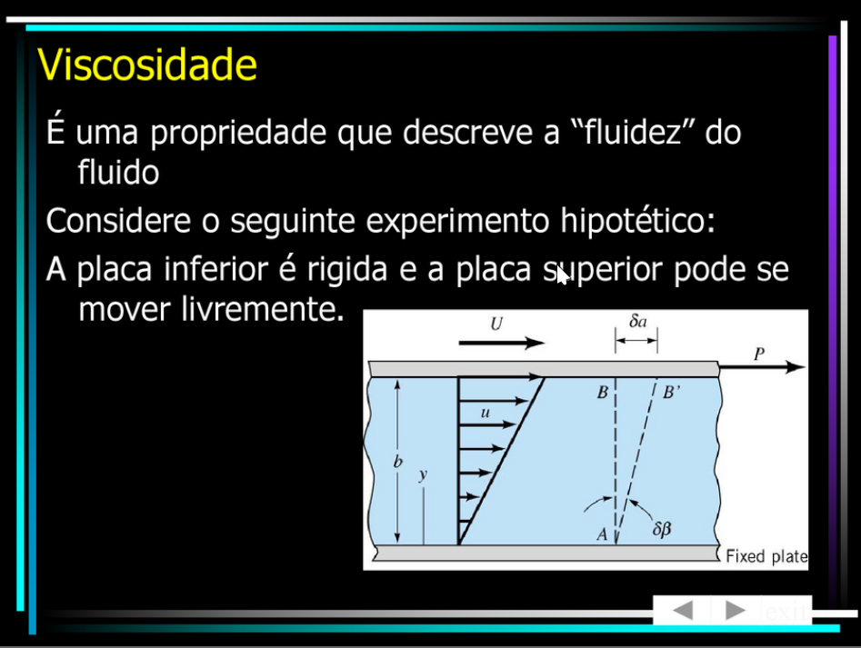

---

## Slide 8

> **Em linguagem simples:** Entre as duas placas, a velocidade do fluido cresce de zero (na placa parada) até o valor da placa que se move  -  numa linha reta no meio. O fluido "gruda" na parede sólida: na superfície da placa, a velocidade do fluido é zero. Isso se chama condição de não escorregamento.

Num fluido newtoniano entre placas paralelas, a velocidade varia de forma **linear** da placa de baixo (zero) até a placa de cima (velocidade $U$):

$$u = \frac{Uy}{b}$$

$$\frac{du}{dy} = \frac{U}{b}$$

**O que essa conta significa:**
* $u$  -  velocidade do fluido num ponto entre as placas
* $U$  -  velocidade da placa superior
* $y$  -  distância a partir da placa de baixo
* $b$  -  distância entre as duas placas
* $\frac{du}{dy}$  -  o quanto a velocidade muda por unidade de distância (inclinação do perfil de velocidade)

**Condição de não escorregamento:** o fluido não desliza na superfície do sólido  -  na parede, a velocidade do fluido é zero.

**Analogia:** Como uma esteira rolante que arrasta o que está em cima: o que toca a esteira move junto; o que está no chão (placa fixa) não se move.

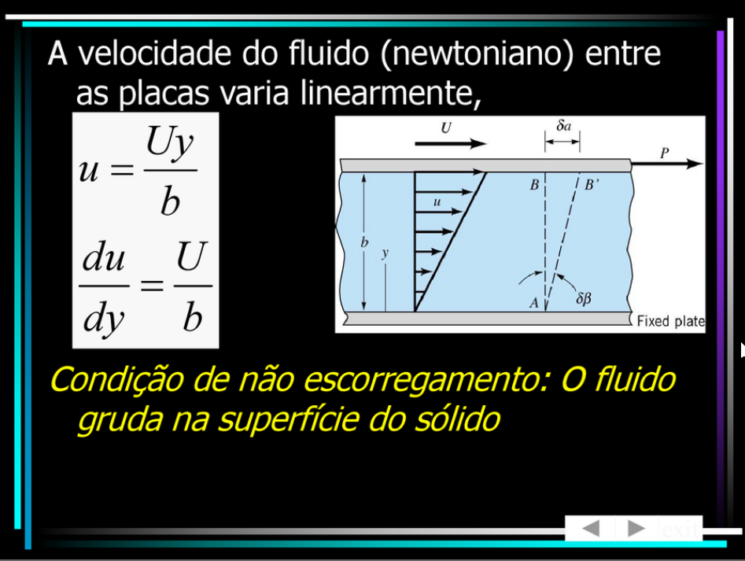

---

## Slide 9

> **Em linguagem simples:** Se você marcar uma linha vertical no fluido e puxar a placa de cima, essa linha vai "inclinar" com o tempo  -  como inclinar um cartão. Quanto mais rápido a placa se move e quanto mais fina a camada de fluido, maior essa inclinação.

Num intervalo de tempo muito pequeno ($\delta t$), uma linha vertical imaginária AB no fluido gira um ângulo $\beta$:

$$\tan \delta\beta \approx \delta\beta = \frac{\delta a}{b}$$

Como o deslocamento horizontal é $\delta a = U \delta t$:

$$\delta\beta = \frac{U \delta t}{b}$$

**O que essa conta significa:**
* $\delta\beta$  -  pequeno ângulo de deformação do fluido
* $\delta a$  -  quanto a placa superior se deslocou no tempo $\delta t$
* $b$  -  espessura da camada de fluido
* $U$  -  velocidade da placa superior
* $\delta t$  -  intervalo de tempo considerado

**Analogia:** Empurrar a tampa de um pote de margarina: a camada de margarina se deforma e "inclina"  -  quanto mais fina a camada, mais ela deforma para o mesmo empurrão.

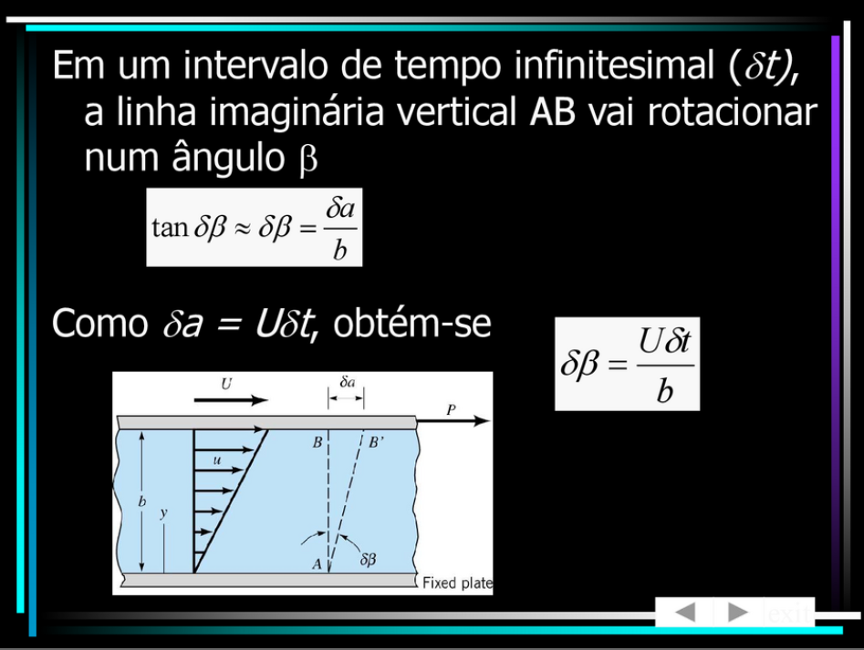

---

## Slide 10

> **Em linguagem simples:** A taxa de deformação mede o quão rápido o fluido está sendo "cortado" ou deformado. Nos fluidos newtonianos, a força necessária para manter essa deformação é proporcional à viscosidade. Mel tem viscosidade alta; água tem viscosidade baixa.

Definimos a **taxa de deformação por cisalhamento** $\gamma$:

$$\gamma = \lim_{\delta t \to 0} \frac{\delta \beta}{\delta t}$$

$$\gamma = \frac{U}{b} = \frac{du}{dy}$$

Experimentalmente, a **tensão de cisalhamento** $\tau$ (força por área que "corta" o fluido) é diretamente proporcional a $\gamma$:

$$\tau \propto \gamma \quad \text{ou} \quad \tau \propto \frac{du}{dy} \quad \text{ou} \quad \tau = \mu \cdot \frac{du}{dy}$$

$\mu$ é a **viscosidade absoluta** (ou viscosidade dinâmica, ou simplesmente viscosidade).

**O que essa conta significa:**
* $\gamma$  -  quão rápido o fluido está sendo deformado por cisalhamento
* $\tau$  -  esforço de cisalhamento por unidade de área (o quanto você precisa "puxar" a placa superior)
* $\mu$  -  viscosidade: propriedade do fluido que mede a resistência ao cisalhamento
* $\frac{du}{dy}$  -  gradiente de velocidade (mesma ideia de $\gamma$ neste caso)

**Dimensão:** $(F \cdot T \cdot L^{-2})$

**Unidades comuns:** $\text{N} \cdot \text{s} \cdot \text{m}^{-2}$ (Pascal·segundo), poise ($\text{dina} \cdot \text{s} \cdot \text{cm}^{-2}$)

**Analogia:** $\mu$ é como a "espessura" do fluido: quanto maior $\mu$, mais força ($\tau$) você precisa para manter a mesma deformação ($\gamma$).

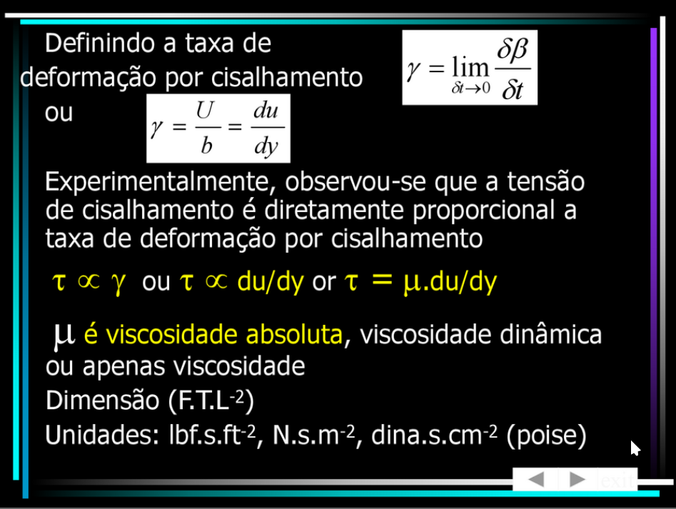

---

## Slide 11

> **Em linguagem simples:** Às vezes é mais útil comparar a viscosidade com a densidade do fluido. A viscosidade cinemática faz isso: água e óleo podem ter viscosidades dinâmicas parecidas em certas condições, mas o óleo é mais denso, então escoa de forma diferente. Fluidos newtonianos obedecem à regra simples: tensão proporcional à taxa de deformação.

Combinando viscosidade com massa específica (densidade), obtemos a **viscosidade cinemática**:

$$\nu = \frac{\mu}{\rho}$$

**O que essa conta significa:**
* $\nu$  -  viscosidade cinemática (útil para comparar escoamentos considerando inércia e viscosidade)
* $\mu$  -  viscosidade dinâmica (absoluta)
* $\rho$  -  massa específica (densidade) do fluido

**Fluidos Newtonianos** são aqueles em que a tensão de cisalhamento varia **linearmente** com a taxa de deformação  -  a relação $\tau = \mu \frac{du}{dy}$ vale em todo o fluido.

**Analogia:** Dois carros com o mesmo motor ($\mu$), mas um muito mais pesado ($\rho$), aceleram de forma diferente  -  $\nu$ junta essas duas ideias.

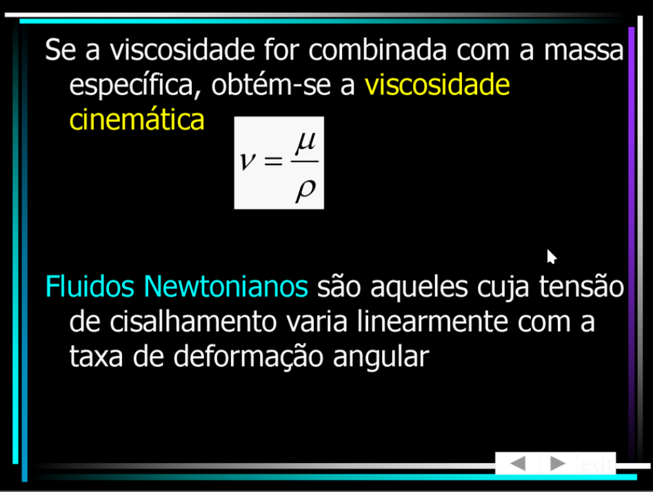

---

## Slide 12

> **Em linguagem simples:** Este slide mostra gráficos comparando fluidos newtonianos (relação linear entre esforço e deformação) com fluidos não newtonianos (comportamentos especiais, como pasta de dente ou sangue). Nem todo fluido do dia a dia é newtoniano, mas a maioria dos líquidos simples (água, ar em condições normais) se comporta assim.

O gráfico típico de um fluido newtoniano é uma **reta** passando pela origem: dobrar a taxa de deformação dobra a tensão de cisalhamento. Fluidos não newtonianos desviam dessa reta  -  podem precisar de mais ou menos força do que a regra linear preveria.

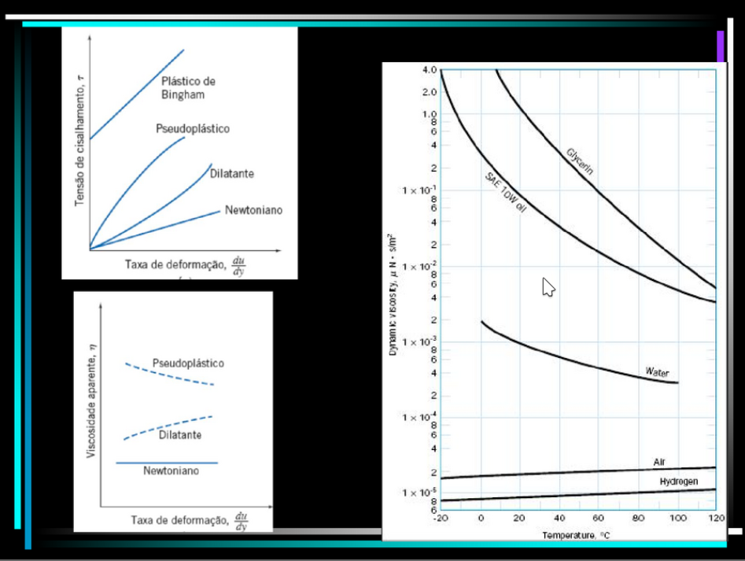

---

## Slide 13  -  Módulo de compressibilidade / Módulo de elasticidade volumétrica

> **Em linguagem simples:** Compressibilidade responde: "se eu apertar esse fluido, o volume diminui muito ou quase nada?". Substâncias com módulo alto são difíceis de comprimir (água, ferro sólido). Gases são mais fáceis de comprimir. Sabendo o módulo, dá para estimar quanto o volume muda quando a pressão aumenta.

**Quão compressível é um fluido?**

O **módulo de compressibilidade volumétrica** $E_v$ mede a resistência à mudança de volume:

$$E_v = -\frac{dp}{d\overline{V}/\overline{V}}$$

**O que essa conta significa:**
* $E_v$  -  módulo de elasticidade volumétrica (quanto maior, menos compressível)
* $dp$  -  pequena variação de pressão aplicada
* $d\overline{V}/\overline{V}$  -  variação relativa de volume (fração em que o volume mudou)
* O sinal negativo garante que $E_v$ seja positivo (aumentar pressão geralmente reduz volume)

Módulos **grandes** = substância **quase incompressível** (água, muitos líquidos).

**Perguntas para refletir:**
* O que tem $E_v$ maior: água ou ferro? Água ou nitrogênio gasoso?
* Conhecendo $E_v$, dá para calcular a variação de volume ao passar de 100 kPa para 1000 kPa? E a variação de densidade?

**Analogia:** Encher um balão de festa (gás, fácil de comprimir) vs. tentar espremer uma garrafa cheia d'água com tampa fechada (líquido, quase não comprime).

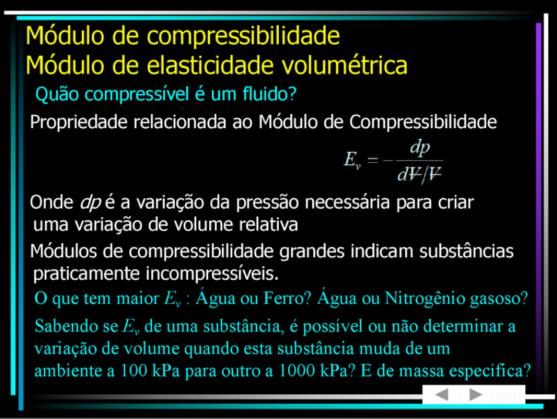

---

## Slide 14  -  Velocidade do som

> **Em linguagem simples:** A velocidade do som é a rapidez com que uma perturbação  -  um "empurrãozinho"  -  se propaga no fluido. Em ar, é cerca de 340 m/s; na água, é maior. Depende de quão "rígido" o fluido é à compressão e da densidade. Por isso o som viaja diferente no ar, na água e no aço.

A **velocidade do som** $c$ é a velocidade com que pequenas perturbações de pressão se propagam no meio:

$$c = \sqrt{\frac{dp}{d\rho}} = \sqrt{\frac{E_v}{\rho}}$$

**O que essa conta significa:**
* $c$  -  velocidade do som no fluido
* $dp/d\rho$  -  quanto a pressão muda quando a densidade muda (ligada à compressibilidade)
* $E_v$  -  módulo volumétrico
* $\rho$  -  densidade do fluido

Para **gases ideais** em processos isentrópicos (perturbações pequenas, sem troca significativa de calor):

$$c = \sqrt{\frac{kp}{\rho}} = \sqrt{kRT}$$

**O que essa conta significa:**
* $k$  -  razão entre calores específicos ($c_p/c_v$)
* $p$  -  pressão
* $R$  -  constante do gás
* $T$  -  temperatura absoluta (Kelvin)

**Analogia:** Jogar pedrinha numa lagoa  -  a ondulação se espalha com certa velocidade; num tanque mais "duro" (menos compressível), a onda viaja mais rápido.

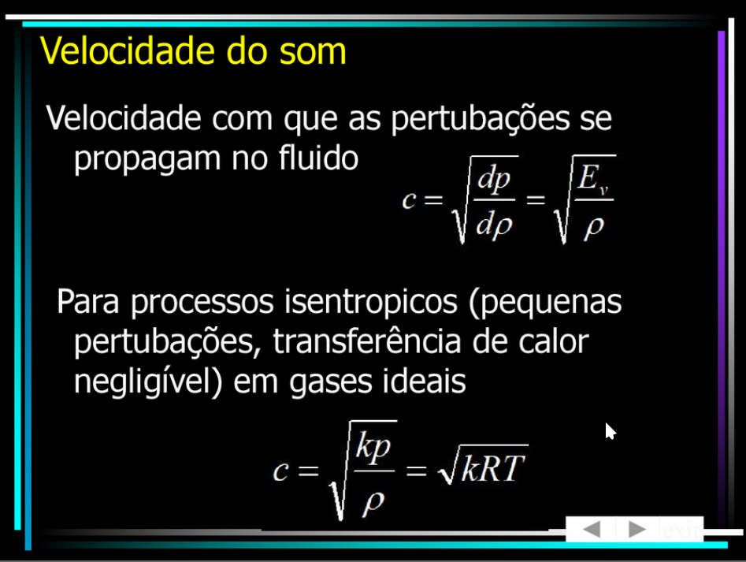

---

## Slide 15  -  Tensão superficial ($\sigma$)

> **Em linguagem simples:** Na superfície de um líquido, as moléculas se puxam umas às outras, como se houvesse uma "película elástica" finíssima. Isso explica por que insetos andam na água, gotas são redondas e bolhas de sabão existem. A tensão superficial geralmente diminui quando a temperatura sobe.

1. **Tensão superficial** $\sigma$  -  intensidade da atração entre moléculas na superfície, por unidade de comprimento
2. Varia com a **temperatura** (em geral, **diminui** quando esquenta)
3. **Dimensões:** força por comprimento ($FL^{-1}$); **unidades:** $\text{N} \cdot \text{m}^{-1}$
4. **Exemplos no dia a dia:**
    1. **Capilaridade**  -  água sobe em tubos finos
    2. **Inseto na água**  -  a superfície sustenta o peso
    3. **Bolha de sabão**  -  filme fino mantido pela tensão superficial

**Analogia:** Uma rede elástica esticada na superfície da água  -  você pode apoiar um clipe de papel cuidadosamente sobre ela.

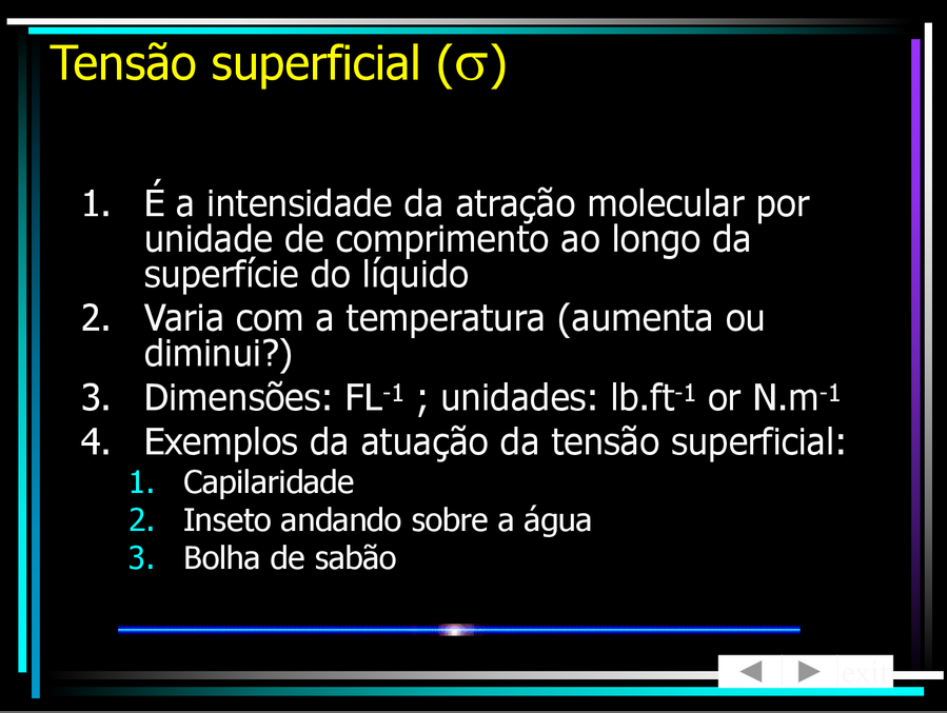

---

## Slide 16  -  Pressão dentro de uma gota de fluido

> **Em linguagem simples:** Por causa da tensão superficial, o interior de uma gota fica com pressão um pouco maior que o exterior  -  como se a "casca" da gota apertasse para dentro. Gotas pequenas têm pressão interna maior que gotas grandes (o raio aparece no denominador).

A tensão superficial na superfície curva de uma gota cria uma diferença de pressão entre dentro e fora:

$$2\pi R\sigma = \Delta p \, \pi R^2$$

$$\Delta p = p_i - p_e = \frac{2\sigma}{R}$$

**O que essa conta significa:**
* $\sigma$  -  tensão superficial
* $R$  -  raio da gota
* $\Delta p$  -  diferença de pressão (interna menos externa)
* $p_i$  -  pressão dentro da gota
* $p_e$  -  pressão fora da gota
* A primeira equação equilibra a força da tensão superficial ($2\pi R\sigma$) com a força da pressão extra ($\Delta p \cdot \pi R^2$)

**Analogia:** Inflar um balão de látex  -  quanto menor o balão, mais "duro" fica de apertar (maior pressão interna para o mesmo material).

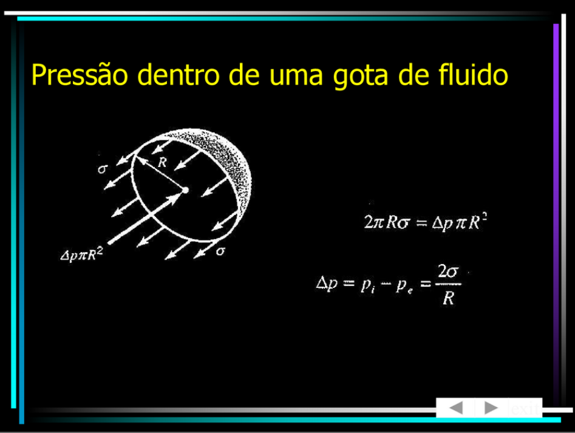

---

## Slide 17  -  Altura do menisco em um tubo capilar

> **Em linguagem simples:** Em tubos muito finos, a tensão superficial puxa o líquido para cima (se o líquido "molha" o vidro, como água) ou para baixo (se não molha, como mercúrio). Quanto mais fino o tubo, mais alto (ou mais baixo) fica o menisco.

**Figura 1.8** Efeito capilar em tubos de diâmetro pequeno.
(a) Elevação para líquido que molha o tubo  -  (b) Diagrama para calcular a altura  -  (c) Depressão para líquido que não molha a parede

O equilíbrio entre peso da coluna de líquido e força da tensão superficial dá:

$$\gamma \pi R^2 h = 2 \pi R \sigma \cos \theta$$

A **altura do menisco**:

$$h = \frac{2 \sigma \cos \theta}{\gamma R}$$

**O que essa conta significa:**
* $h$  -  altura de elevação (ou depressão) da coluna de líquido no tubo
* $\sigma$  -  tensão superficial
* $\theta$  -  ângulo de contato entre líquido e parede do tubo
* $\gamma$  -  peso específico do líquido (peso por unidade de volume = $\rho g$)
* $R$  -  raio interno do tubo
* $\cos\theta$  -  quanto a tensão superficial "puxa" verticalmente (molha bem $\rightarrow$ $\theta$ pequeno $\rightarrow$ $\cos\theta$ grande)

**Analogia:** Água subindo levemente entre os fios de um pano molhado  -  quanto mais estreito o espaço, mais visível o efeito.

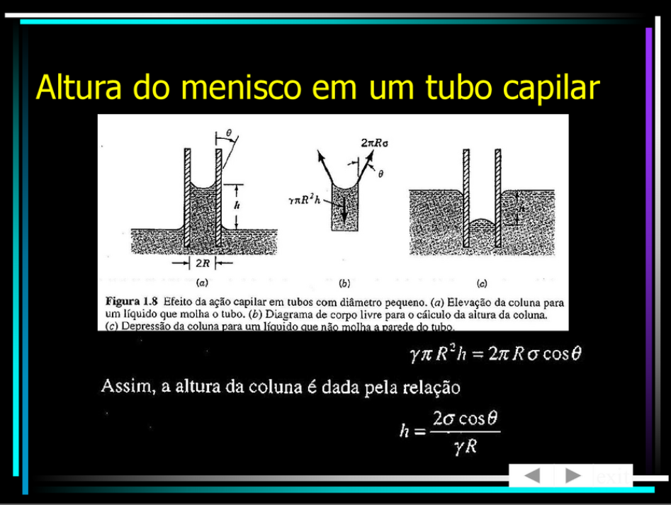

---

## Slide 18  -  Campos de escoamento

> **Em linguagem simples:** Um "campo de escoamento" é um mapa que diz, em cada ponto do espaço (e em cada instante), qual é a velocidade do fluido. É como um mapa de vento que mostra de que direção e com que intensidade o ar se move em cada lugar.

**Forma de representar** pressão, velocidade e outras grandezas em função da posição no espaço.

### Campo de velocidade

As propriedades dependem da posição $(x, y, z)$ e do tempo $t$.

O vetor velocidade tem três componentes:

$$\vec{V} = u \vec{i} + v \vec{j} + w \vec{k}$$

$$u = u(x, y, z, t)$$

(v e w seguem a mesma lógica nas direções $y$ e $z$)

Se acompanharmos uma partícula, a velocidade também pode ser escrita como:

$$\vec{V} = \frac{d \vec{r}}{dt}$$

**O que essa conta significa:**
* $\vec{V}$  -  vetor velocidade do fluido
* $u, v, w$  -  componentes da velocidade nas direções $x$, $y$, $z$
* $\vec{i}, \vec{j}, \vec{k}$  -  vetores unitários dos eixos
* $\vec{r}$  -  posição da partícula no espaço
* $t$  -  tempo

**Analogia:** App de clima com setas de vento em cada cidade  -  cada seta é o valor do "campo" naquele ponto.

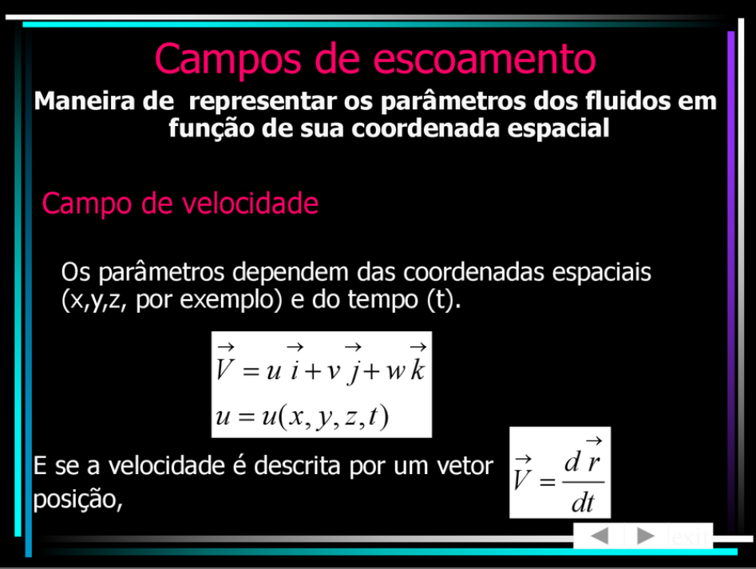

---

## Slide 19

> **Em linguagem simples:** Este slide ilustra visualmente como o campo de velocidade pode variar no espaço  -  regiões mais rápidas, mais lentas, com direções diferentes. É a ideia de "mapa do escoamento" que usaremos nas próximas explicações.

As figuras mostram exemplos de como a velocidade do fluido pode mudar de um ponto a outro  -  formação de regiões de aceleração, desaceleração e mudança de direção. Esse tipo de visualização ajuda a entender escoamentos antes de entrar nas descrições Euleriana e Lagrangiana.

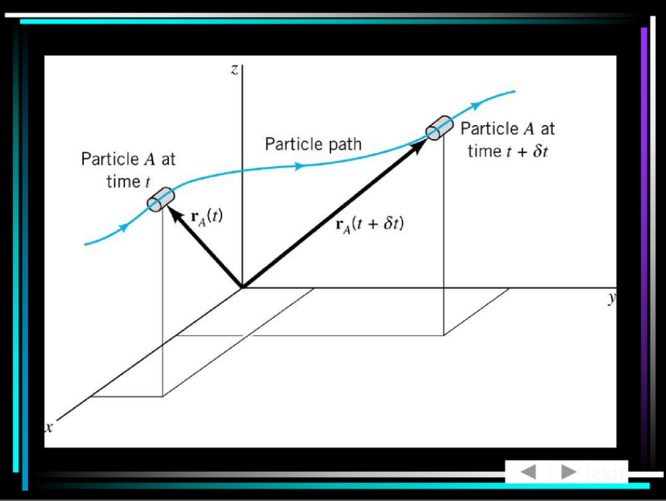

---

## Slide 20

> **Em linguagem simples:** Há duas formas de "filmar" um escoamento. A Euleriana: câmera fixa num ponto, observando o que passa. A Lagrangiana: câmera grudada numa gotícula, seguindo sua viagem. As duas descrevem o mesmo fenômeno, mas com pontos de vista diferentes.

Duas maneiras de descrever e analisar escoamentos:

**Descrição Euleriana:**
* Foco no que acontece **em cada ponto fixo do espaço**
* Usa o conceito de **campo** de escoamento (velocidade, pressão etc. em cada $(x,y,z,t)$)

**Descrição Lagrangiana:**
* Foco em **uma partícula específica** e em como ela se move
* Acompanha como as propriedades mudam ao longo da trajetória da partícula

**Analogia:** Euleriano = ficar na beira da rodovia medindo a velocidade dos carros que passam. Lagrangiano = instalar um GPS num carro e seguir sua rota.

---

## Slide 21  -  Formas de descrever um escoamento

> **Em linguagem simples:** Use Lagrangiano quando quiser seguir "onde cada pedacinho de massa foi parar". Use Euleriano quando quiser saber "o que está acontecendo agora nesta região do tanque ou do duto". Engenheiros usam muito a visão Euleriana em tubulações e tanques.

* **Lagrangiana**  -  acompanha o deslocamento dos elementos que compõem uma massa de fluido (como seguir uma gota de tinta na água).
* **Euleriana**  -  analisa o que ocorre numa região fixa do espaço num determinado instante (como medir velocidade num ponto fixo do rio).

**Analogia:** Lagrangiano = rastrear uma bolinha de gude na correnteza. Euleriano = medir a água que passa por um funil fixo na cachoeira.

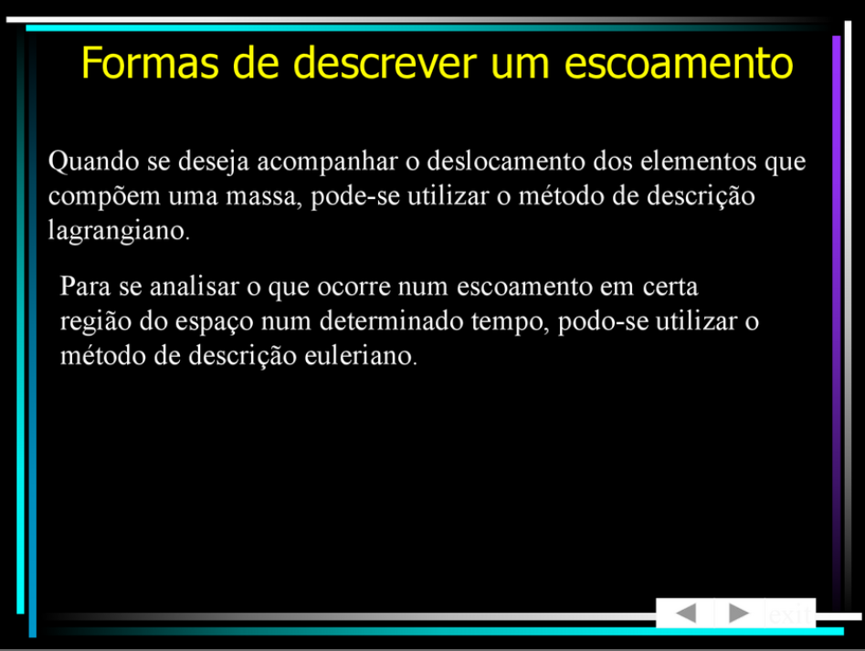

---

## Slide 22  -  Escoamentos em 1, 2 ou 3 dimensões

> **Em linguagem simples:** Escoamentos reais são tridimensionais (velocidade varia em x, y e z), mas muitas vezes podemos simplificar: se uma direção importa pouco, tratamos como 2D ou até 1D. É um atalho de engenharia que funciona bem quando uma componente da velocidade é muito menor que as outras.

**Classificação pelo número de direções importantes:**

1. **Tridimensional (3D):** velocidade depende de três coordenadas espaciais ($x$, $y$, $z$)
2. **Bidimensional (2D):** velocidade depende de apenas duas ($x$, $y$, por exemplo)
3. **Unidimensional (1D):** velocidade depende de uma só coordenada ($x$, por exemplo)

Se uma ou mais componentes do vetor velocidade forem **muito pequenas** em relação às outras, o problema pode ser tratado como 2D ou 1D sem grande perda de precisão.

**Analogia:** Fluxo num rio largo e raso  -  às vezes basta medir a velocidade ao longo da largura (2D), ignorando pequenas variações na vertical.

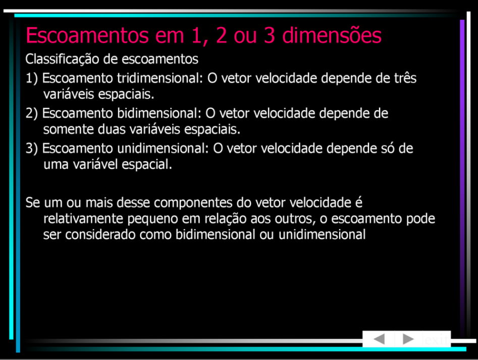

---

## Slide 23

> **Em linguagem simples:** Na prática, quase tudo é 3D e muda com o tempo  -  mas simplificar para 1D ou 2D torna os cálculos possíveis. O ar ao redor de uma asa de avião precisa de análise 3D; escoamento num cano longo e reto muitas vezes aceita modelo 1D. O segredo é saber quando a simplificação ainda é confiável.

**4.1.2 Escoamentos Unidimensionais, Bidimensionais e Tridimensionais**

Escoamentos reais costumam ser **tridimensionais**, **transitórios** (mudam com o tempo) e complexos: $\mathbf{V} = \mathbf{V}(x, y, z, t)$. Porém, hipóteses simplificadoras  -  como tratar o escoamento como 1D ou 2D  -  permitem analisar muitos problemas com boa precisão.

O campo de velocidade em geral tem três componentes ($u$, $v$, $w$). Ignorar uma delas quando ela é importante gera erros grandes. O escoamento de ar em torno de uma **asa de avião** é exemplo clássico de escoamento 3D complexo (ver Fig. 4.3 nos slides originais).

Quando **uma componente é pequena** frente às outras duas, pode ser razoável assumir escoamento **bidimensional**: $\mathbf{V} = u \hat{i} + v \hat{j}$, com $u$ e $v$ funções de $x$, $y$ e, talvez, $t$.

*MUNSON B. R., YOUNG D. F., OKIISHI T. H.; Fundamentos da Mecânica dos Fluidos. Vol II. Ed. Edgard Blucher Ltda., 1997.*

**Escoamentos Uni, Bi e Tridimensionais**

A classificação depende de **quantas coordenadas espaciais** são necessárias para descrever o campo de velocidade. Um campo $\mathbf{V}(x,y,z,t)$ é **tridimensional** (e **transiente** se depende de $t$).

**Fig. 2.2** Exemplos de escoamentos uni e bidimensionais.

*FOX AND MCDONALD, Introdução à Mecânica dos Fluidos. 6ª ed. LTC editora, 2006.*

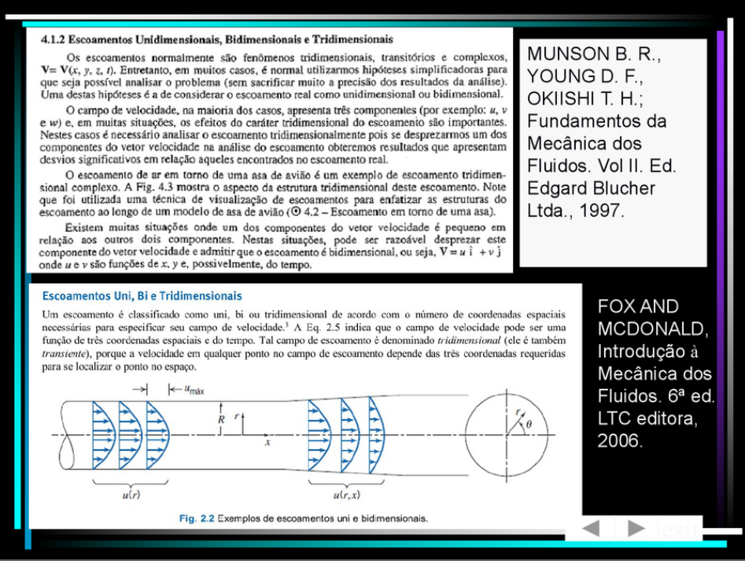

---

## Slide 24

> **Em linguagem simples:** Escoamento estacionário (ou permanente) é quando, num ponto fixo, a velocidade e outras propriedades não mudam com o tempo  -  como água fluindo sempre igual numa torneira totalmente aberta. Escoamento transiente muda com o tempo  -  como encher uma banheira ou acelerar um carro.

**Tipos em relação ao tempo:**

* **Escoamento estacionário (permanente):** em cada ponto fixo do espaço, velocidade e outras propriedades **não variam** com o tempo.

$$\frac{\partial \vec{V}}{\partial t} = 0$$

**O que essa conta significa:**
* $\vec{V}$  -  vetor velocidade
* $\frac{\partial \vec{V}}{\partial t}$  -  como a velocidade muda com o tempo, em um ponto fixo
* Igual a zero = nada muda com o tempo naquele ponto (embora o fluido esteja se movendo!)

**Analogia:** Torneira aberta em regime constante  -  em um ponto fixo do jato, a velocidade é sempre a mesma. Transiente = abrir ou fechar a torneira, quando o jato ainda está se ajustando.

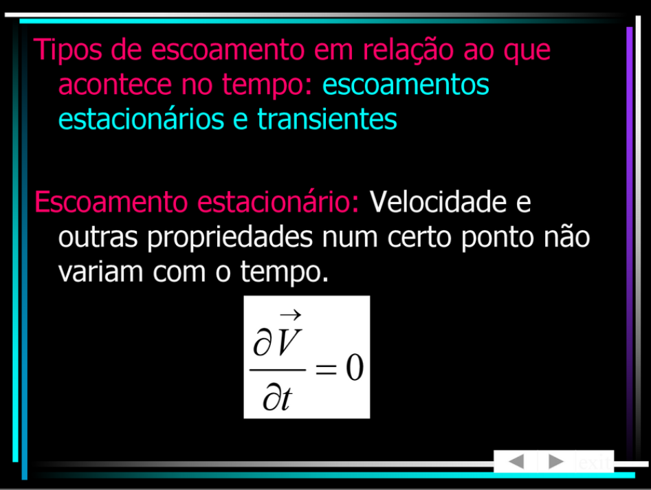

---

## Slide 25

> **Em linguagem simples:** Para visualizar escoamentos, usamos linhas que mostram para onde o fluido vai. Linhas de corrente indicam a direção instantânea do movimento em cada ponto  -  como as linhas de um mapa de vento. Em 2D, a inclinação da linha de corrente segue a proporção entre as componentes da velocidade.

**Conceitos para visualizar campos de escoamento:**

Linhas de corrente, linhas de emissão e trajetória.

**Linhas de corrente:**
* Mostram a **direção instantânea** do movimento do fluido
* São curvas contínuas **tangentes** ao vetor velocidade em cada ponto
* Abordagem matemática (Euleriana)

No escoamento **bidimensional**, a inclinação da linha de corrente satisfaz:

$$\frac{dy}{dx} = \frac{v}{u}$$

**O que essa conta significa:**
* $dy/dx$  -  inclinação da linha de corrente no plano $xy$
* $v$  -  componente da velocidade na direção $y$
* $u$  -  componente da velocidade na direção $x$
* A linha aponta na direção do vetor $(u, v)$

**Analogia:** Linhas de corrente são como as setas de um mapa de vento ligadas numa curva contínua  -  mostram "para onde o fluxo aponta" em cada lugar.

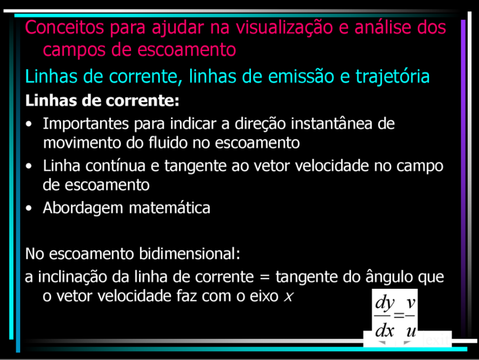

---

## Slide 26

> **Em linguagem simples:** Linha de emissão: todas as partículas que passaram por um mesmo ponto (como fumaça saindo de uma chaminé). Trajetória: o caminho de UMA partícula ao longo do tempo (como seguir um balão). As duas são ideias experimentais; linhas de corrente são mais teóricas e instantâneas.

**Linhas de emissão:** curva formada por todas as partículas que **passaram** por um mesmo ponto em instantes diferentes (como tinta injetada num ponto fixo).

**Trajetória:** caminho percorrido por **uma partícula específica** ao longo do tempo. Visão **Lagrangiana**.

**Ambas** são abordagens que você observaria em laboratório ou na natureza (fumaça, tinta, bolhas).

**Analogia:** Linha de emissão = rastro de todos os carros que passaram por um cruzamento. Trajetória = rota de um único carro no GPS.

---

## Slide 27

> **Em linguagem simples:** Quando o escoamento não muda com o tempo (estacionário), linhas de corrente, linhas de emissão e trajetórias coincidem  -  é como uma foto estática do fluxo. Quando o escoamento muda com o tempo, essas linhas podem ser diferentes; uma partícula pode sair de uma linha de corrente se o campo estiver mudando.

* No escoamento **permanente**, a velocidade em cada ponto não muda com o tempo $\rightarrow$ as **linhas de corrente** não mudam de um instante a outro.
* Uma partícula que está numa linha de corrente **permanece** nela.
* Partículas que passam em sequência por um mesmo ponto fixo ficam na **mesma** linha de corrente.
* Portanto, em escoamento permanente: **trajetórias = linhas de emissão = linhas de corrente**.
* Em escoamentos **transientes**, elas podem ser **diferentes**.

**Analogia:** Correnteza constante no rio  -  uma folha segue exatamente o mesmo desenho que as setas do fluxo. Correnteza que muda após chuva  -  a folha pode seguir caminho diferente do que as setas indicavam antes.

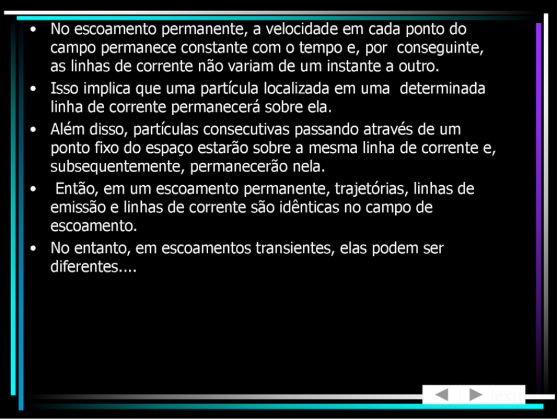

---

## Slide 28  -  Diferenças e semelhanças entre linhas de corrente, linhas de emissão e trajetória

> **Em linguagem simples:** Resumo prático: no regime permanente, os três tipos de linha são iguais. No transiente, não. Linhas de corrente e trajetórias seguem a direção da velocidade; linhas de emissão ligam partículas diferentes no mesmo instante. Regras de cruzamento ajudam a interpretar os desenhos sem contradizer a física.

1. **Iguais** no escoamento estacionário
2. **Podem diferir** em escoamentos transientes
3. **Linhas de corrente e trajetória:** tangentes ao campo de velocidade (direção do movimento)
4. **Linhas de emissão:** partículas **diferentes**, no **mesmo** instante, que passaram por um ponto
5. **Trajetória:** a **mesma** partícula em **instantes diferentes**
6. Essas linhas indicam **direção** do movimento, mas **não** a magnitude (rapidez)  -  salvo quando o desenho usa espessura ou cor para isso
7. **Linhas de corrente estacionárias não se cruzam**  -  uma partícula não pode ter duas velocidades no mesmo ponto
8. **Linhas de emissão não se cruzam**  -  duas partículas não ocupam o mesmo lugar ao mesmo tempo
9. **Trajetórias podem se cruzar**  -  a mesma posição em instantes diferentes é permitida
10. Linhas de corrente e de emissão são como **fotos** do campo; trajetórias são **filme** de uma partícula

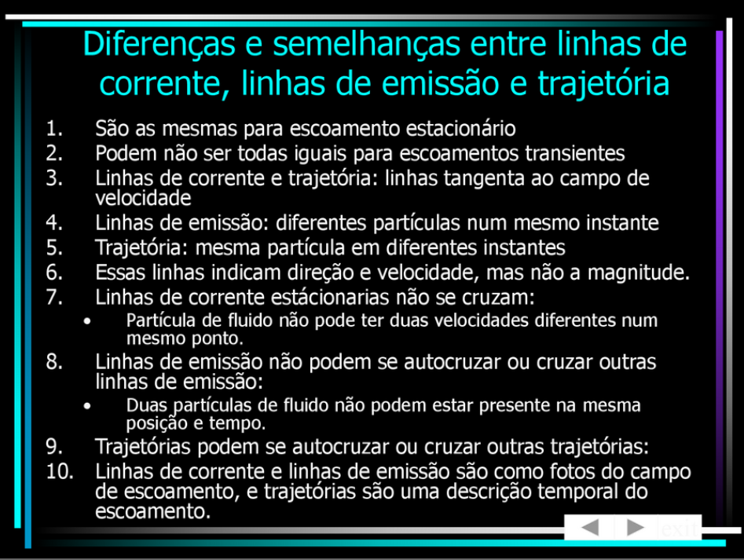

---

## Slide 29  -  Aplicação destes conceitos

> **Em linguagem simples:** Essas ideias não são só teoria: levam à equação de Bernoulli (relação entre pressão e velocidade ao longo de uma linha de corrente) e ajudam engenheiros a testar aerodinâmica com fumaça ou tinta. É assim que se projeta carro, avião ou turbina com menos arrasto ou mais sustentação.

1. Ao longo de **linhas de corrente** desenvolvem-se equações importantes  -  como a **equação de Bernoulli**, que relaciona pressão, velocidade e altura num escoamento.
2. Engenheiros usam **tinta na água** ou **fumaça no ar** para ver **linhas de emissão** e entender o escoamento ao redor de protótipos  -  reduzindo arrasto, aumentando sustentação ou melhorando eficiência.

**Analogia:** Testar formato de carro no túnel de vento com fumaça  -  as linhas visíveis mostram onde o ar "gruda" ou se separa da carroceria.

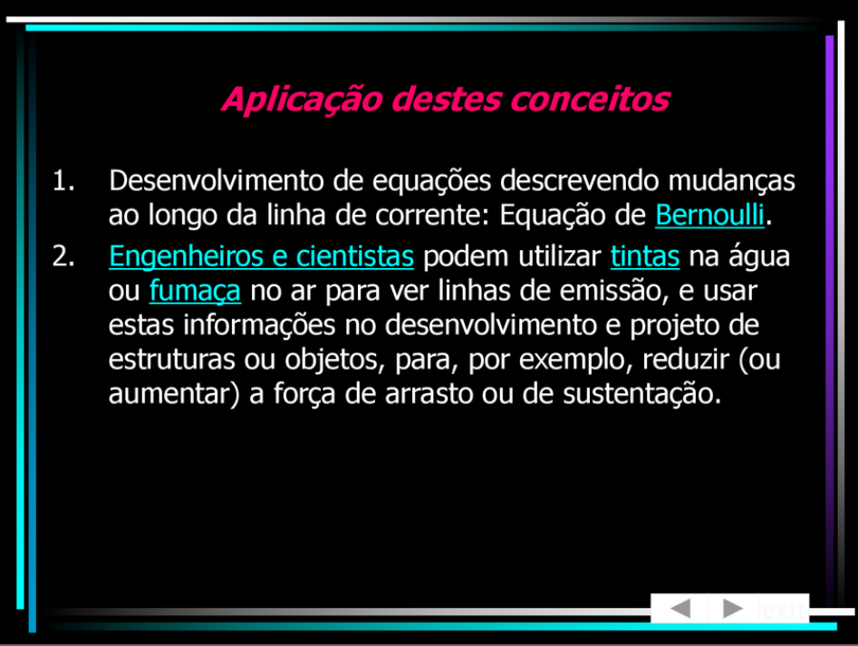

---

## Slide 32  -  Campo de tensão

> **Em linguagem simples:** Em qualquer pedacinho de fluido, podem atuar forças de pressão (empurrando perpendicular à superfície) e de cisalhamento (arrastando paralelo à superfície). O campo de tensão descreve essas forças por unidade de área em cada direção. É como medir quanto o fluido está sendo "apertado" e "puxado" em cada face de um cubinho imaginário.

Forças por unidade de área numa superfície infinitesimal:

$$\sigma_n = \lim_{\delta A \to 0} \frac{\delta F_n}{\delta A}$$

$$\tau_1 = \lim_{\delta A \to 0} \frac{\delta F_1}{\delta A}$$

$$\tau_2 = \lim_{\delta A \to 0} \frac{\delta F_2}{\delta A}$$

**O que essa conta significa:**
* $\sigma_n$  -  **tensão normal** (pressão na direção perpendicular à superfície)
* $\tau_1$, $\tau_2$  -  **tensões de cisalhamento** nas duas direções paralelas à superfície
* $\delta F_n$, $\delta F_1$, $\delta F_2$  -  pequenas forças nas respectivas direções
* $\delta A$  -  área muito pequena da superfície
* O limite quando $\delta A \to 0$ dá a tensão **num ponto**

**Analogia:** Apoiar a palma na parede  -  há pressão perpendicular (normal) e, se você desliza a mão, cisalhamento paralelo à parede.

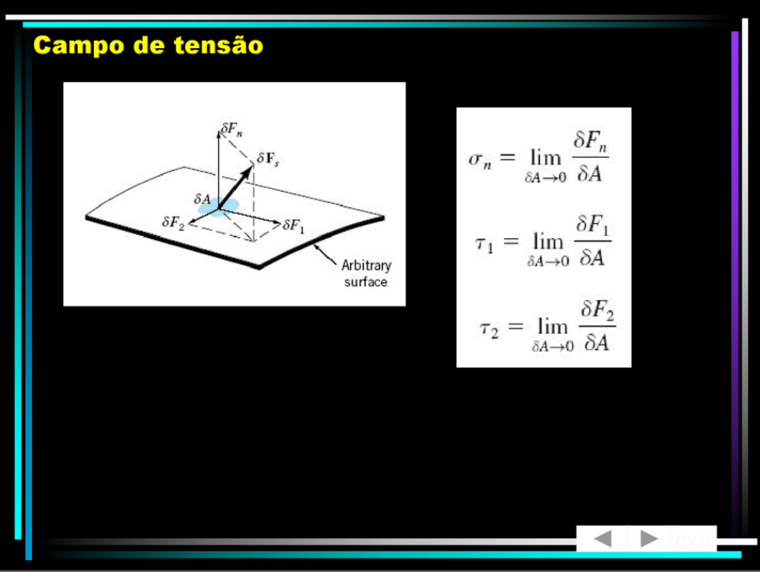

---

## Slide 33  -  Campo de tensão

> **Em linguagem simples:** Cada tensão tem um "nome" com duas letras: a primeira indica a face onde a força age (normal à face); a segunda indica a direção da força. Assim sabemos se estamos falando de pressão em x ou de cisalhamento na face y na direção z.

**Convenção de índices:**

* **Primeira letra (subscrito):** eixo **normal** à superfície onde a força atua
* **Segunda letra (subscrito):** eixo **paralelo** à direção em que a força atua

Exemplo: $\tau_{xy}$  -  força na direção $x$ atuando na face cuja normal é $y$.

**Analogia:** Endereço com rua e número  -  a primeira informação diz "em qual face", a segunda "para qual direção a força aponta".

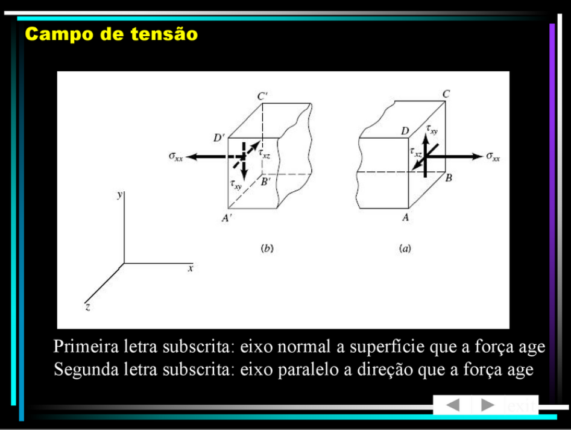

---

## Slide 34

> **Em linguagem simples:** No total, precisamos de nove números para descrever completamente o estado de tensão num ponto do fluido  -  três pressões normais e seis cisalhamentos (organizados numa matriz $3 \times 3$). É o "relatório completo" de todas as forças por área nas três direções.

A tensão num ponto é especificada por **nove componentes** (matriz simétrica na maioria dos materiais):

$$
\begin{bmatrix}
\sigma_{xx} & \tau_{xy} & \tau_{xz} \\
\tau_{yx} & \sigma_{yy} & \tau_{yz} \\
\tau_{zx} & \tau_{zy} & \sigma_{zz}
\end{bmatrix}
$$

**O que essa conta significa:**
* $\sigma_{xx}$, $\sigma_{yy}$, $\sigma_{zz}$  -  tensões **normais** nas faces perpendiculares a $x$, $y$, $z$ (pressionam/estiram nessas direções)
* $\tau_{xy}$, $\tau_{xz}$, etc.  -  tensões de **cisalhamento** (forças paralelas à face)
* Cada linha/coluna se relaciona a uma face e uma direção de força
* Juntas, descrevem o estado completo de esforços internos no fluido naquele ponto

**Analogia:** Nove medidores num cubinho imaginário dentro do fluido  -  três medem "aperto" nas faces e seis medem "arrasto" lateral.

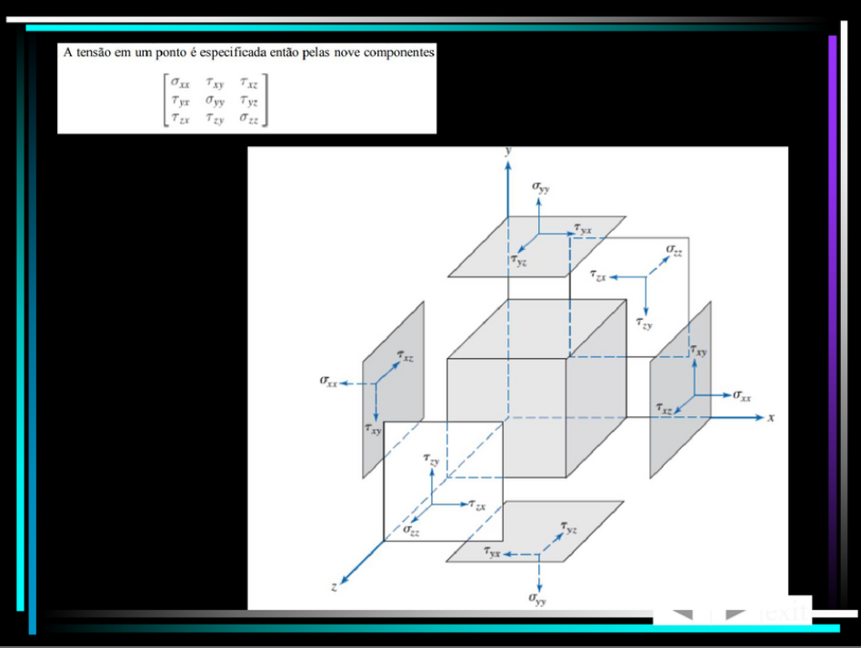

---

## Formulário  -  Parte 1

Esta seção reúne as fórmulas dos slides, com explicação em linguagem simples de cada uma.

### Fórmulas dos slides (organizadas por tópico)

#### Viscosidade (escoamento entre placas paralelas)

$$u = \frac{Uy}{b}$$

*Velocidade $u$ num ponto entre as placas: cresce linearmente de 0 até $U$ conforme a distância $y$; $b$ é a distância entre as placas.*

$$\frac{du}{dy} = \frac{U}{b}$$

*Inclinação do perfil de velocidade  -  o quanto a velocidade muda por unidade de distância entre as placas.*

$$\tan \delta\beta \approx \delta\beta = \frac{\delta a}{b}$$

*Pequeno ângulo de deformação do fluido: deslocamento horizontal $\delta a$ dividido pela espessura $b$.*

$$\delta\beta = \frac{U \delta t}{b}$$

*Ângulo de deformação após tempo $\delta t$ com placa superior se movendo a velocidade $U$.*

$$\gamma = \lim_{\delta t \to 0} \frac{\delta \beta}{\delta t} = \frac{U}{b} = \frac{du}{dy}$$

*Taxa de deformação por cisalhamento  -  quão rápido o fluido está sendo "cortado".*

$$\tau = \mu \frac{du}{dy}$$

*Tensão de cisalhamento = viscosidade $\times$ gradiente de velocidade (lei da viscosidade newtoniana).*

$$\nu = \frac{\mu}{\rho}$$

*Viscosidade cinemática = viscosidade dinâmica dividida pela densidade.*

#### Módulo de compressibilidade (elasticidade volumétrica)

$$E_v = -\frac{dp}{d\overline{V}/\overline{V}}$$

*Quanto maior $E_v$, mais difícil comprimir o fluido. Relaciona pequena mudança de pressão $dp$ à mudança relativa de volume.*

#### Velocidade do som

$$c = \sqrt{\frac{dp}{d\rho}} = \sqrt{\frac{E_v}{\rho}}$$

*Velocidade com que perturbações se propagam; depende da compressibilidade e da densidade.*

$$c = \sqrt{\frac{kp}{\rho}} = \sqrt{kRT}$$

*Para gases ideais em perturbações pequenas: depende da pressão $p$, densidade $\rho$, constante $k$ e temperatura $T$.*

#### Tensão superficial

$$\Delta p = p_i - p_e = \frac{2\sigma}{R}$$

*Pressão extra dentro de uma gota esférica de raio $R$ devido à tensão superficial $\sigma$.*

$$2\pi R\sigma = \Delta p \, \pi R^2$$

*Equilíbrio de forças: tensão superficial ao longo da circunferência equilibra a força da pressão interna.*

$$\gamma \pi R^2 h = 2 \pi R \sigma \cos \theta$$

*No tubo capilar: peso da coluna de altura $h$ equilibra a componente vertical da tensão superficial; $\gamma$ é peso específico, $\theta$ é ângulo de contato.*

$$h = \frac{2 \sigma \cos \theta}{\gamma R}$$

*Altura do menisco capilar  -  quanto menor o raio $R$ do tubo, maior a elevação (ou depressão).*

#### Campo de velocidade

$$\vec{V} = u \vec{i} + v \vec{j} + w \vec{k}$$

*Vetor velocidade com componentes nas direções $x$, $y$, $z$.*

$$u = u(x, y, z, t)$$

*Cada componente pode variar com posição e tempo.*

$$\vec{V} = \frac{d \vec{r}}{dt}$$

*Velocidade como taxa de mudança da posição $\vec{r}$ de uma partícula (visão Lagrangiana).*

#### Escoamento estacionário

$$\frac{\partial \vec{V}}{\partial t} = 0$$

*Em escoamento permanente, a velocidade em qualquer ponto fixo não muda com o tempo.*

#### Linhas de corrente (escoamento bidimensional)

$$\frac{dy}{dx} = \frac{v}{u}$$

*Inclinação da linha de corrente = razão entre componentes $v$ e $u$ da velocidade.*

#### Campo de tensão

$$\sigma_n = \lim_{\delta A \to 0} \frac{\delta F_n}{\delta A}$$

*Tensão normal: força perpendicular por unidade de área num ponto.*

$$\tau_1 = \lim_{\delta A \to 0} \frac{\delta F_1}{\delta A}, \quad \tau_2 = \lim_{\delta A \to 0} \frac{\delta F_2}{\delta A}$$

*Tensões de cisalhamento: forças paralelas à superfície, por unidade de área.*

$$
\begin{bmatrix}
\sigma_{xx} & \tau_{xy} & \tau_{xz} \\
\tau_{yx} & \sigma_{yy} & \tau_{yz} \\
\tau_{zx} & \tau_{zy} & \sigma_{zz}
\end{bmatrix}
$$

*Matriz $3 \times 3$ com todas as componentes de tensão normal e cisalhamento num ponto do fluido.*
