# Forças hidrostáticas  -  Versão para Iniciantes

Este material é uma versão didática dos slides sobre **forças hidrostáticas**  -  ou seja, as forças que a água (ou outro fluido parado) exerce sobre paredes, portas, barragens e objetos imersos. O conteúdo técnico original foi reescrito para quem está começando do zero, sem precisar ser especialista em física ou engenharia. As fórmulas aparecem para referência, mas cada uma vem acompanhada de explicação em linguagem simples.

---

## Slide 1

> **Em linguagem simples:** Quando você enche um tanque, uma barragem ou o casco de um navio com água, a água empurra as paredes. Saber calcular essa força é essencial para projetar estruturas que não vão rachar ou tombar. Aqui assumimos que a água está parada e não há “arrasto” lateral entre as camadas de fluido.

Calcular essas forças é fundamental no projeto de:

- tanques de armazenamento
- barragens
- cascos de navios
- outras estruturas que ficam em contato com água

**Premissa importante:** o fluido está em repouso, sem tensões de cisalhamento (sem “escorrer” ou se deformar por arrasto interno).

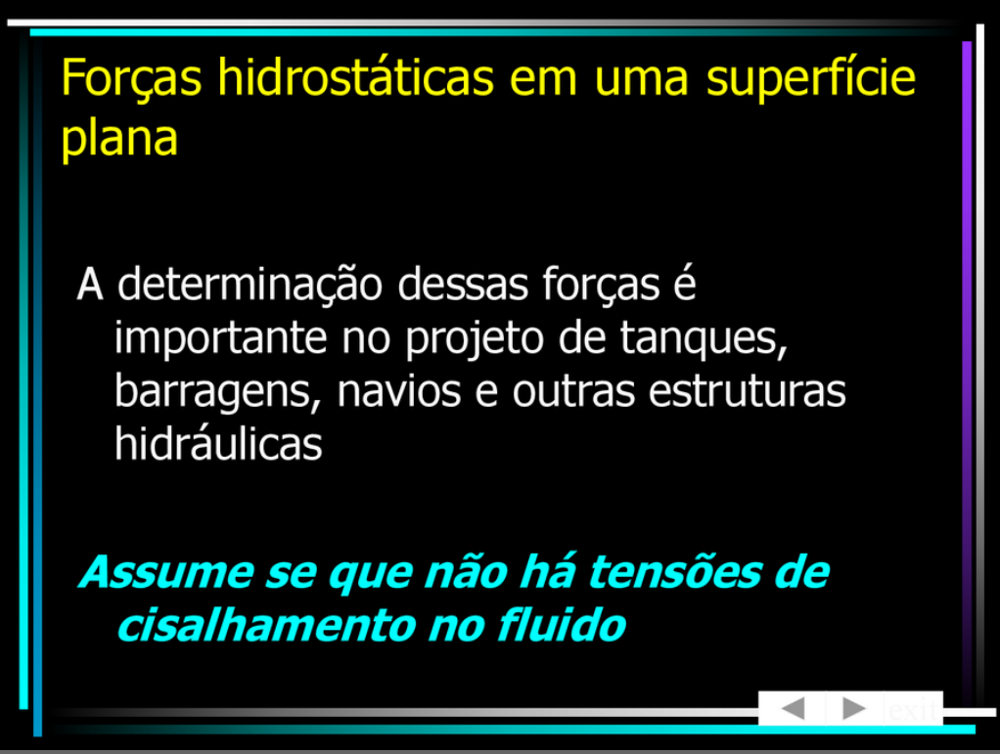

---

## Slide 2  -  Antes de continuar...

> **Em linguagem simples:** Antes de falar de forças, precisamos entender o que é **centroide**  -  o “ponto central” de uma figura plana. É como o ponto de equilíbrio de um recorte de papel: se você apoiar o recorte exatamente no centroide, ele fica em equilíbrio.

**Centroide:** ponto que representa o centro geométrico de uma figura. Se você medir a distância de cada pedacinho da área até esse ponto e somar tudo (com sinais), o resultado é zero  -  a figura está “balanceada” em torno dele.

**Analogia:** pense no centroide como o ponto onde você colocaria o dedo para equilibrar uma régua retangular sobre a ponta do dedo.

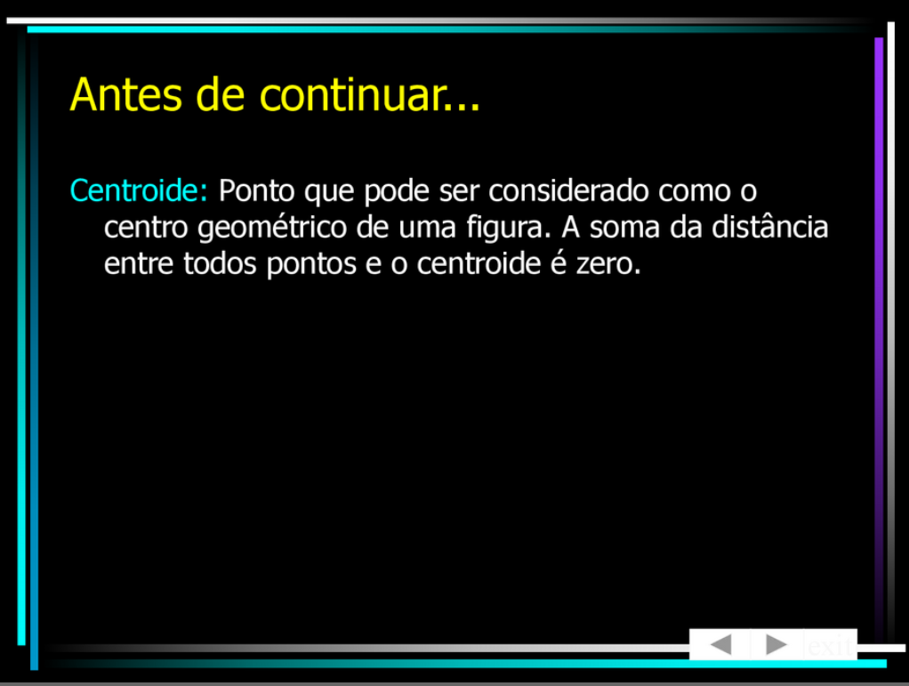

---

## Slide 3

> **Em linguagem simples:** Imagine uma porta ou placa inclinada dentro da água. A pressão aumenta conforme a profundidade, então a força não é igual em todos os pontos  -  é maior lá embaixo. Para calcular a força total, somamos (integramos) o empurrão em cada pedacinho de área.

Considere uma superfície plana inclinada de forma qualquer, mergulhada em um fluido.

- O eixo **y** segue ao longo da superfície (de cima para baixo na placa).
- A origem **0** fica no nível da superfície livre da água (topo).
- Em qualquer ponto, a profundidade vertical é **h**.

Em um pedacinho minúsculo de área $dA$, a força da água é:

$$dF = \gamma h \, dA$$

A força resultante (total) sobre toda a superfície é a soma de todos esses pedacinhos:

$$F_R = \int_A \gamma h \, dA = \int_A \gamma y \sin\theta \, dA$$

**O que essa conta significa:**

- $dF$  -  força em um pedacinho minúsculo da superfície
- $\gamma$ (gama)  -  “peso” da água por unidade de volume (quanto a água pesa por litro, por exemplo)
- $h$  -  profundidade vertical do ponto abaixo da superfície da água
- $dA$  -  área desse pedacinho minúsculo
- $y$  -  distância medida ao longo da placa inclinada
- $\theta$ (teta)  -  ângulo de inclinação da placa em relação à horizontal
- $F_R$  -  força total resultante sobre toda a placa

**Analogia:** é como calcular o peso total de uma pilha de livros empilhados com alturas diferentes  -  você soma o peso de cada camada.

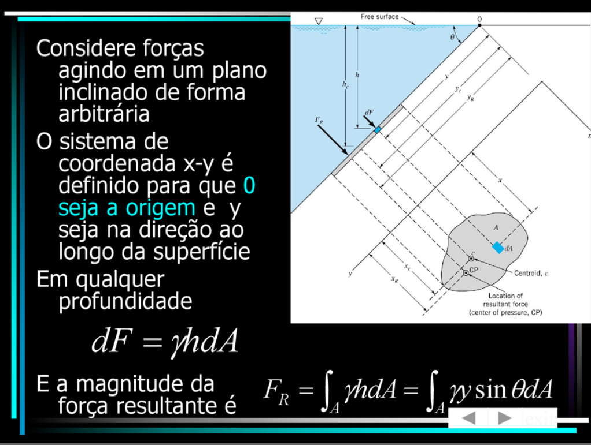

---

## Slide 4

> **Em linguagem simples:** Como o peso específico $\gamma$ e o ângulo $\theta$ são os mesmos em toda a placa, podemos tirá-los de dentro da soma. O que sobra é uma integral que mede como a área está distribuída em relação ao eixo x  -  isso se liga diretamente ao centroide.

Com $\gamma$ e $\theta$ constantes:

$$F_R = \gamma \sin\theta \int_A y \, dA$$

A integral $\int_A y \, dA$ é chamada de **primeiro momento de área** em relação ao eixo x, e vale:

$$\int_A y \, dA = y_c A$$

**O que essa conta significa:**

- $\int_A y \, dA$  -  soma ponderada de “quão longe cada pedacinho de área está” na direção y
- $y_c$  -  coordenada y do **centroide** da superfície (medida a partir do eixo x)
- $A$  -  área total da superfície

**Analogia:** imagine que cada pedacinho da placa tem um peso proporcional à sua distância vertical. O primeiro momento de área é como o “momento de peso” de toda a figura  -  e o centroide é o ponto médio dessa distribuição.

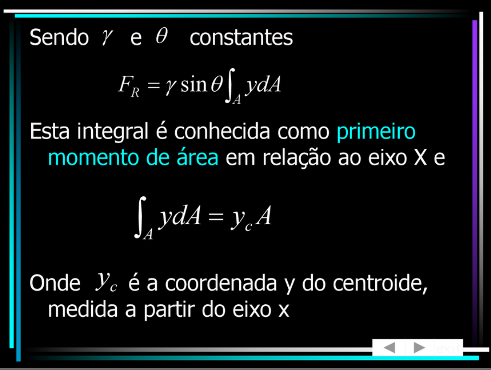

---

## Slide 5

> **Em linguagem simples:** A força total sobre a placa é o peso da “coluna de água” equivalente sobre a área inteira, calculada pela profundidade do centroide. A força empurra perpendicular à placa  -  mas o ponto exato onde ela age pode ser diferente do centroide. Esse ponto especial se chama **centro de pressão**.

A **magnitude** (tamanho) da força resultante é:

$$F_R = \gamma A y_c \sin\theta = \gamma h_c A$$

- A direção da força é **perpendicular** à superfície.
- A força **não** age necessariamente no centroide  -  ela age no **centro de pressão**, nas coordenadas $x_R$ e $y_R$.

**O que essa conta significa:**

- $h_c$  -  profundidade vertical do centroide ($h_c = y_c \sin\theta$)
- $F_R$  -  força total = peso específico $\times$ profundidade do centroide $\times$ área

**Analogia:** empurrar uma porta de casa debaixo d’água: a força total depende de quão fundo está o “meio” da porta, mas o ponto onde você sente o empurrão concentrado fica um pouco mais abaixo do centro geométrico.

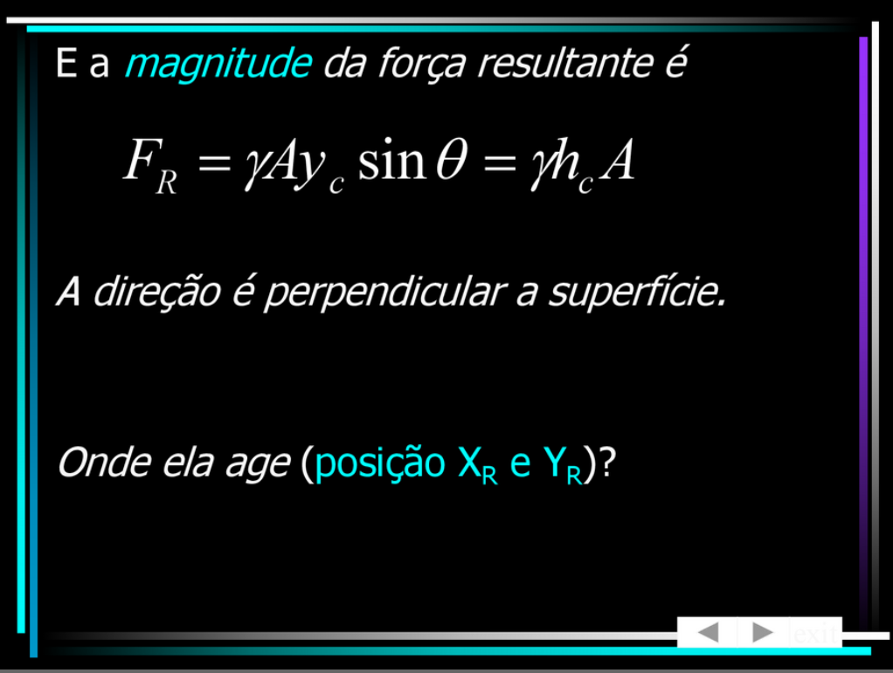

---

## Slide 6  -  Na coordenada y...

> **Em linguagem simples:** O centro de pressão é o ponto onde podemos concentrar toda a força sem mudar o efeito de “tombo”. Para encontrá-lo, igualamos o momento (efeito de alavanca) da força total ao momento da força distribuída em cada pedacinho.

O momento da força resultante deve ser igual ao momento da força distribuída:

$$F_R y_R = \int_A y \, dF = \int_A \gamma \sin\theta \, y^2 \, dA$$

Daí:

$$y_R = \frac{\int_A y^2 \, dA}{y_c A}$$

A integral do numerador é o **momento de segunda ordem da área** ($I_x$), também chamado de **momento de inércia** da área.

**O que essa conta significa:**

- $y_R$  -  posição do centro de pressão na direção y (medida a partir do eixo x)
- $\int_A y^2 \, dA$  -  mede como a área está espalhada em relação ao eixo x (quanto mais “longe” do eixo, maior)
- $I_x$  -  momento de inércia da área em relação ao eixo x

**Analogia:** numa gangorra, o ponto de apoio não fica necessariamente no meio se as crianças tiverem pesos diferentes. O centro de pressão é o “ponto de apoio equivalente” da força da água.

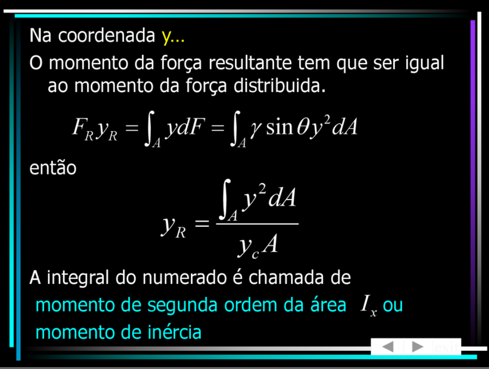

---

## Slide 7

> **Em linguagem simples:** O momento de inércia é mais fácil de calcular quando medimos a partir do centroide da figura. O teorema dos eixos paralelos permite “transportar” esse valor para o eixo x original, somando um termo extra que depende da área e da distância do centroide.

Podemos reescrever:

$$y_R = \frac{I_x}{y_c A}$$

Pelo **Teorema dos Eixos Paralelos**:

$$I_x = I_{xc} + A y_c^2$$

**O que essa conta significa:**

- $I_{xc}$  -  momento de inércia em relação a um eixo que passa pelo **centroide** e é paralelo ao eixo x
- $A y_c^2$  -  correção para “mover” o eixo do centroide até o eixo x original

**Analogia:** medir a inércia de um objeto girando em torno de um eixo que passa pela borda é diferente de medir em torno do centro  -  o teorema diz exatamente quanto somar para compensar essa mudança de eixo.

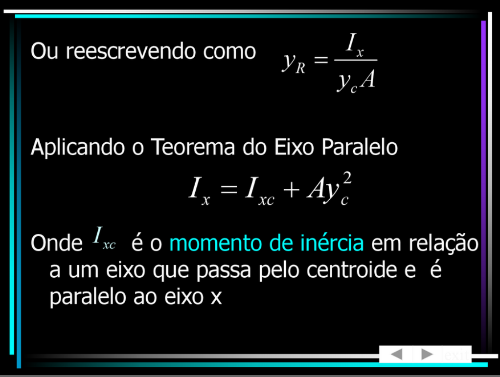

---

## Slide 8

> **Em linguagem simples:** Com o teorema dos eixos paralelos, chegamos a uma fórmula prática: o centro de pressão fica abaixo do centroide (na direção y). Na direção x, o cálculo é parecido, mas usa o produto de inércia.

Então, na coordenada y:

$$y_R = \frac{I_{xc}}{y_c A} + y_c$$

O centro de pressão fica **abaixo** do centroide (na direção y), porque a pressão é maior nas partes mais fundas.

Na coordenada x, de forma semelhante:

$$x_R = \frac{I_{xyc}}{y_c A} + x_c$$

**O que essa conta significa:**

- $y_R$  -  posição y do centro de pressão (sempre mais fundo que $y_c$)
- $x_R$  -  posição x do centro de pressão
- $I_{xyc}$  -  produto de inércia em relação aos eixos que passam pelo centroide

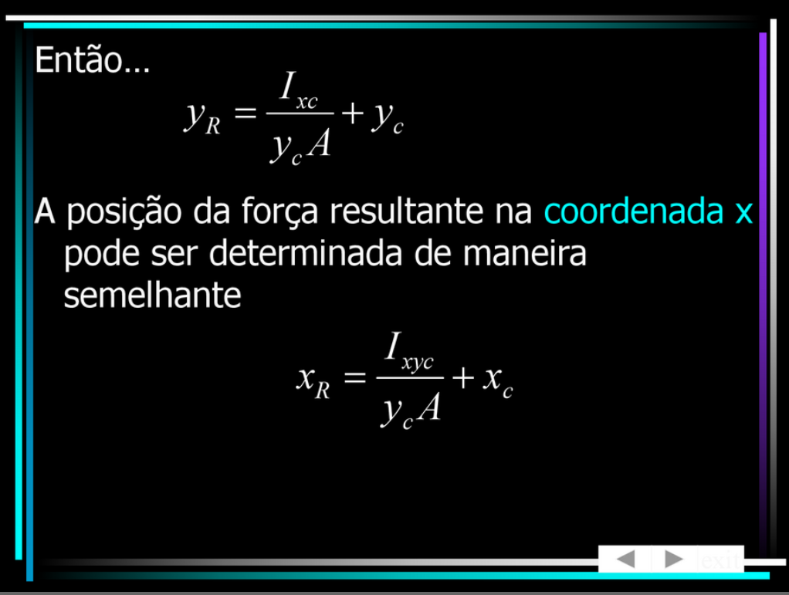

---

## Slide 9

> **Em linguagem simples:** Este slide junta todo o raciocínio para a coordenada x. O produto de inércia mede se a figura está “desbalanceada” em relação aos eixos  -  por exemplo, um triângulo não simétrico terá produto de inércia diferente de zero.

Partindo do equilíbrio de momentos na direção x:

$$F_R x_R = \int_A x \, dF = \int_A \gamma \sin\theta \, x y \, dA$$

$$\Rightarrow \quad x_R = \frac{\gamma \sin\theta \int_A x y \, dA}{\gamma \sin\theta \, y_C A} = \frac{\int_A x y \, dA}{y_C A} = \frac{I_{xy}}{y_C A}$$

Pelo teorema dos eixos paralelos para o produto de inércia:

$$I_{xy} = I_{xyc} + x_C y_C A$$

Portanto:

$$x_R = \frac{I_{xyc}}{y_C A} + x_C$$

**O que essa conta significa:**

- $I_{xy}$  -  produto de inércia da área em relação aos eixos x e y
- $I_{xyc}$  -  produto de inércia medido a partir do centroide
- $x_C$, $y_C$  -  coordenadas do centroide

**Analogia:** o produto de inércia indica se a figura está “puxada” para um lado. Um retângulo centrado nos eixos tem produto de inércia zero; um triângulo deslocado, não.

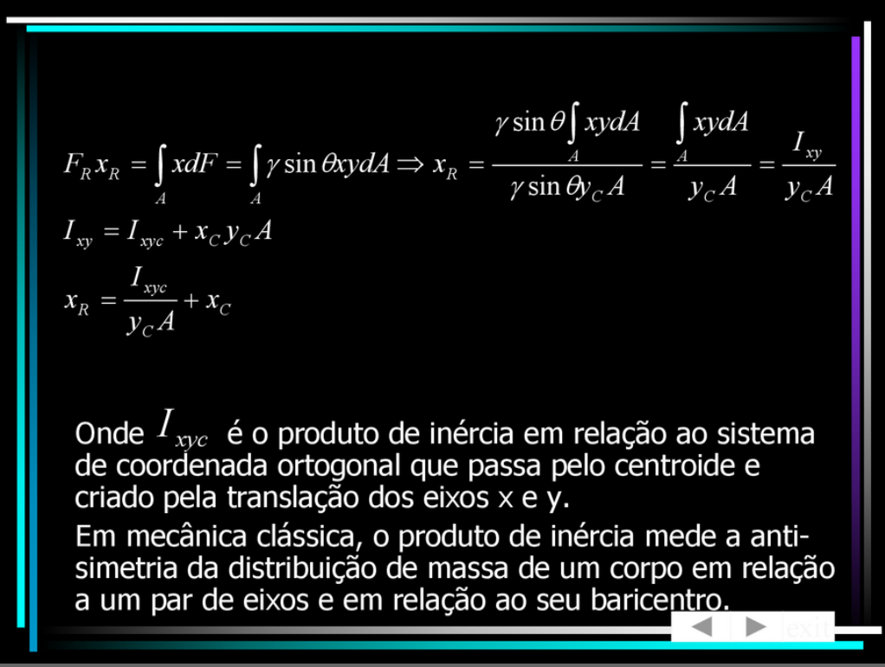

---

## Slide 10  -  Propriedades geométricas de algumas formas

> **Em linguagem simples:** Para calcular o centro de pressão, precisamos de três informações da forma da superfície: a área, o momento de inércia e (às vezes) o produto de inércia. A tabela abaixo traz esses valores prontos para formas comuns  -  assim você não precisa integrar do zero.

**(a) Retângulo**  -  $A = ba$; $I_{xc} = \frac{1}{12} b a^3$; $I_{yc} = \frac{1}{12} a b^3$; $I_{xyc} = 0$

**(b) Círculo**  -  $A = \pi R^2$; $I_{xc} = I_{yc} = \frac{\pi R^4}{4}$; $I_{xyc} = 0$

**(c) Semicírculo**  -  $A = \frac{\pi R^2}{2}$; $I_{xc} = 0{,}1098 \, R^4$; $I_{yc} = 0{,}3927 \, R^4$; $I_{xyc} = 0$

**(d) Triângulo**  -  $A = \frac{a b}{2}$; $I_{xc} = \frac{b a^3}{36}$; $I_{xyc} = \frac{b a^2}{72}(b - 2d)$

**(e) Quarto de círculo**  -  $A = \frac{\pi R^2}{4}$; $I_{xc} = I_{yc} = 0{,}05488 \, R^4$; $I_{xyc} = -0{,}01647 \, R^4$

**O que essa conta significa:**

- $A$  -  área da figura
- $a$, $b$  -  dimensões do retângulo ou triângulo
- $R$  -  raio do círculo
- $I_{xc}$, $I_{yc}$  -  momentos de inércia em relação aos eixos pelo centroide
- $I_{xyc}$  -  produto de inércia (zero quando a figura é simétrica em relação aos eixos)

**Analogia:** é como uma tabela de multiplicação para engenheiros  -  em vez de calcular a área e a inércia de um círculo toda vez, você consulta os valores prontos.

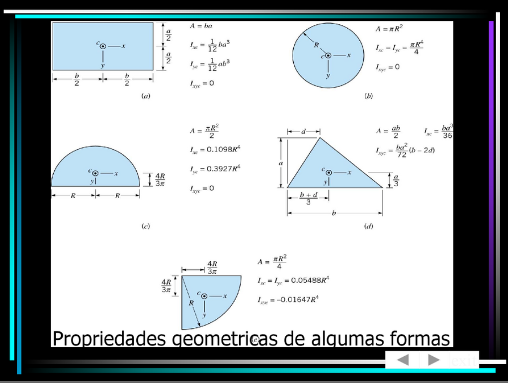

---

## Slide 11  -  Como calcular a localização do centroide?

> **Em linguagem simples:** Se a forma não está na tabela, você pode encontrar o centroide integrando (somando continuamente) ou dividindo a figura em pedaços simples. Para formas complexas, divide-se em retângulos ou triângulos, calcula-se o centroide de cada um e faz-se uma média ponderada pela área.

**Para curvas definidas por uma função $y = f(x)$:**

$$C_x = \frac{\int x \, dA}{A} = \frac{\int x y \, dx}{A}$$

$$C_y = \frac{\int y \, dA}{A} = \frac{\int y^2 \, dx}{A}$$

$$A = \int f(x) \, dx$$

**Para geometrias complexas** (divididas em partes simples):

$$C_x = \frac{\sum_n A_n C_{xn}}{\sum_n A_n}$$

$$C_y = \frac{\sum_n A_n C_{yn}}{\sum_n A_n}$$

**O que essa conta significa:**

- $C_x$, $C_y$  -  coordenadas do centroide
- $A_n$  -  área de cada pedaço $n$
- $C_{xn}$, $C_{yn}$  -  centroide de cada pedaço $n$

**Analogia:** para achar o centro de uma placa com um recorte estranho, você pode pensar nela como várias placas menores coladas  -  o centro geral é a média dos centros, dando mais peso às partes maiores.

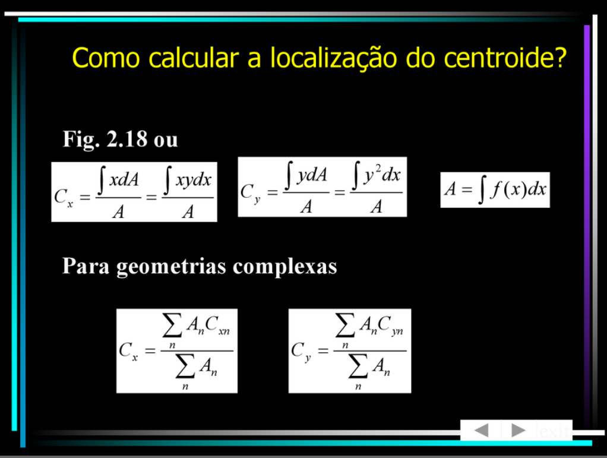

---

## Slide 12  -  Forças hidrostáticas em uma superfície curva

> **Em linguagem simples:** Paredes curvas (como a de um tanque cilíndrico ou uma represa arqueada) são mais complicadas que placas planas. O truque é decompor a força em duas partes: uma horizontal e uma vertical. Depois, juntamos as duas com o teorema de Pitágoras para obter a força total.

Considera-se o fluido “dentro” da superfície curva e suas projeções nas direções vertical e horizontal.

- $F_V$  -  componente **vertical** da força (peso do fluido acima da superfície + outras forças verticais)
- $F_H$  -  componente **horizontal** da força (empurrão lateral)

No equilíbrio:

$$F_V = W + F_1$$

$$F_H = F_2$$

A força resultante total:

$$F_R = \sqrt{(F_H)^2 + (F_V)^2}$$

**O que essa conta significa:**

- $F_V$  -  força vertical (para cima ou para baixo)
- $F_H$  -  força horizontal (empurrando a parede)
- $W$  -  peso do volume de fluido envolvido
- $F_R$  -  força total, obtida combinando as duas componentes perpendicularmente

**Analogia:** imagine empurrar um carrinho numa rampa: a força que você aplica pode ser separada em “para frente” e “para cima”. Aqui fazemos o mesmo com a força da água numa parede curva.

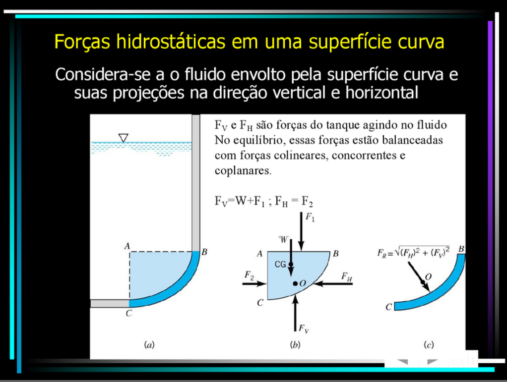

---

## Slide 17  -  PRINCÍPIO DE ARQUIMEDES

> **Em linguagem simples:** Todo corpo mergulhado em um fluido recebe um empurrão para cima igual ao peso do fluido que o corpo “empurra para fora” (desloca). Se esse empurrão for maior que o peso do corpo, ele flutua; se for menor, afunda.

**Princípio de Arquimedes:**

- Um corpo total ou parcialmente imerso em um fluido é sustentado por uma força (**empuxo**) cuja intensidade é igual ao peso do fluido deslocado pelo corpo.

**Quando o fluido é mais denso que o objeto** ($\rho_{fl} > \rho_{ob}$):

- Peso do fluido deslocado (empuxo) > peso do objeto $\rightarrow$ **flutua**

**Quando o fluido é menos denso que o objeto** ($\rho_{fl} < \rho_{ob}$):

- Peso do fluido deslocado (empuxo) < peso do objeto $\rightarrow$ **afunda**

**Analogia:** coloque um pedaço de madeira e um pedaço de ferro na água. A madeira desloca água pesando mais que ela mesma  -  sobe. O ferro desloca água pesando menos  -  desce.

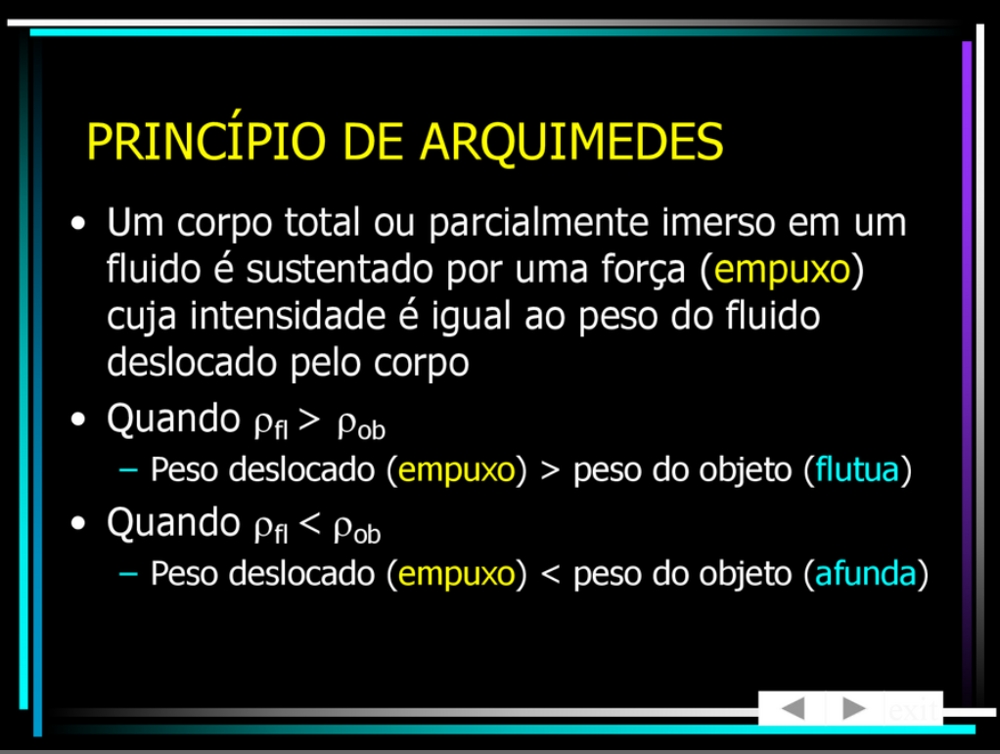

---

## Slide 18  -  Princípio de Arquimedes

> **Em linguagem simples:** O empuxo pode ser calculado multiplicando a densidade do fluido pela gravidade e pelo volume de fluido deslocado. Essa força age no **centro de sustentação**  -  o centro do volume de água “afastado” pelo objeto.

$$F_E = \rho g \mathcal{V}$$

**O que essa conta significa:**

- $F_E$  -  empuxo (força para cima)
- $\rho$ (rô)  -  densidade do fluido (kg/m$^3$)
- $g$  -  aceleração da gravidade (~9,8 m/s$^2$)
- $\mathcal{V}$  -  volume de fluido deslocado pelo objeto

O empuxo $F_E$ passa pelo **centro de gravidade do volume deslocado**  -  ponto chamado de **centro de sustentação**.

**Analogia:** quando você entra na banheira, o nível da água sobe. O empuxo é o peso dessa água “extra” que subiu, e age no meio desse volume deslocado.

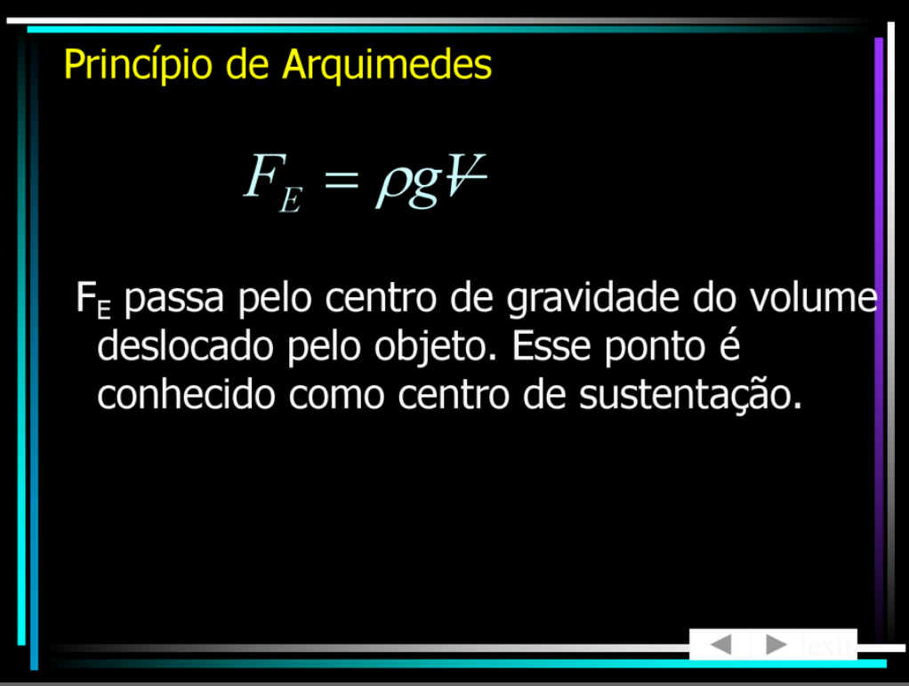

---

## Slide 19

> **Em linguagem simples:** Um objeto na água tem duas forças principais: o peso puxando para baixo (no centro de gravidade) e o empuxo empurrando para cima (no centro de sustentação). Se esses dois pontos não coincidem, o objeto pode girar e ficar estável ou instável.

- **Empuxo** age no **centro de sustentação** (centroide do volume deslocado).
- **Peso** age no **centro de gravidade** do objeto.

Um objeto imerso ou parcialmente imerso pode estar em:

- **equilíbrio estável**  -  volta à posição original se for levemente inclinado
- **equilíbrio instável**  -  continua tombando se for levemente inclinado

**Analogia:** um barco de brinquedo com peso colado no fundo fica estável; com peso colado no mastro, tomba fácil.

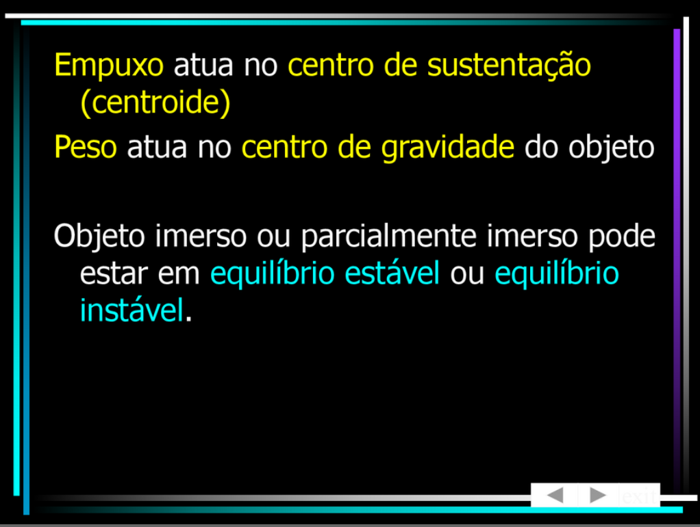

---

## Slide 20  -  Objeto submerso

> **Em linguagem simples:** Para um objeto totalmente submerso, a regra é simples: se o centro de gravidade fica abaixo do centro de sustentação, o objeto se endireita sozinho (estável). Se fica acima, ele tomba (instável).

**Centro de gravidade abaixo do centro de sustentação** $\rightarrow$ **equilíbrio estável**

- Figura 2.25  -  Estabilidade de um corpo submerso: centro de gravidade abaixo do centróide.
- **Estável**  -  momento de restauração (força que “endireita” o corpo)

**Centro de gravidade acima do centro de sustentação** $\rightarrow$ **equilíbrio instável**

- Figura 2.26  -  Estabilidade de um corpo submerso: centro de gravidade acima do centróide.
- **Instável**  -  momento de instabilização (força que “derruba” o corpo)

**Analogia:** um submarino com a maior parte do peso na parte de baixo fica estável; com peso na parte de cima, qualquer inclinação faz ele capotar.

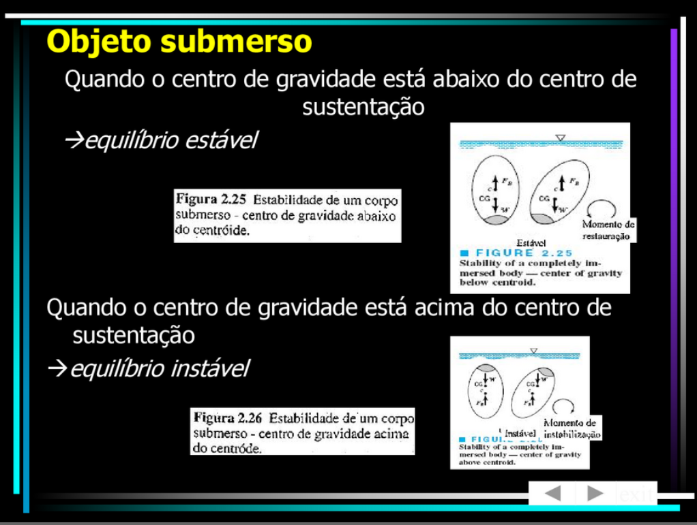

---

## Slide 21  -  Equilíbrio estável

> **Em linguagem simples:** Para objetos que flutuam parcialmente (como barcos), o centro de sustentação muda de posição conforme o barco inclina, porque o volume de água deslocado muda de forma. Se o novo centro de sustentação se move para “segurar” o barco, ele volta ao equilíbrio  -  é estável.

Em objetos **parcialmente submersos**, o centro de sustentação pode mudar conforme o volume submerso.

- $c$  -  centróide do volume original deslocado
- $c'$  -  centróide do novo volume deslocado (após inclinar)

**Momento de restauração** $\rightarrow$ **equilíbrio estável**

Quando o barco inclina, o centro de sustentação se desloca de forma a gerar um momento que “endireita” o barco de volta.

**Analogia:** quando um barco inclina, a parte que entra na água muda de formato. Se o empuxo passa a agir mais para o lado que “segura” o barco, ele volta à posição reta.

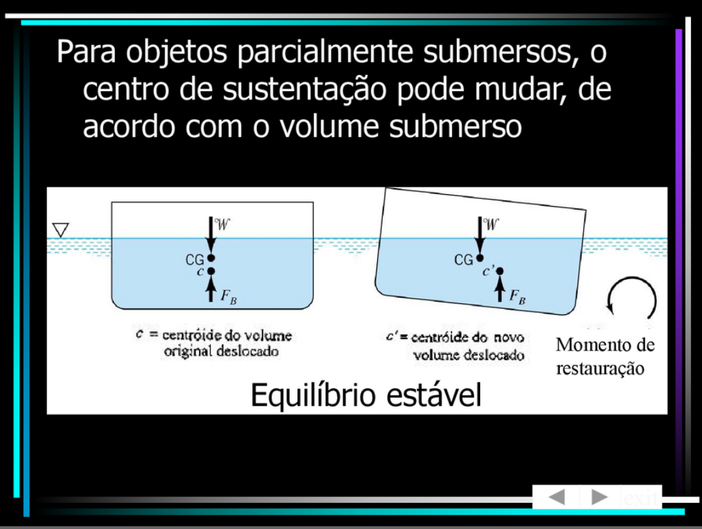

---

## Slide 22  -  Equilíbrio instável

> **Em linguagem simples:** Se, ao inclinar, o centro de sustentação se move no sentido que aumenta a inclinação, o objeto continua tombando  -  é instável. É o oposto do slide anterior.

- $c$  -  centróide do volume original deslocado
- $c'$  -  centróide do novo volume deslocado (após inclinar)

**Momento de instabilização** $\rightarrow$ **equilíbrio instável**

O centro de sustentação se desloca de forma a **aumentar** a inclinação, em vez de corrigi-la.

**Analogia:** imagine equilibrar um lápis na ponta  -  qualquer inclinação faz ele cair mais. O centro de sustentação se afasta do eixo de rotação e o tombo se intensifica.

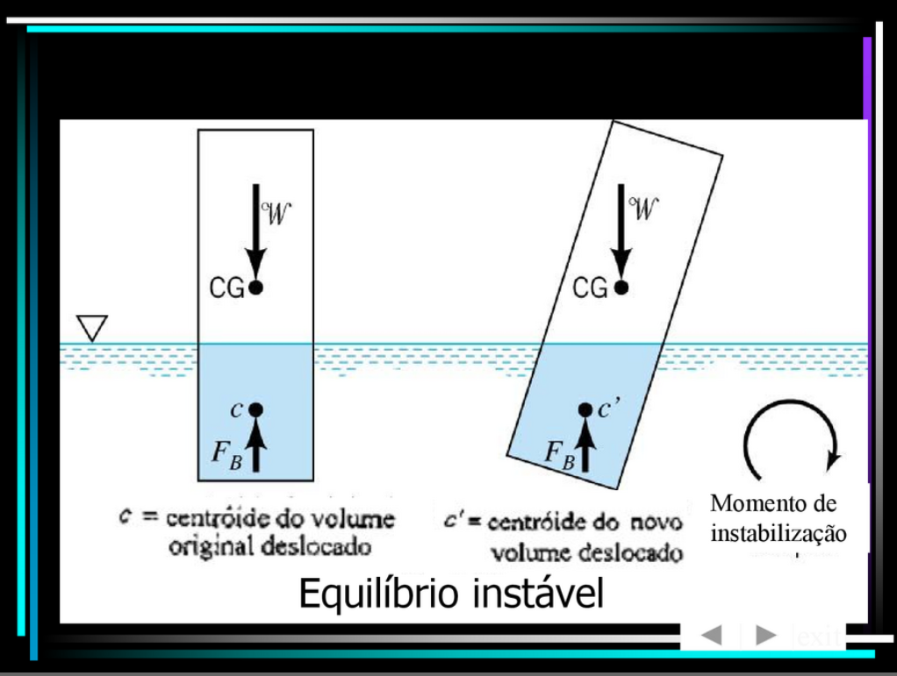

---

## Formulário  -  Parte 2

### Fórmulas dos slides (organizadas por tópico)

#### Força hidrostática elementar e resultante (superfície plana inclinada)

$$dF = \gamma h \, dA$$

> Força em um pedacinho minúsculo = peso específico $\times$ profundidade $\times$ área do pedacinho.

$$h = y \sin\theta$$

> Profundidade vertical = distância ao longo da placa $\times$ seno do ângulo de inclinação.

$$F_R = \int_A \gamma h \, dA = \int_A \gamma y \sin\theta \, dA$$

> Força total = soma de todos os pedacinhos de força sobre a superfície.

$$F_R = \gamma \sin\theta \int_A y \, dA$$

> Tirando as constantes de fora da integral.

$$F_R = \gamma A y_c \sin\theta = \gamma h_c A$$

> Força total = peso específico $\times$ área $\times$ profundidade do centroide. Forma mais prática de calcular.

#### Primeiro momento de área e centroide

$$\int_A y \, dA = y_c A$$

> Primeiro momento de área = coordenada y do centroide $\times$ área total.

$$C_x = \frac{\int x \, dA}{A} = \frac{\int x y \, dx}{A}$$

> Coordenada x do centroide = soma ponderada de x ÷ área.

$$C_y = \frac{\int y \, dA}{A} = \frac{\int y^2 \, dx}{A}$$

> Coordenada y do centroide = soma ponderada de y ÷ área.

$$A = \int f(x) \, dx$$

> Área sob a curva $y = f(x)$.

$$C_x = \frac{\sum_n A_n C_{xn}}{\sum_n A_n}, \quad C_y = \frac{\sum_n A_n C_{yn}}{\sum_n A_n}$$

> Centroide de figura complexa = média ponderada dos centroides de cada parte, usando a área como peso.

#### Centro de pressão (superfície plana)

$$F_R y_R = \int_A y \, dF$$

> Momento da força total = momento da força distribuída.

$$y_R = \frac{\int_A y^2 \, dA}{y_c A} = \frac{I_x}{y_c A}$$

> Posição y do centro de pressão = momento de inércia ÷ (centroide y $\times$ área).

$$y_R = \frac{I_{xc}}{y_c A} + y_c$$

> Centro de pressão na direção y fica abaixo do centroide.

$$x_R = \frac{\int_A x y \, dA}{y_c A} = \frac{I_{xy}}{y_c A}$$

> Posição x do centro de pressão usando o produto de inércia.

$$x_R = \frac{I_{xyc}}{y_c A} + x_c$$

> Forma prática com produto de inércia no centroide.

#### Teorema dos eixos paralelos

$$I_x = I_{xc} + A y_c^2$$

> Momento de inércia em relação ao eixo x = inércia no centroide + área $\times$ distância ao centroide ao quadrado.

$$I_{xy} = I_{xyc} + x_c y_c A$$

> Produto de inércia no eixo original = produto de inércia no centroide + correção pela posição do centroide.

#### Propriedades geométricas (referência)

Retângulo: $A = ba$; $I_{xc} = \frac{1}{12} b a^3$; $I_{yc} = \frac{1}{12} a b^3$; $I_{xyc} = 0$

> Área = base $\times$ altura. Inércias prontas para retângulo centrado.

Círculo: $A = \pi R^2$; $I_{xc} = I_{yc} = \frac{\pi R^4}{4}$; $I_{xyc} = 0$

> Área = $\pi R^2$. Inércias iguais nos dois eixos por simetria.

Semicírculo: $A = \frac{\pi R^2}{2}$; $I_{xc} = 0{,}1098 R^4$; $I_{yc} = 0{,}3927 R^4$; $I_{xyc} = 0$

> Metade de um círculo. Valores numéricos prontos.

Triângulo: $A = \frac{a b}{2}$; $I_{xc} = \frac{b a^3}{36}$; $I_{xyc} = \frac{b a^2}{72}(b - 2d)$

> Área = base $\times$ altura ÷ 2.

Quarto de círculo: $A = \frac{\pi R^2}{4}$; $I_{xc} = I_{yc} = 0{,}05488 R^4$; $I_{xyc} = -0{,}01647 R^4$

> Um quarto de círculo. Produto de inércia diferente de zero por falta de simetria completa.

#### Forças em superfície curva

$$F_V = W + F_1$$

> Força vertical = peso do fluido + outras forças verticais.

$$F_H = F_2$$

> Força horizontal = empurrão lateral sobre a projeção vertical.

$$F_R = \sqrt{F_H^2 + F_V^2}$$

> Força total = combinação das componentes horizontal e vertical (teorema de Pitágoras).

#### Princípio de Arquimedes e flutuabilidade

$$F_E = \rho g \mathcal{V} = \gamma \mathcal{V}$$

> Empuxo = densidade $\times$ gravidade $\times$ volume deslocado = peso específico $\times$ volume deslocado.

$$\rho_{fl} > \rho_{ob} \Rightarrow \text{flutua}$$

> Fluido mais denso que o objeto $\rightarrow$ empuxo maior que o peso $\rightarrow$ flutua.

$$\rho_{fl} < \rho_{ob} \Rightarrow \text{afunda}$$

> Fluido menos denso que o objeto $\rightarrow$ empuxo menor que o peso $\rightarrow$ afunda.

### Fórmulas relacionadas (usadas nas questões)

#### Pressão e peso específico

$$p = \gamma h$$

> Pressão = peso específico $\times$ profundidade. Quanto mais fundo, maior a pressão.

$$\gamma = \rho g$$

> Peso específico = densidade $\times$ gravidade.

#### Força hidrostática em comportas e anteparos planos

$$F_R = \gamma h_c A$$

> Força total = peso específico $\times$ profundidade do centroide $\times$ área.

$$M = F_R \cdot d$$

> Momento (efeito de tombo) = força $\times$ distância ao ponto de rotação.

#### Superfície curva  -  componentes e momento

$$F_H = \gamma h_{cg} A_{proj,\,vertical}$$

> Força horizontal = peso específico $\times$ profundidade do centroide da projeção vertical $\times$ área da projeção.

$$F_V = \gamma \mathcal{V}_{fluido\,acima\,da\,superficie}$$

> Força vertical = peso específico $\times$ volume de fluido acima da superfície curva.

#### Empuxo, peso aparente e densidade relativa

$$E = \rho g \mathcal{V}_{deslocado}$$

> Empuxo = densidade $\times$ gravidade $\times$ volume deslocado.

$$W_{liquido} = W_{ar} - E$$

> Peso medido no fluido = peso no ar - empuxo (por isso objetos parecem mais leves na água).

$$SG = \frac{\rho}{\rho_{ref}} = \frac{W_{ar}}{W_{ar} - W_{agua}}$$

> Densidade relativa (gravidade específica) = densidade do material ÷ densidade de referência (geralmente água).

$$\rho_{coroa} = \frac{W_a}{W_a - W_w} \cdot \rho_{agua}$$

> Densidade de um objeto = peso no ar ÷ (peso no ar - peso na água) $\times$ densidade da água. Método de Arquimedes para medir densidade.

#### Equilíbrio de corpos flutuantes

$$E = W$$

> Para flutuar em repouso, empuxo deve ser igual ao peso.

$$\sum F = ma \Rightarrow E - W = m_{total} \cdot a$$

> Se empuxo $\neq$ peso, o corpo acelera (sobe ou desce).

#### Ar quente em balão (gás ideal, pressão padrão)

$$\rho = \frac{p M}{R T}$$

> Densidade do gás = pressão $\times$ massa molar ÷ (constante dos gases $\times$ temperatura).

$$E = \rho_{ar\,externo} \cdot g \cdot \mathcal{V}_{balao}$$

> Empuxo no balão = densidade do ar externo $\times$ gravidade $\times$ volume do balão.

$$W_{total} = E$$

> Balão sobe quando o empuxo iguala o peso total (balão + gás + carga).

#### Mistura água-ar (afundamento)

$$\rho_{mistura} < \rho_{agua} \Rightarrow E_{reduzido} < W \Rightarrow \text{afunda}$$

> Se ar entra no navio e forma bolhas, a densidade média da “mistura” cai, o empuxo diminui e o navio pode afundar.
