# Escoamentos viscosos e não viscosos  -  Versão para Iniciantes

Este material é uma versão didática da **Parte 3** dos slides de Fenômenos de Transporte. Foi escrito para quem está aprendendo do zero  -  sem pressupor que você já domina cálculo avançado ou mecânica dos fluidos. Cada slide traz uma explicação em linguagem simples, o conteúdo técnico resumido e, quando há fórmulas, uma tradução do que cada símbolo representa na prática.

**O que você vai ver nesta parte:** como descrever o movimento de um fluido (equações de Euler), a famosa equação de Bernoulli (conservação de energia ao longo do fluxo), exemplos de aplicação (jatos, medição de vazão, tubo de Pitot), e o escoamento dentro de tubulações  -  laminar, turbulento, perdas de carga e o diagrama de Moody.

## Slide 1

> **Em linguagem simples:** Esta parte do curso fala de fluidos em **movimento**  -  não só parados como num tanque. Vamos estudar duas ferramentas poderosas (Euler e Bernoulli) e depois o que acontece quando a água ou o óleo escoa **dentro de tubos**, onde a viscosidade (a "pegajosidade") importa muito.

**Tópicos desta parte:**
* Equações de Euler  -  movimento sem atrito interno (fluido "ideal")
* Equação de Bernoulli  -  troca entre pressão, velocidade e altura
* Escoamento viscoso em tubulações  -  fluxo real com atrito nas paredes

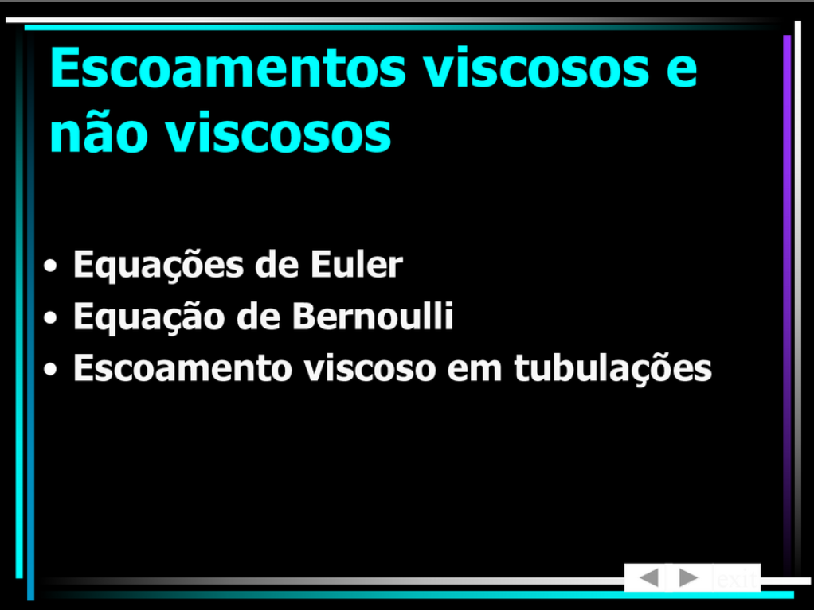

## Slide 2

> **Em linguagem simples:** Antes de escrever equações para o fluido inteiro, os engenheiros olham para um pedacinho minúsculo dele. Em qualquer superfície dentro desse pedaço, há forças empurrando de frente (normais) e forças "raspando" de lado (tangenciais/cisalhamento).

### Forças em uma superfície minúscula dentro do fluido

Imagine uma área muito pequena ($\delta A$) dentro do líquido. A força total pode ser decomposta em:
* **Componente normal** ($\delta F_n$)  -  empurra perpendicular à superfície (ligada à **pressão**)
* **Componentes tangenciais** ($\delta F_1$, $\delta F_2$)  -  "raspam" ao longo da superfície (cisalhamento)

$$\sigma_n = \lim_{\delta A \to 0} \frac{\delta F_n}{\delta A}$$

$$\tau_1 = \lim_{\delta A \to 0} \frac{\delta F_1}{\delta A}$$

$$\tau_2 = \lim_{\delta A \to 0} \frac{\delta F_2}{\delta A}$$

**O que essa conta significa:**
* $\sigma_n$  -  tensão normal: força por unidade de área na direção perpendicular
* $\tau_1$, $\tau_2$  -  tensões de cisalhamento: força por unidade de área nas direções paralelas
* O limite ($\delta A \to 0$)  -  quanto menor o pedaço, mais precisa fica a "força por centímetro quadrado"

**Analogia:** Pressione a palma contra uma parede  -  força perpendicular é como $\sigma_n$; deslize a mão  -  força paralela é como $\tau$.

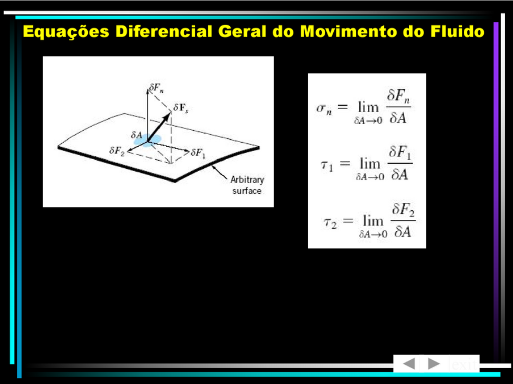

## Slide 3

> **Em linguagem simples:** As forças dentro do fluido têm nomes com dois subíndices. O primeiro diz **em qual face** a força atua; o segundo diz **para qual direção** ela aponta. É só um "endereço" para cada empurrão.

### Como ler os subíndices das tensões

* **Primeiro subíndice**  -  eixo **normal** à superfície onde a força age
* **Segundo subíndice**  -  eixo **paralelo** à direção em que a força age

Nas faces perpendiculares ao eixo $x$: tensões $\sigma_{xx}$, $\tau_{xy}$, $\tau_{xz}$

**Analogia:** "Na face voltada para o norte ($x$), há uma força apontando para o leste ($y$)"  -  isso seria $\tau_{xy}$.

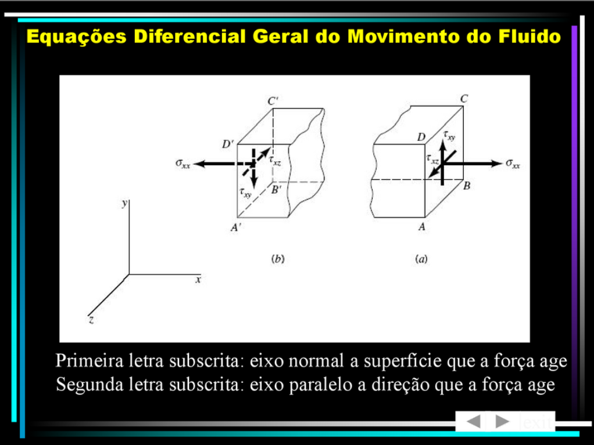

## Slide 4

> **Em linguagem simples:** Pegamos um cubinho minúsculo de fluido e somamos todas as forças das seis faces. A segunda lei de Newton diz: força total = massa $\times$ aceleração, em cada direção ($x$, $y$, $z$).

### Equilíbrio de forças em um cubinho de fluido

$$\delta F_x = \delta m \, a_x; \quad \delta F_y = \delta m \, a_y; \quad \delta F_z = \delta m \, a_z$$

**Forças de superfície na direção $x$** em um elemento $\delta x \times \delta y \times \delta z$:

* Face esquerda: $\left(\sigma_{xx} - \frac{\partial \sigma_{xx}}{\partial x} \frac{\delta x}{2}\right) \delta y \delta z$
* Face direita: $\left(\sigma_{xx} + \frac{\partial \sigma_{xx}}{\partial x} \frac{\delta x}{2}\right) \delta y \delta z$
* Faces superior/inferior: $\tau_{yx}$ com variação em $y$
* Faces frontal/traseira: $\tau_{zx}$ com variação em $z$

**O que essa conta significa:** Em cada face, a tensão varia um pouco (derivadas $\partial/\partial x$). Somando tudo, obtemos a força líquida que acelera o fluido.

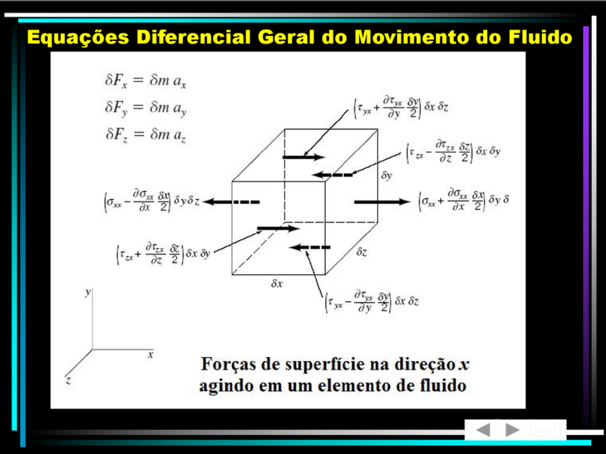

## Slide 5

> **Em linguagem simples:** Juntando gravidade, forças nas faces e aceleração, chegamos às **equações de Cauchy**  -  as mais gerais do movimento de fluido (ou sólido). Incluem viscosidade, mas têm muitas incógnitas; por isso simplificamos depois.

### Equações gerais do movimento (Cauchy)

Válidas para **qualquer meio contínuo**, com **efeitos viscosos incluídos**. Problema: mais incógnitas (tensões + velocidades) do que equações.

$$\rho g_x + \frac{\partial \sigma_{xx}}{\partial x} + \frac{\partial \tau_{yx}}{\partial y} + \frac{\partial \tau_{zx}}{\partial z} = \rho \left( \frac{\partial u}{\partial t} + u \frac{\partial u}{\partial x} + v \frac{\partial u}{\partial y} + w \frac{\partial u}{\partial z} \right)$$

(Equações análogas para $y$ e $z$.)

**O que essa conta significa:**
* Esquerda: gravidade + variação das tensões nas faces
* Direita: massa $\times$ aceleração na direção $x$
* $u$, $v$, $w$  -  velocidades nos eixos $x$, $y$, $z$; $\rho$  -  densidade

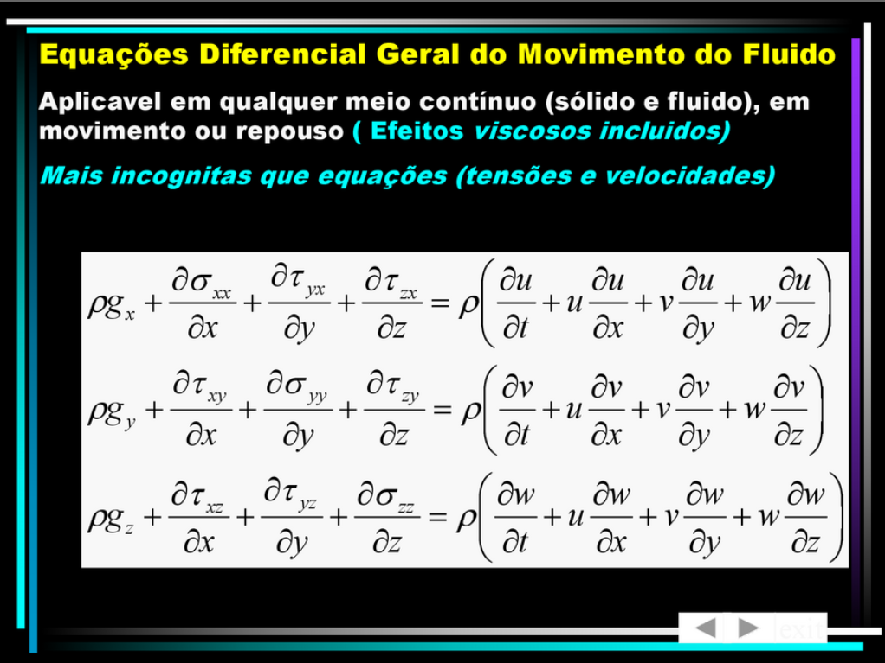

## Slide 6

> **Em linguagem simples:** Sem viscosidade (fluido "sem cola interna"), o cisalhamento some e as tensões normais viram **pressão**. Isso dá as **equações de Euler**  -  mais simples, mas só quando o atrito interno é desprezível.

### Equações de Euler (fluido sem viscosidade)

Sem viscosidade: sem cisalhamento; tensões normais = pressão $p$.

$$\rho g_x - \frac{\partial p}{\partial x} = \rho \left( \frac{\partial u}{\partial t} + u \frac{\partial u}{\partial x} + v \frac{\partial u}{\partial y} + w \frac{\partial u}{\partial z} \right)$$

(Análogas para $y$ e $z$.)

**O que essa conta significa:** $-\partial p/\partial x$  -  o fluido é empurrado de alta para baixa pressão. À direita: aceleração total do fluido.

**Analogia:** Soprar uma bolinha  -  onde a pressão é maior, ela empurra.

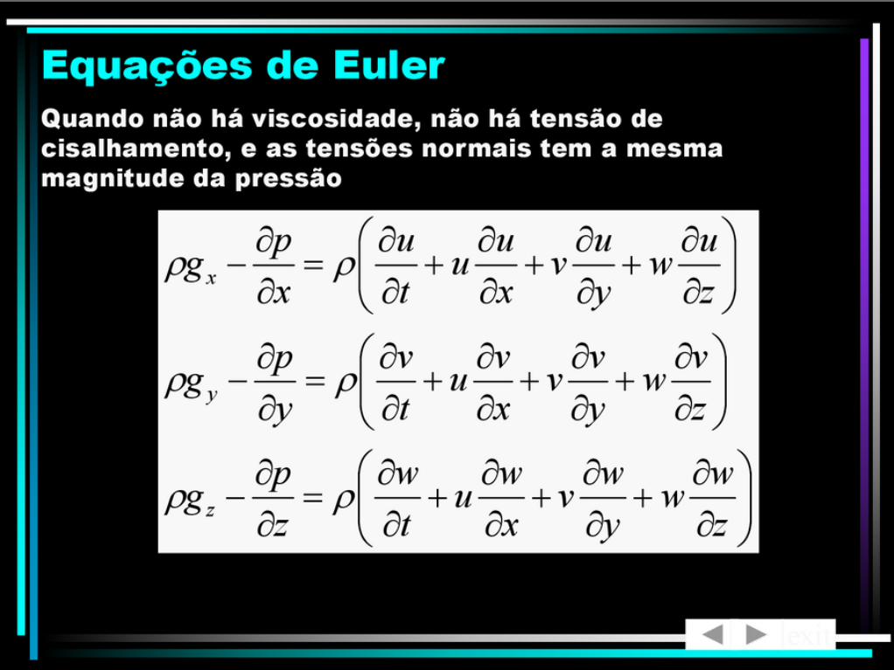

## Slide 7

> **Em linguagem simples:** Uma **linha de corrente** é o caminho que uma partícula seguiria se marcada com tinta. Em fluxo estacionário, essas linhas não se cruzam  -  senão a partícula teria duas direções ao mesmo tempo.

### Linhas de corrente  -  visão geral

* Linhas **tangentes** ao vetor velocidade
* Em escoamento **estacionário**, linhas **não se cruzam**

**Figura 3.1**  -  (a) Escoamento no plano $x$-$z$; (b) coordenadas $s$ (ao longo) e $n$ (normal); raio de curvatura $\mathcal{R}$.

**O que essa conta significa:** $s$  -  distância ao longo da linha; $n$  -  perpendicular; $\mathcal{R}$  -  quão curvada é a linha.

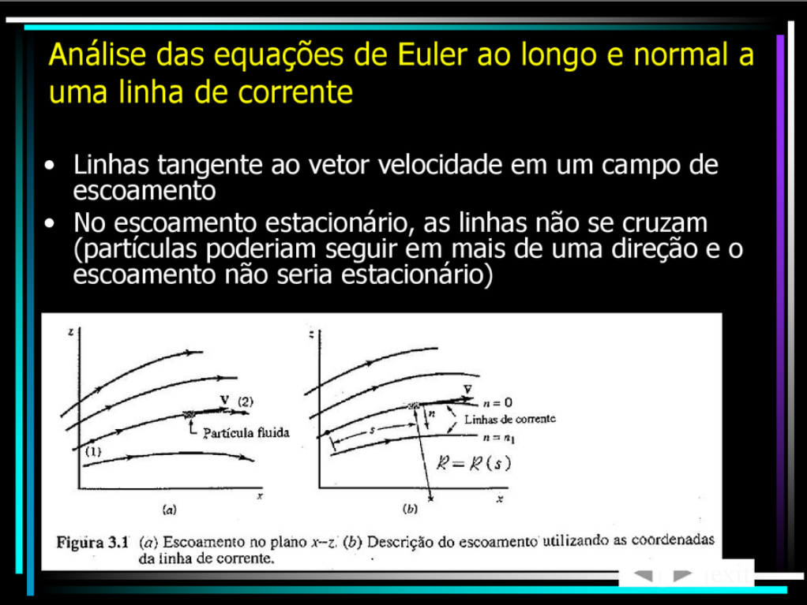

## Slide 8

> **Em linguagem simples:** A linha de corrente é como uma estrada subaquática. Toda partícula que passa por $Q_0$ segue essa mesma estrada  -  desde que o fluxo não mude com o tempo.

### Definição prática

Em escoamento **estacionário**: partículas que passam por $Q_0$ seguem os demais pontos da **mesma** linha de corrente.

**Analogia:** Fio de tinta num rio calmo  -  desenha o caminho da água.

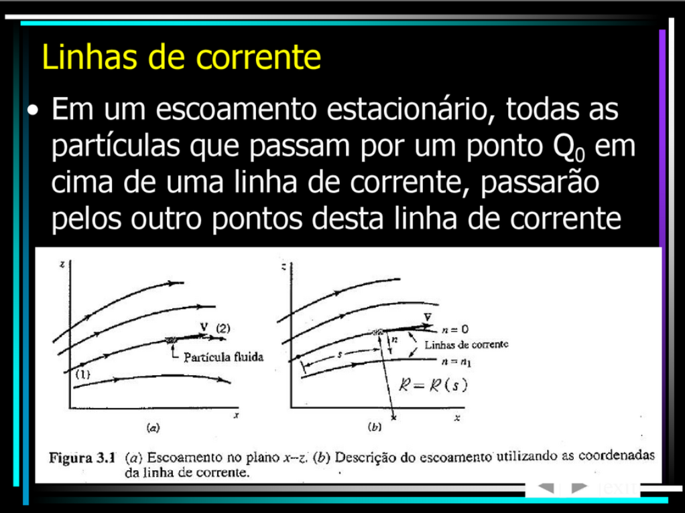

## Slide 9

> **Em linguagem simples:** Seguimos uma partícula ao longo da linha de corrente. Para fluido sem viscosidade, só importam **pressão** e **gravidade**  -  sem atrito, bombas ou perdas.

### Forças ao longo da linha de corrente

Partícula movendo-se na coordenada $s$ (ao longo da linha).

Forças: **pressão** e **gravidade** apenas.

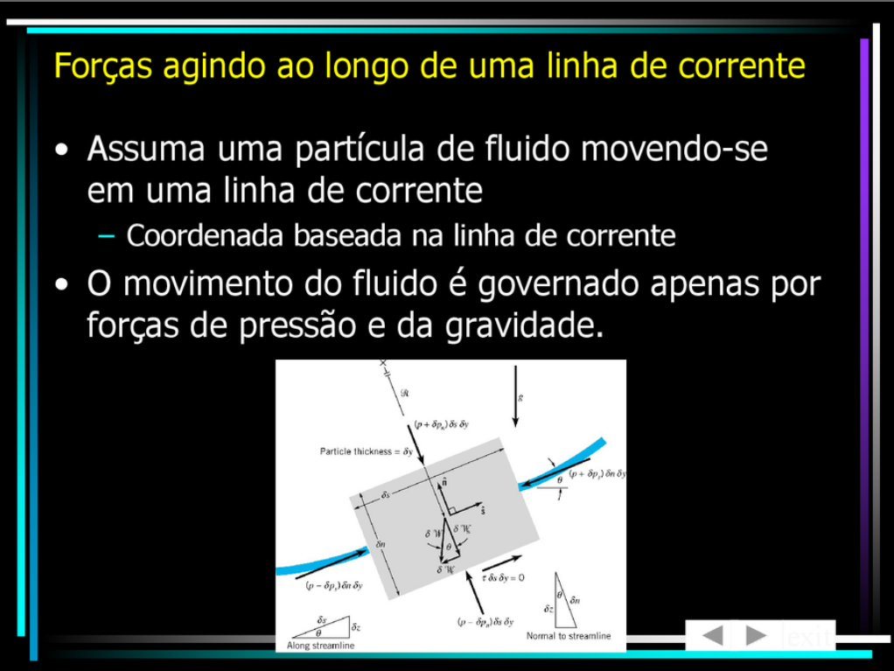

## Slide 10

> **Em linguagem simples:** Diagrama de forças de um pedacinho de fluido alongado no fluxo: pressão nas pontas, peso, e cisalhamento zero no caso ideal.

### Diagrama de forças no elemento

Dimensões: $\delta s$ (ao longo), $\delta n$ (normal), $\delta y$ (espessura).

* Vetores $\hat{s}$, $\hat{n}$; raio $\mathcal{R}$
* Pressão em $s$ e $n$ nas faces opostas
* Peso $\delta \mathcal{W}$ com componentes $\delta \mathcal{W}_s$, $\delta \mathcal{W}_n$
* Cisalhamento $\tau \delta s \delta y = 0$
* $\sin \theta = \delta z / \delta s$; $\cos \theta = \delta z / \delta n$

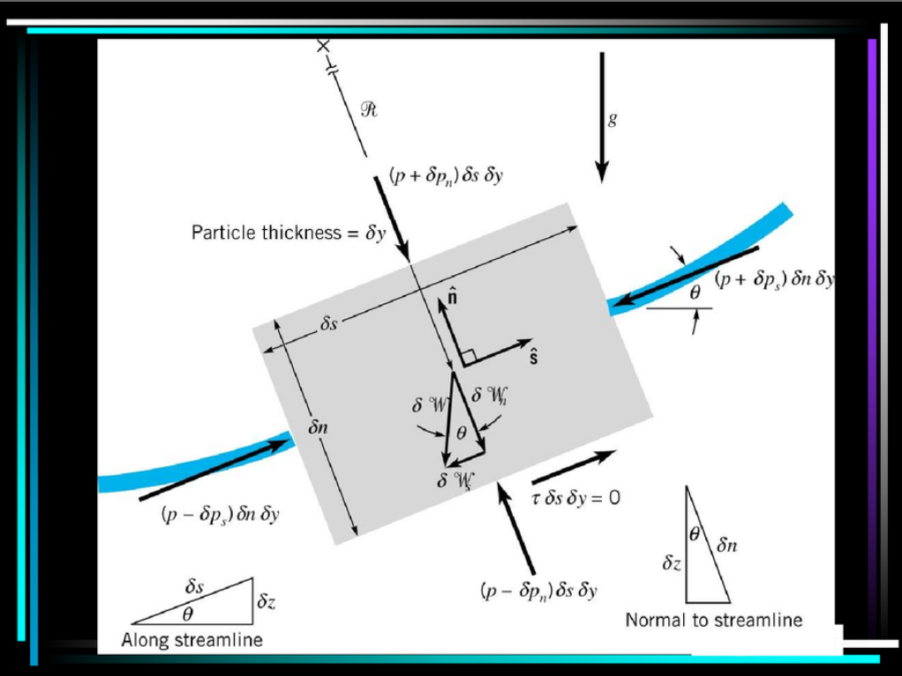

## Slide 11

> **Em linguagem simples:** Segunda lei de Newton na direção do movimento. A aceleração depende de como $V$ muda ao longo do caminho. O peso contribui conforme a inclinação.

### Segunda lei ao longo de $s$

$$\sum \delta F_s = \delta m \, a_s = \rho \delta \forall \, V \frac{\partial V}{\partial s}$$

$$a_s = \frac{\partial V}{\partial s} V$$

Peso na direção $s$:

$$\delta W_s = -\gamma \delta \forall \sin \theta$$

**O que essa conta significa:** $V$  -  velocidade ao longo da linha; $\gamma$  -  peso específico; $\sin \theta$  -  inclinação do trecho.

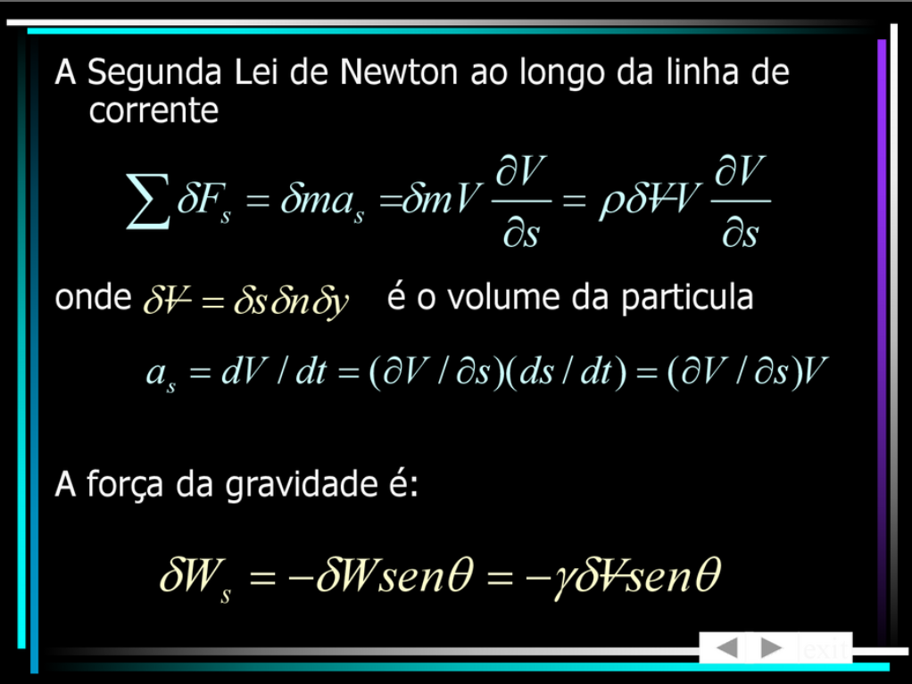

## Slide 12

> **Em linguagem simples:** A pressão nas duas pontas do pedacinho difere um pouco. Somando as forças de pressão, sobra uma força líquida ligada a como a pressão muda ao longo do caminho.

### Força líquida de pressão

$$\delta p_s \approx \frac{\partial p}{\partial s} \frac{\delta s}{2}$$

$$\delta F_{ps} = -\frac{\partial p}{\partial s} \delta \forall$$

**O que essa conta significa:** Pressão aumentando na direção do fluxo gera força **contra** o movimento.

**Analogia:** Balão entre duas mãos  -  empurra para o lado de menor pressão.

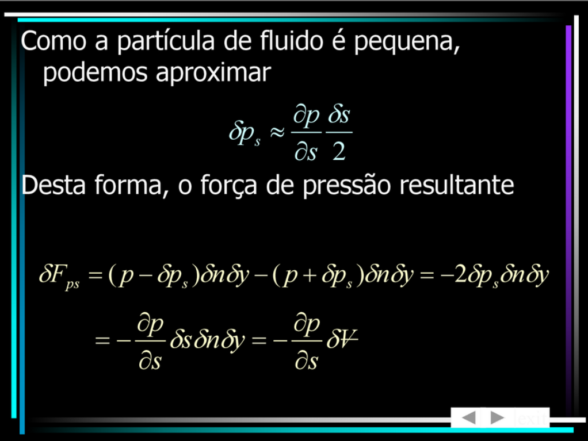

## Slide 13

> **Em linguagem simples:** Somando peso e pressão, obtemos a equação do movimento ao longo da linha. Inclinação + variação de pressão = o que acelera o fluido.

### Equação do movimento na direção $s$

$$\sum \delta F_s = \left( -\gamma \sin \theta - \frac{\partial p}{\partial s} \right) \delta \forall$$

$$-\gamma \sin \theta - \frac{\partial p}{\partial s} = \rho V \frac{\partial V}{\partial s}$$

**O que essa conta significa:** Base para derivar a equação de Bernoulli.

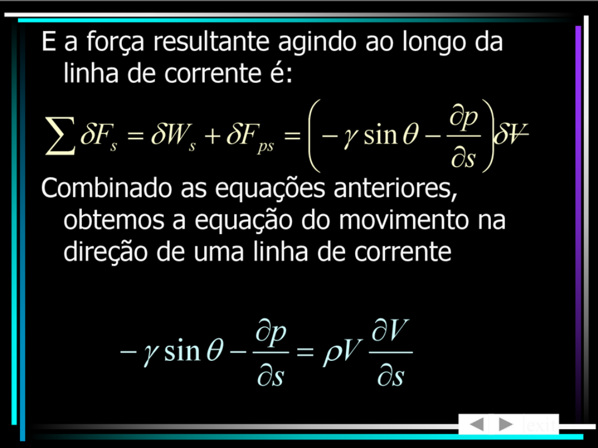

## Slide 14

> **Em linguagem simples:** Reescrevemos usando altura $z$ e a identidade $V \, dV = \frac{1}{2} d(V^2)$, preparando a integração.

### Reorganizando a equação

$\sin \theta = dz / ds$

$$V \frac{dV}{ds} = \frac{1}{2} \frac{d(V^2)}{ds}; \quad \frac{\partial p}{\partial s} = \frac{dp}{ds}$$

$$-\gamma \frac{dz}{ds} - \frac{dp}{ds} = \frac{1}{2} \rho \frac{d(V^2)}{ds}$$

**O que essa conta significa:** Altura, pressão e $V^2$ mudam acopladamente ao longo de $s$.

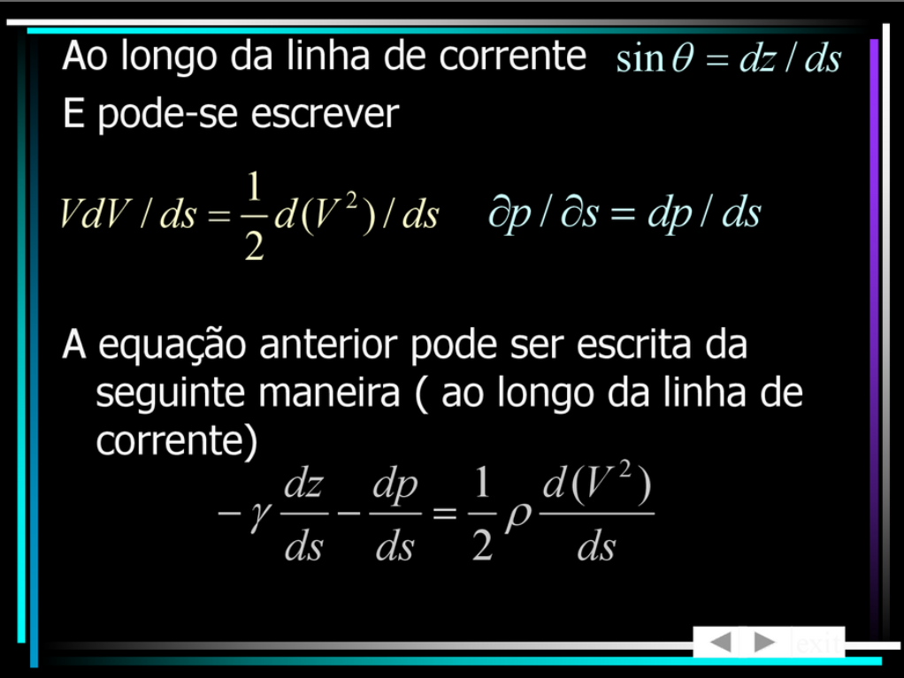

## Slide 15

> **Em linguagem simples:** Integrando, chegamos à **equação de Bernoulli**  -  uma das fórmulas mais usadas da engenharia. Pressão + velocidade + altura (em energia) permanecem constantes ao longo da mesma linha de corrente.

### Equação de Bernoulli

$$dp + \frac{1}{2} \rho \, d(V^2) + \gamma \, dz = 0$$

Integrando (fluido incompressível):

$$p + \frac{1}{2} \rho V^2 + \gamma z = C$$

**O que essa conta significa:**
* $p$  -  energia de pressão; $\frac{1}{2}\rho V^2$  -  energia cinética; $\gamma z$  -  energia potencial
* $C$  -  constante **na mesma linha de corrente**

**Analogia:** Três contas de energia  -  o total não muda, só troca de uma para outra.

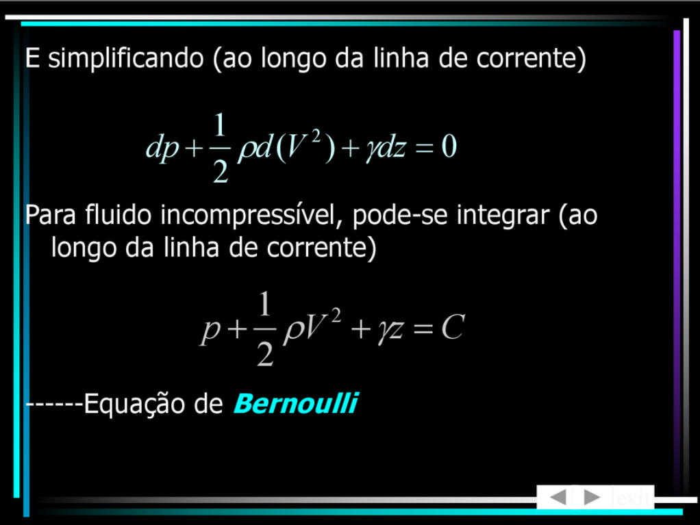

## Slide 16

> **Em linguagem simples:** Agora olhamos **perpendicular** à linha de corrente. Em curvas, a pressão precisa "segurar" o fluido na trajetória  -  como a força centrípeta num carro em curva.

### Forças normais à linha de corrente

Segunda lei na direção normal $n$:

$$\sum \delta F_n = \frac{\delta m \, V^2}{\mathcal{R}} = \frac{\rho \delta \forall \, V^2}{\mathcal{R}}$$

**O que essa conta significa:** $V^2/\mathcal{R}$  -  aceleração centrípeta; $\mathcal{R}$  -  raio de curvatura (curva mais fechada $\rightarrow$ maior aceleração).

**Analogia:** Carro em curva  -  precisa de força para o centro; no fluido, essa força vem da diferença de pressão.

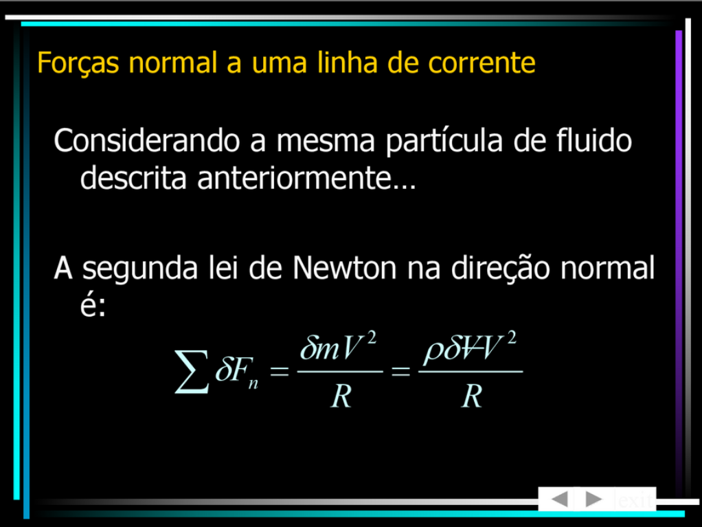

## Slide 17

> **Em linguagem simples:** Na direção perpendicular ao fluxo, gravidade e pressão equilibram a "força centrífuga" do fluido em curva. Em trechos retos e horizontais, isso se simplifica muito.

### Equação do movimento na direção $n$

$$\sum \delta F_n = \left( -\gamma \cos \theta - \frac{\partial p}{\partial n} \right) \delta \forall$$

$$-\gamma \frac{dz}{dn} - \frac{dp}{dn} = \frac{\rho V^2}{\mathcal{R}}$$

ou

$$p + \gamma z + \int \frac{\rho V^2}{\mathcal{R}} \, dn = C$$

**O que essa conta significa:** Em curvas, a pressão do lado de fora da curva tende a ser **maior**  -  é o que mantém o fluxo na trajetória.

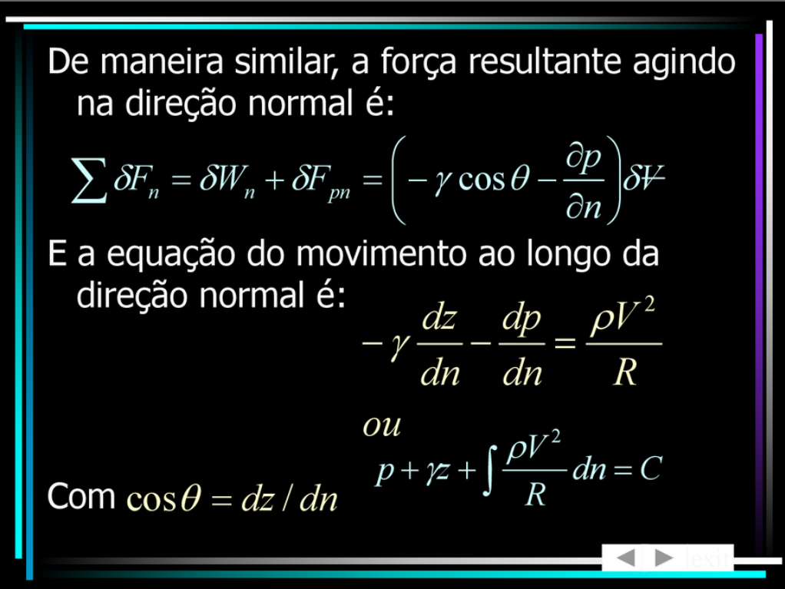

## Slide 18

> **Em linguagem simples:** Dividindo Bernoulli pelo peso específico $\gamma$, cada termo vira uma "altura equivalente"  -  mais fácil de visualizar e medir.

### Interpretação física da Bernoulli

Dividindo por $\gamma$:

$$\frac{p}{\gamma} + \frac{V^2}{2g} + z = C$$

Cada termo tem dimensão de **comprimento** (metros) e representa um tipo de **carga** (energia por peso).

**O que essa conta significa:**
* $p/\gamma$  -  carga de pressão (metros de coluna d'água)
* $V^2/(2g)$  -  carga de velocidade
* $z$  -  carga de elevação (altura)

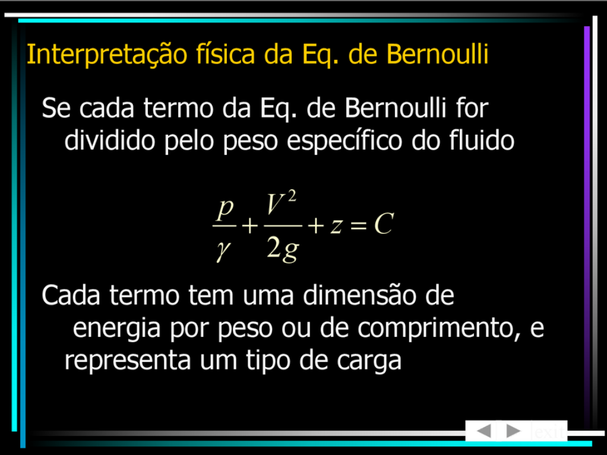

## Slide 19

> **Em linguagem simples:** Os três termos de Bernoulli são três "formas" de energia que se transformam uma na outra. A soma é constante  -  é conservação de energia para um fluido ideal.

### Os três tipos de carga

**Carga de elevação** ($z$)  -  energia potencial (altura)

**Carga de pressão** ($p/\gamma$)  -  altura de coluna d'água que geraria a pressão $p$

**Carga de velocidade** ($V^2/2g$)  -  altura de queda livre para atingir velocidade $V$

A soma é **constante** ao longo de uma linha de corrente.

**Analogia:** Tobogã d'água  -  no topo: muita altura, pouca velocidade; embaixo: o contrário.

Bernoulli é uma **equação de conservação de energia**.

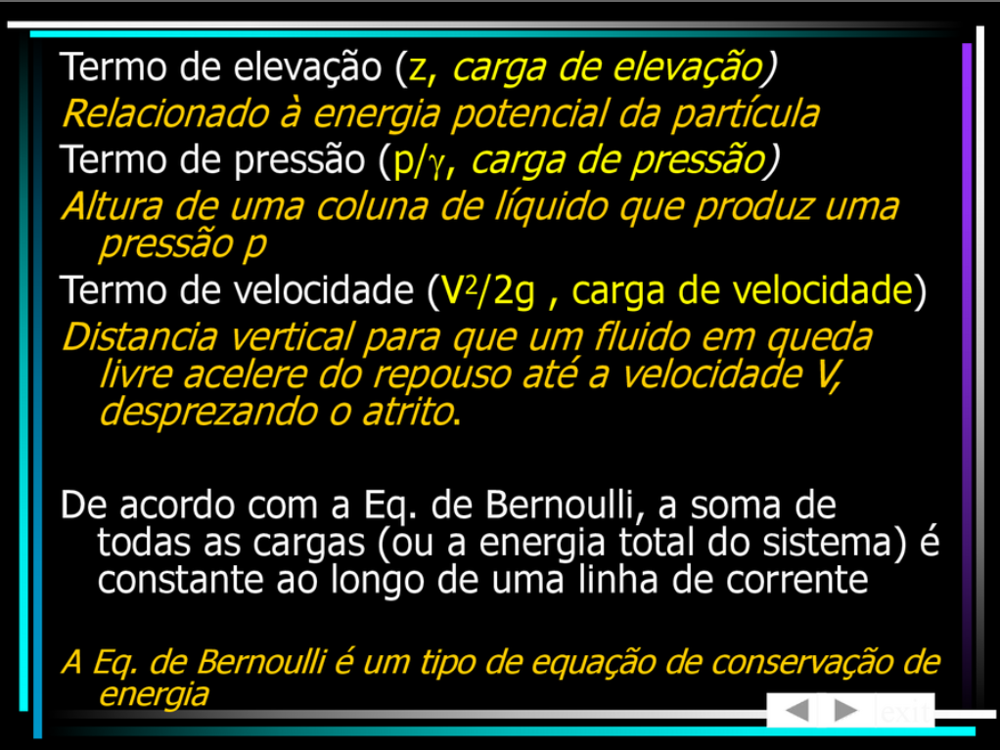

## Slide 20

> **Em linguagem simples:** Engenheiros dividem a pressão em "pedaços": estática (medida parada junto ao fluxo), dinâmica (por causa da velocidade) e hidrostática (por causa da altura).

### Pressão estática, dinâmica e total

Na Bernoulli:

* $p$  -  **pressão estática** (medida "viajando com" o fluido)
* $\gamma z$  -  **pressão hidrostática** (efeito da altura)
* $\rho V^2 / 2$  -  **pressão dinâmica** (efeito da velocidade)

**Estática** = medida como se você se movesse junto com o fluido, sem velocidade relativa.

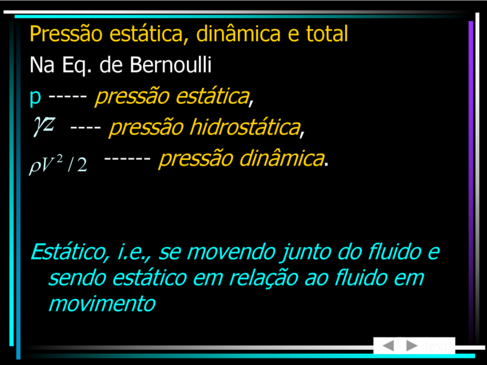

## Slide 21

> **Em linguagem simples:** Para medir pressão estática, usamos um tubo com furo lateral: o fluido naquele trecho está parado em relação à parede, e a pressão obedece à lei da hidrostática entre os pontos.

### Medindo pressão estática

Fluido parado entre (3) e (4); entre (1) e (3) move-se com mesma velocidade (sem cisalhamento).

$$p_1 = p_3 + \gamma h_{3-1}$$

$$p_3 = p_0 + \gamma h_{4-3}$$

$$p_1 = p_0 + \gamma h$$

**O que essa conta significa:** A diferença de altura $h$ entre os pontos traduz-se em diferença de pressão $\gamma h$.

**Analogia:** Dois pontos numa piscina em alturas diferentes  -  o mais fundo tem mais pressão.

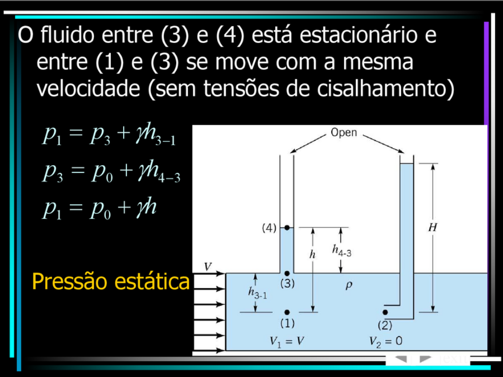

## Slide 22

> **Em linguagem simples:** Se o fluido bate de frente num obstáculo e **para** (velocidade zero), a pressão sobe. Essa pressão máxima é a **pressão de estagnação**  -  soma da estática com a dinâmica.

### Ponto de estagnação

No ponto 2: $V_2 = 0$  -  **ponto de estagnação**

Bernoulli entre 1 e 2:

$$p_2 = p_1 + \frac{1}{2} \rho V_1^2$$

**Pressão de estagnação**

**O que essa conta significa:** Toda a energia cinética virou pressão extra no ponto onde o fluxo parou.

**Analogia:** Água batendo na palma da mão aberta  -  você sente mais "empurrão" do que no fluxo lateral.

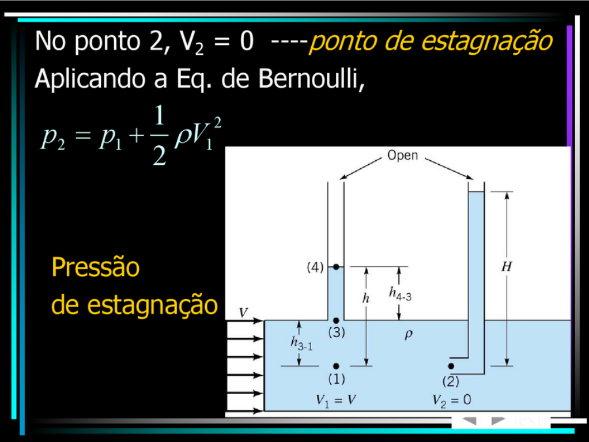

## Slide 23

> **Em linguagem simples:** O termo $\gamma z$ não é uma pressão real medida num manômetro  -  é a parcela de energia ligada à **altura**. Sobe de andar, muda essa parcela.

### Pressão hidrostática (termo de altura)

Não é pressão medida diretamente  -  representa a variação de energia potencial por causa da **altura** $z$.

**Analogia:** Subir escada com balde d'água  -  você "carrega" energia potencial; no fluido, isso aparece no termo $\gamma z$.

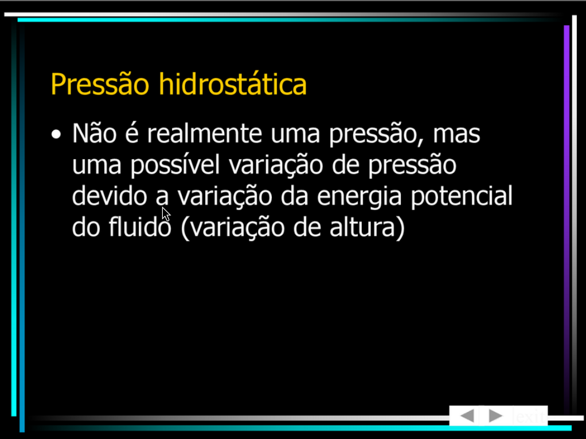

## Slide 24

> **Em linguagem simples:** Somando estática + dinâmica + hidrostática, temos a **pressão total**. Bernoulli diz que essa soma não muda ao longo da mesma linha de corrente.

### Pressão total

$$p + \frac{1}{2} \rho V^2 + \gamma z = p_T = C$$

**Pressão total** $p_T$ constante ao longo da linha de corrente.

**O que essa conta significa:** Se a velocidade aumenta, a pressão estática tende a **cair** para manter $p_T$ constante.

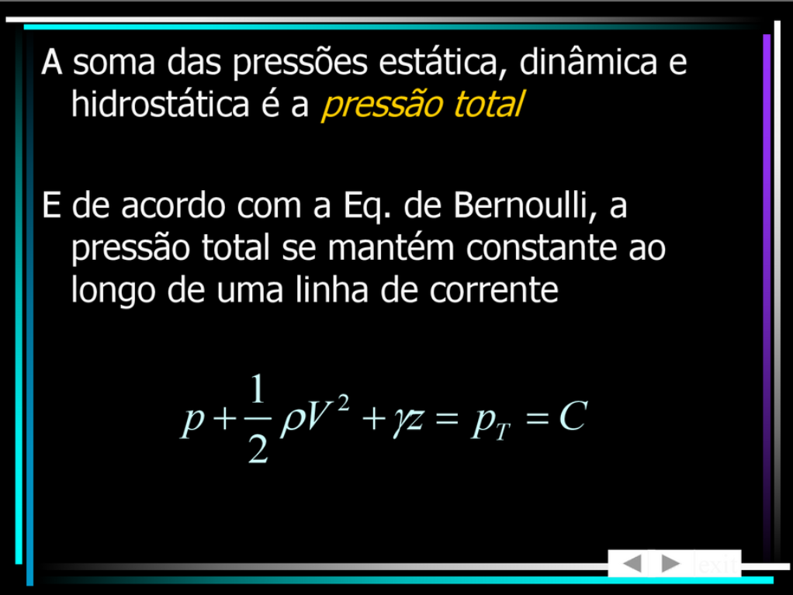

## Slide 26

> **Em linguagem simples:** Bernoulli é poderosa, mas **não vale para tudo**. Só use quando o fluido é incompressível, o fluxo estável, sem viscosidade significativa e sem bombas ou perdas no trecho.

### Restrições ao uso da Bernoulli

a) Fluidos **incompressíveis** (volume quase não muda com pressão)

b) Fluxo **estacionário** (não muda com o tempo)

c) Fluidos **não viscosos** (atrito interno desprezível)

d) Sem **perdas de carga** e sem **bombas** no trecho analisado

**Analogia:** Receita de bolo  -  funciona só se você seguir as condições (forno certo, ingredientes certos).

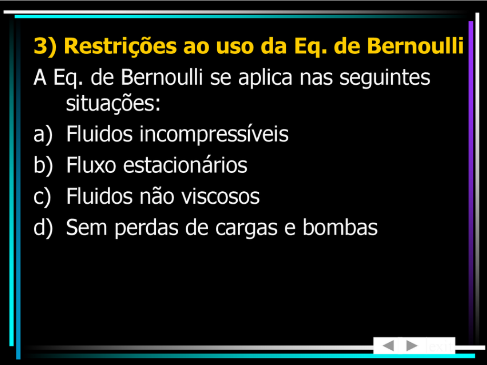

## Slide 27

> **Em linguagem simples:** Gases normalmente são compressíveis, mas para velocidades bem abaixo do som podemos tratá-los como incompressíveis. O critério usa o número de Mach.

### Fluido incompressível e número de Mach

Gás como incompressível se **Mach < 0,3**:

$$Ma = V/c; \quad c = \sqrt{kRT}$$

Exemplo: $c \approx 332$ m/s a 15$^\circ$C $\rightarrow$ $V \approx 1195$ km/h ainda é "incompressível" nesse critério.

**O que essa conta significa:**
* $Ma$  -  razão entre velocidade do fluxo e velocidade do som
* $c$  -  velocidade do som no gás; $k$, $R$, $T$  -  propriedades do gás e temperatura

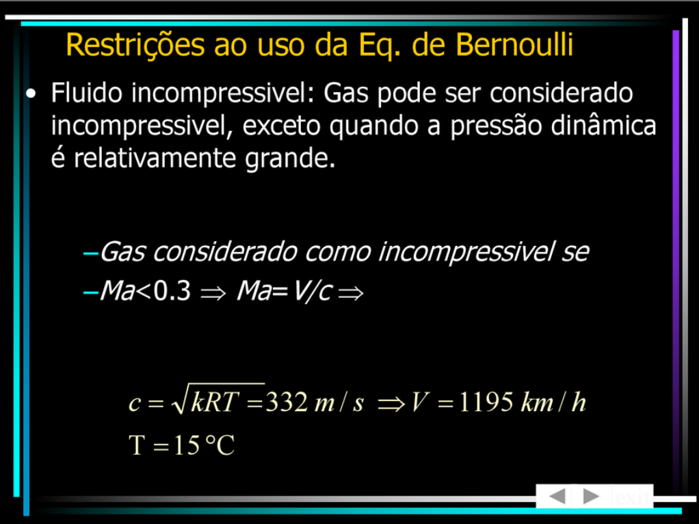

## Slide 28

> **Em linguagem simples:** Fluxo **estacionário** = o padrão de velocidade não muda com o tempo. **Transiente** = muda (como encher uma mangueira). Bernoulli clássica exige estacionário.

### Estacionário vs. transiente

* Estacionário: $V = f(s)$ apenas
* Transiente: $V = f(s, t)$

Aceleração ao longo de $s$:

Estacionário: $a_s = V \frac{\partial V}{\partial s}$

Transiente: $a_s = V \frac{\partial V}{\partial s} + \frac{\partial V}{\partial t}$

**O que essa conta significa:** O termo extra $\partial V/\partial t$ aparece quando a velocidade muda com o tempo  -  Bernoulli simples não inclui isso.

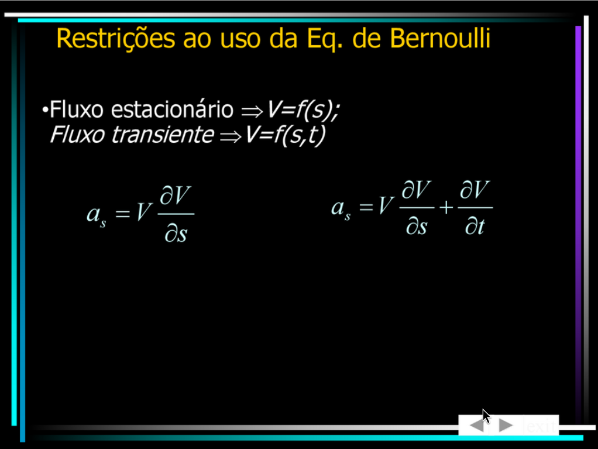

## Slide 29

> **Em linguagem simples:** Viscosidade, perdas de carga e bombas **não** entraram na derivação de Bernoulli. Se houver atrito nas paredes ou bomba no meio, use a Bernoulli **estendida** (com termo de perda $h_L$ e bomba $h_{eixo}$).

### Sem viscosidade, perdas ou bombas

A equação geral considerou só **pressão** e **gravidade** ao derivar Bernoulli.

Na prática real (tubos, válvulas, curvas): há atrito $\rightarrow$ precisa de correções.

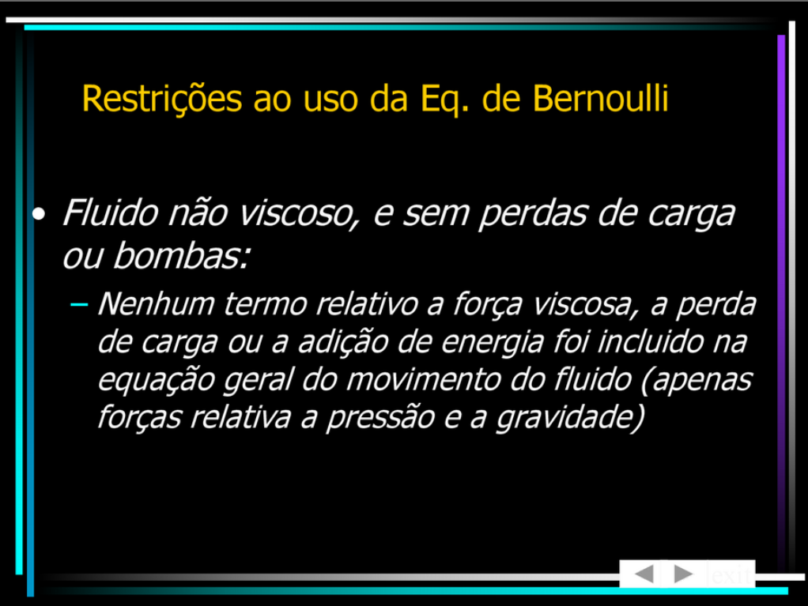

## Slide 30

> **Em linguagem simples:** A forma mais usada: compare **dois pontos** na mesma linha de corrente. O que um perde em pressão, ganha em velocidade ou altura  -  e vice-versa.

### Bernoulli entre dois pontos

$$p_1 + \frac{1}{2}\rho V_1^2 + \gamma z_1 = p_2 + \frac{1}{2}\rho V_2^2 + \gamma z_2$$

**O que essa conta significa:** Escolha dois pontos no mesmo fio de fluxo; a soma dos três termos é igual nos dois.

**Analogia:** Conta bancária com três cofres  -  transferência entre cofres, saldo total fixo.

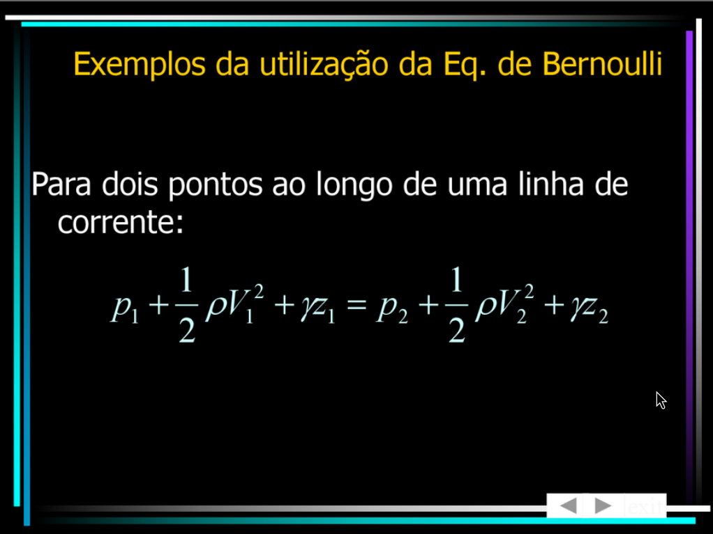

## Slide 31

> **Em linguagem simples:** Água saindo de um buraco num tanque forma um **jato livre**  -  a pressão na saída é a mesma do ar (atmosférica). A altura da água "vira" velocidade na saída: quanto mais fundo o furo, mais rápido o jato.

### Jatos livres

Na saída (ponto 2): pressão = pressão atmosférica.

Pontos: **(1)** superfície livre; **(2)** centro do orifício; **(3)** fundo; **(4)** borda; **(5)** no jato abaixo.

$$p_1 + \frac{1}{2} \rho V_1^2 + \gamma z_1 = p_2 + \frac{1}{2} \rho V_2^2 + \gamma z_2$$

Com $V_1 \approx 0$ e $p_1 \approx p_2$:

$$\gamma h = \frac{1}{2} \rho V_2^2 \Rightarrow V_2 = \sqrt{2gh}$$

**O que essa conta significa:**
* $h$  -  distância vertical da superfície até o orifício
* $V_2$  -  velocidade do jato (Torricelli)
* $g$  -  gravidade ($\approx$ 9,81 m/s$^2$)

**Analogia:** Furar o fundo de um balde  -  o jato sai mais forte quanto mais cheio está.

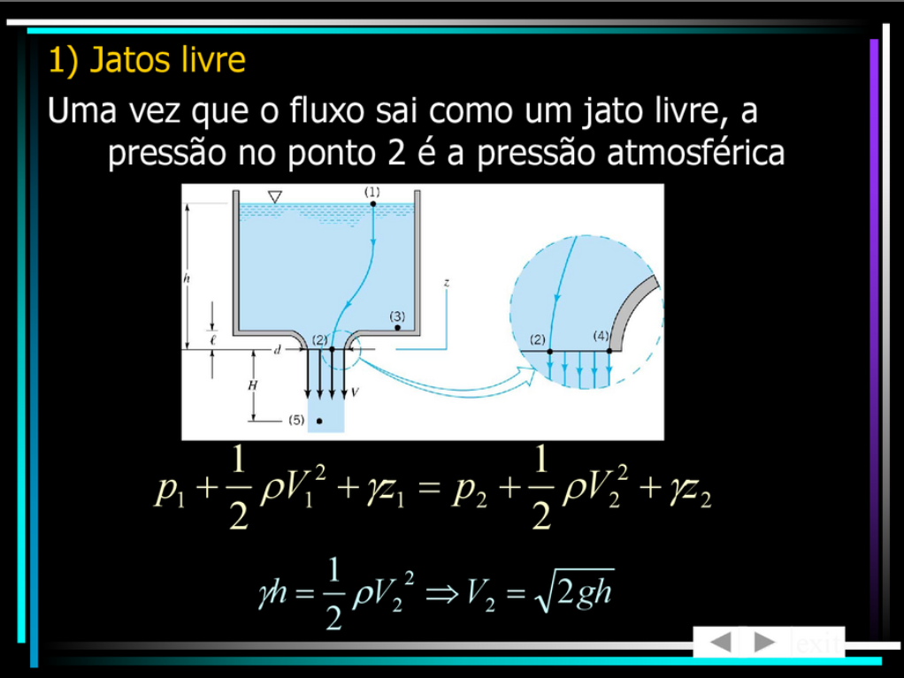

## Slide 33

> **Em linguagem simples:** Exercício que combina Bernoulli com **queda livre** do jato. A água sai horizontalmente e cai como projétil; medindo distâncias $L$ e alturas, achamos onde o jato atinge o solo.

### Exercício  -  jato com trajetória curva

Bernoulli entre pontos + cinemática de queda livre.

Resultados principais:

$$V_1 = \sqrt{2g(h_2 - h_1)}; \quad V_2 = \sqrt{2gh_2}$$

$$L = 2 \sqrt{h_2(h_2 - h_1)}$$

**O que essa conta significa:** A distância horizontal $L$ depende das cotas $h_1$, $h_2$  -  sem medir velocidade diretamente, só geometria.

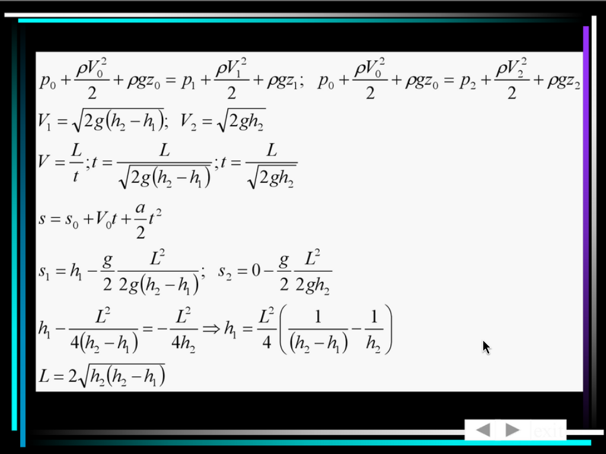

## Slide 34

> **Em linguagem simples:** Em tubos e dutos, o fluido não cai no ar  -  está **confinado**. A área do tubo muda a velocidade: tubo estreito $\rightarrow$ mais rápido. A **continuidade** (conservação de massa) liga as velocidades; Bernoulli liga as pressões.

### Escoamentos confinados

* Fluido confinado  -  pressão ou velocidade desconhecidas em alguns pontos
* Use **continuidade** + **Bernoulli** juntas

**Continuidade** (incompressível):

$$\dot{m} = \rho A V \Rightarrow A_1 V_1 = A_2 V_2$$

**O que essa conta significa:**
* $A$  -  área da seção transversal
* $\dot{m}$  -  vazão mássica (kg/s)
* Tubo afunila: mesma vazão volumétrica $Q = AV$ $\rightarrow$ área menor, velocidade maior

**Analogia:** Mangueira de jardim apertada no bico  -  água acelera.

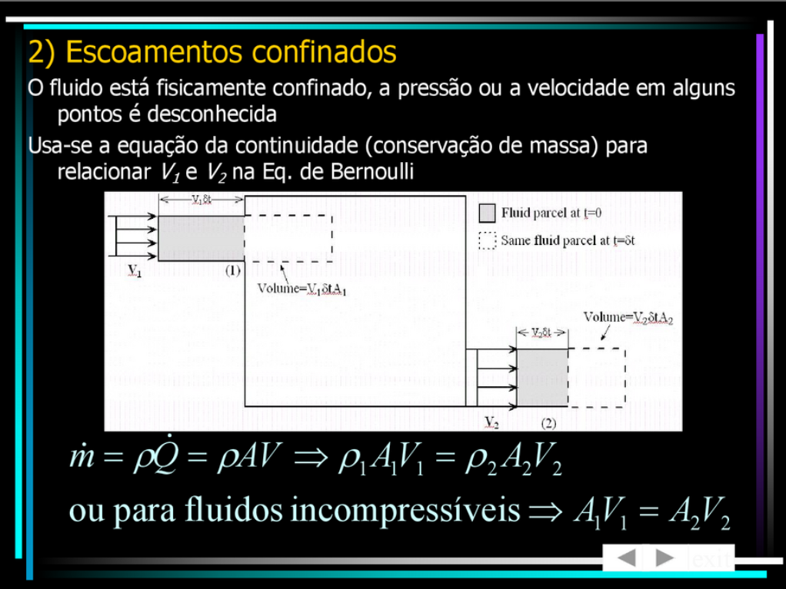

## Slide 37

> **Em linguagem simples:** **Cavitação** é quando a pressão cai tanto que o líquido "ferve" e formam bolhas de vapor  -  perigoso para bombas e hélices. Acontece em curvas (aceleração centrífuga) ou onde o tubo **estreita** (velocidade sobe, pressão cai).

### Cavitação

Ocorre quando pressão $\leq$ pressão de vapor do fluido (ebulição local).

Causas comuns:
* **Curvas**  -  pressão menor no lado externo da curva
* **Contração**  -  velocidade aumenta, pressão diminui (Bernoulli)

Equação normal à linha de corrente:

$$p + \gamma z + \int \frac{\rho V^2}{\mathcal{R}} \, dn = C$$

**Analogia:** Abrir garrafa de refrigerante depressa  -  bolhas aparecem; em tubulação, bolhas colapsam e corroem metal.

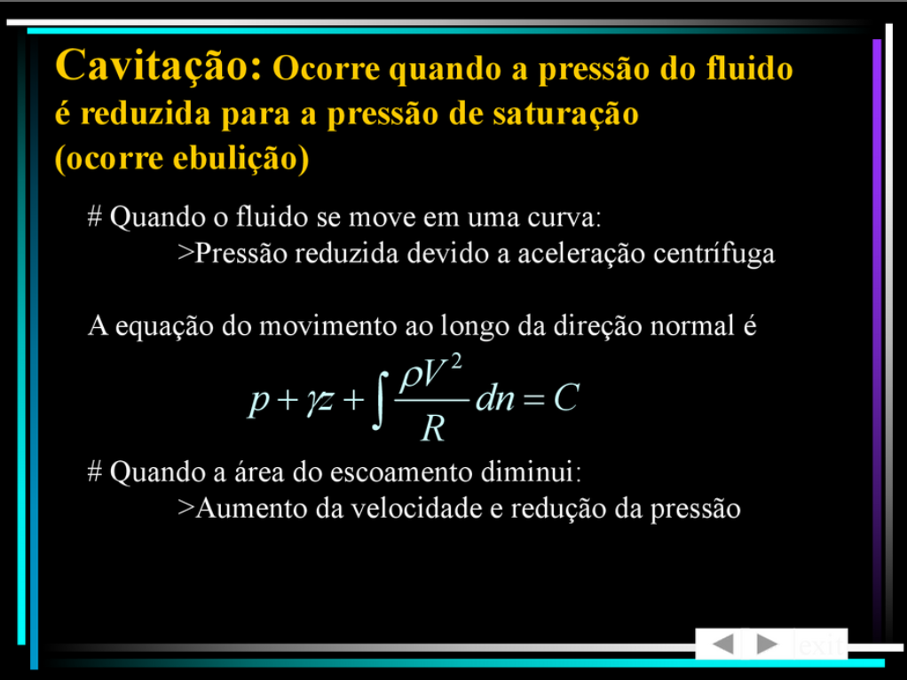

## Slide 39

> **Em linguagem simples:** Orifício, bocal e venturi **estreitam** o fluxo de propósito para medir vazão. Medindo a diferença de pressão entre largo e estreito, calculamos quanto fluido passa.

### Medição de vazão e velocidade

Dispositivos: **orifício**, **bocal (nozzle)**, **venturi**

Bernoulli + continuidade:

$$P_1 + \frac{1}{2} \rho V_1^2 = P_2 + \frac{1}{2} \rho V_2^2$$

$$Q = A_1 V_1 = A_2 V_2$$

$$Q = A_2 \sqrt{\frac{2(P_1 - P_2)}{\rho[1 - (A_2 / A_1)^2]}}$$

**O que essa conta significa:**
* $P_1 - P_2$  -  diferença de pressão medida entre seções
* $A_1$, $A_2$  -  áreas da tubulação e da garganta
* Quanto maior $\Delta P$, maior a vazão $Q$

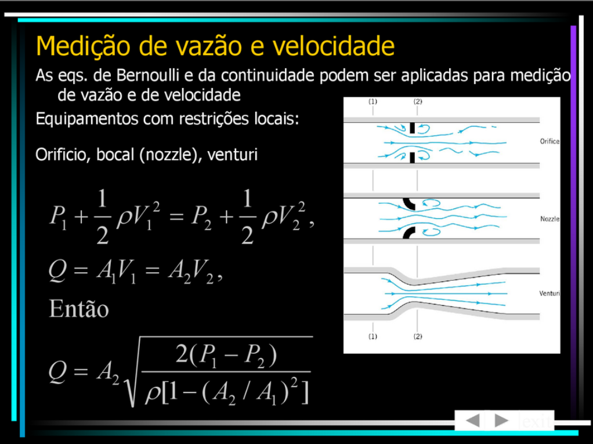

## Slide 41

> **Em linguagem simples:** Exercício: medir vazão observando como o jato **curva** ao cair (gravidade). Medindo $L$ e $x$, calculamos $Q$ sem venturi  -  só geometria e tempo de queda.

### Exercício 3.21  -  vazão pelo jato curvado

Enunciado: jato de tubo em ambiente aberto; deflexão medida por $L$ e $x$.

$$Q = \frac{\pi D^2 L g^{1/2}}{2^{5/2} x^{1/2}}$$

**O que essa conta significa:** $D$  -  diâmetro do tubo; $L$  -  comprimento horizontal; $x$  -  queda vertical; $g$  -  gravidade.

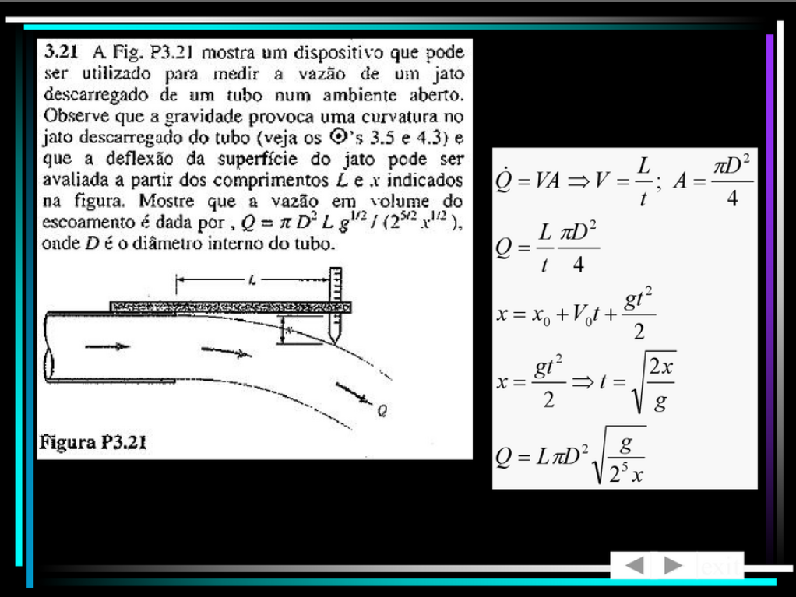

## Slide 43

> **Em linguagem simples:** O **tubo de Pitot** mede velocidade comparando pressão total (bico de frente ao fluxo) com pressão estática (furo lateral). A diferença vem só da velocidade.

### Tubo de Pitot estático

Pontos: **(1)** estática na parede; **(2)** estagnação na ponta; **(3)** saída estagnação; **(4)** saída estática.

$$p_3 = p + \frac{1}{2} \rho V^2$$

$$p_4 = p$$

$$p_3 - p_4 = \frac{1}{2} \rho V^2$$

$$V = \sqrt{\frac{2(p_3 - p_4)}{\rho}}$$

**O que essa conta significa:** Diferença de pressão no manômetro $\rightarrow$ velocidade do escoamento.

**Analogia:** Colocar a mão de frente ao vento (total) vs. de lado (estática)  -  sente a diferença.

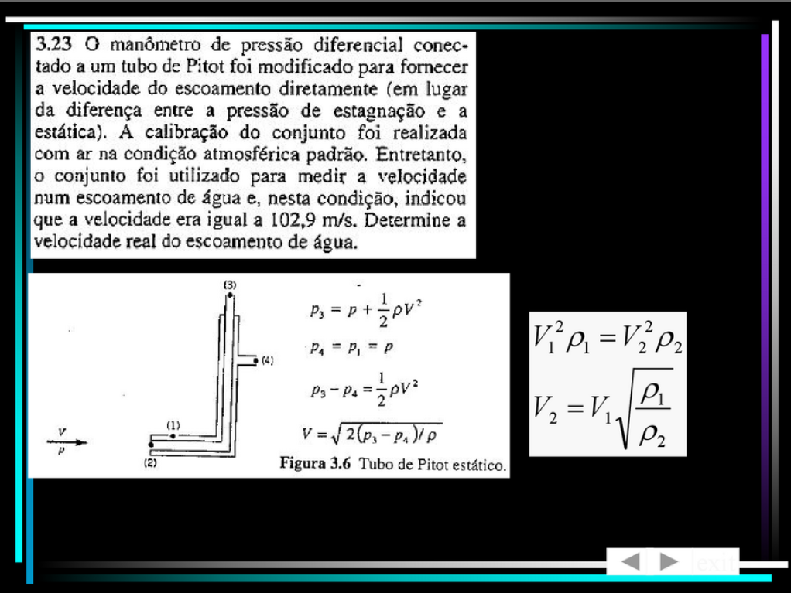

## Slide 44

> **Em linguagem simples:** Mangueira drenando piscina  -  Bernoulli entre superfície e saída da mangueira. A diferença de altura gera a velocidade; multiplicando pela área, temos a vazão.

### Exercício 3.43  -  mangueira na piscina

Mangueira 10 m, $D = 15$ mm; profundidade 0,2 m; queda de cota 0,23 m.

$$V_1 = \sqrt{2g(z_0 - z_1)}$$

$$\dot{Q} = V_1 A$$

**O que essa conta significa:** Desprezando atrito (Bernoulli ideal), só a diferença de altura importa para a velocidade na saída.

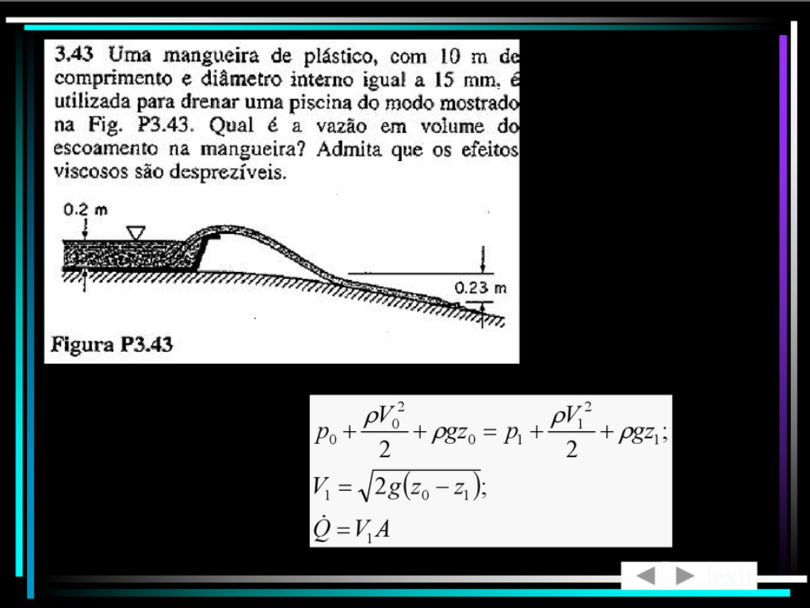

## Slide 46

> **Em linguagem simples:** Tubo que **afunila** ou **alarga** muda velocidade e pressão. Se a pressão no trecho estreito cai demais, pode haver cavitação  -  solução: aumentar diâmetro montante ou reduzir o estreitamento.

### Exercício  -  tubo com mudança de diâmetro

Bernoulli + continuidade entre seções:

$$V_2 = \sqrt{2gh}; \quad V_1 = \frac{D_2^2}{D_1^2} \sqrt{2gh}$$

Relação de cavitacao:

$$h = \frac{P_0 - P_1}{\gamma} \left( \frac{D_1^4}{D_2^4 - D_1^4} \right)$$

Para **evitar cavitação**: aumentar $P_1$ ou ajustar diâmetros ($V_1 D_1^2 = V_2 D_2^2$).

**O que essa conta significa:** Garganta estreita $\rightarrow$ alta velocidade $\rightarrow$ baixa pressão local.

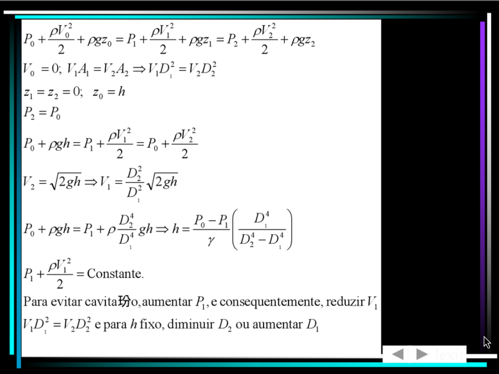

## Slide 48

> **Em linguagem simples:** Exercício com tubo inclinado e fluidos de densidades diferentes no manômetro. A diferença de densidade aparece na fórmula final da vazão.

### Exercício  -  tubo inclinado e manômetro

Cadeia hidrostática entre pontos + Bernoulli.

$$\left( \frac{\rho_w}{\rho} - 1 \right) 2 g \sin \theta \, L = V_2^2 - V_1^2$$

$$\dot{Q} = \frac{D_2^2 D_1^2}{2} \sqrt{\left( \frac{\rho_w}{\rho} - 1 \right) \frac{\pi^2 g \sin \theta \, L}{2(D_1^4 - D_2^4)}}$$

**O que essa conta significa:** $\rho_w$  -  densidade do fluido no manômetro; $\theta$  -  inclinação; $L$  -  comprimento inclinado.

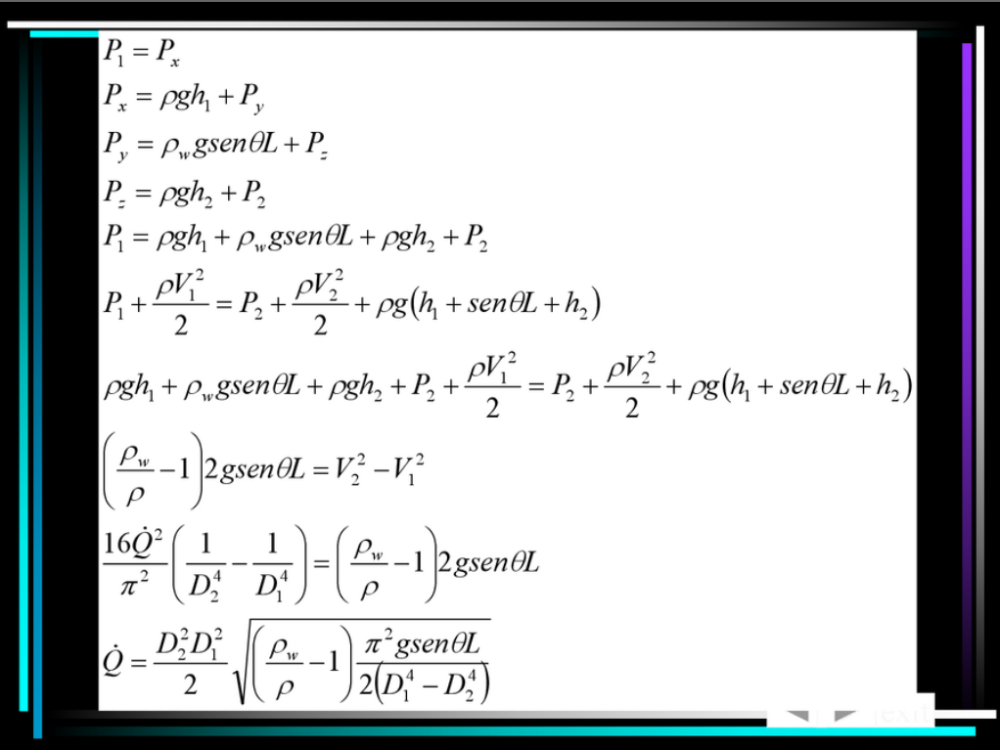

## Slide 49

> **Em linguagem simples:** Relógio de água antigo: o nível desce a velocidade constante se o vaso tiver formato certo. Bernoulli + continuidade definem o raio $R(z)$ do vaso.

### Exercício 3.76  -  relógio de água

Velocidade da superfície $u_1 = 0{,}10$ m/h; orifício $d = 5$ mm.

$$R^2 u_1 = \frac{d^2}{4} u_2$$

$$R = \frac{d}{2} \sqrt[4]{\frac{2gz}{u_1^2} + 1}$$

**O que essa conta significa:** O raio do vaso cresce com $z$ de forma específica para manter $u_1$ constante.

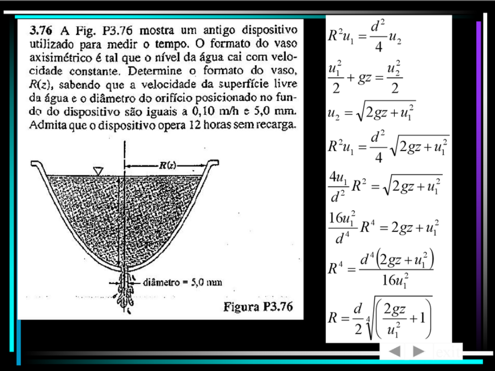

## Slide 50

> **Em linguagem simples:** Hovercraft (colchão de ar): o ventilador empurra ar para baixo; o ar escapa pela fresta e a pressão interna sustenta o peso do veículo. Bernoulli liga pressão interna, velocidade na fresta e vazão necessária.

### Exercício 3.88  -  colchão de ar

Equilíbrio: força para cima = peso.

$$P_i = P_e + \frac{mg}{a \times b}$$

$$P_i = P_e + \frac{\rho V_e^2}{2}$$

$$\dot{Q} = 2(a+b)\varepsilon \sqrt{\frac{2mg}{\rho(a \times b)}}$$

**O que essa conta significa:**
* $m$  -  massa do veículo; $a \times b$  -  área da base
* $\varepsilon$  -  espessura da fresta de escape
* $\dot{Q}$  -  vazão de ar necessária para sustentar o peso

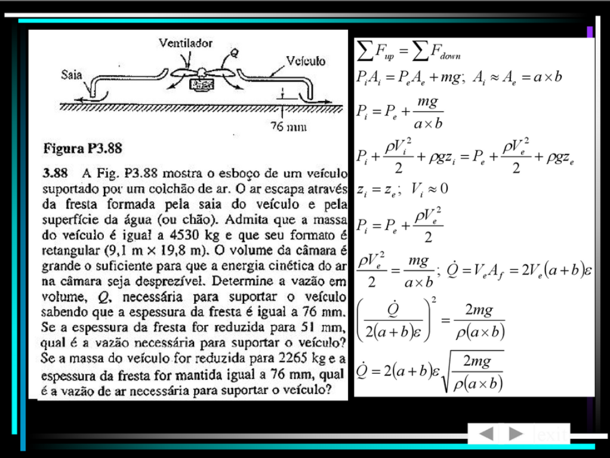

## Slide 51

> **Em linguagem simples:** Sustentar o hovercraft não basta  -  o ventilador precisa de **potência** para vencer a diferença de pressão e mover o ar. A Bernoulli estendida dá a potência do eixo $\dot{W}$.

### Potência do ventilador (hovercraft)

Bernoulli estendida com altura de bomba $h_{eixo}$:

$$\frac{p_e}{\gamma} + \frac{V_e^2}{2g} + z_e + h_{eixo} = \frac{p_i}{\gamma} + \frac{V_i^2}{2g} + z_i + h_L$$

Com $V_i \approx 0$ e $z_i = z_e$:

$$\dot{W} = \dot{Q}(p_i - p_e)$$

**O que essa conta significa:** Potência = vazão $\times$ diferença de pressão (em watts: J/s).

**Analogia:** Bomba de bicicleta  -  quanto mais ar por segundo e mais força, mais potência nas mãos.

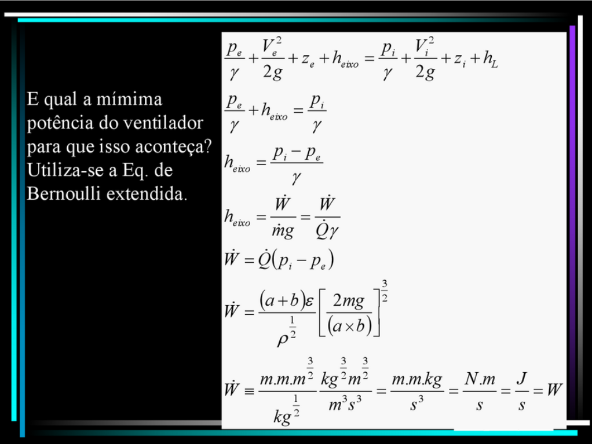

## Slide 52

> **Em linguagem simples:** Quando há atrito e mudança de diâmetro, a Bernoulli **estendida** inclui **perda de energia**. Este exercício calcula a energia perdida numa curva de tubo.

### Exercício  -  perda de energia numa curva

Vazão mássica $\dot{m} = 1000$ lbm/s; $\Delta p = 5$ psi na curva; diâmetros 12 in. e 24 in.

$$\frac{p_s}{\rho} + \frac{V_s^2}{2} + gz_s = \frac{p_e}{\rho} + \frac{V_e^2}{2} + gz_e + w_{\text{liq.eixo}} - \text{perda}$$

$$\text{perda} = \frac{p_e}{\rho} + \frac{V_e^2}{2} - \frac{p_s}{\rho} - \frac{V_s^2}{2}$$

**O que essa conta significa:** "Perda" = energia que virou calor por atrito e turbulência, por unidade de massa.

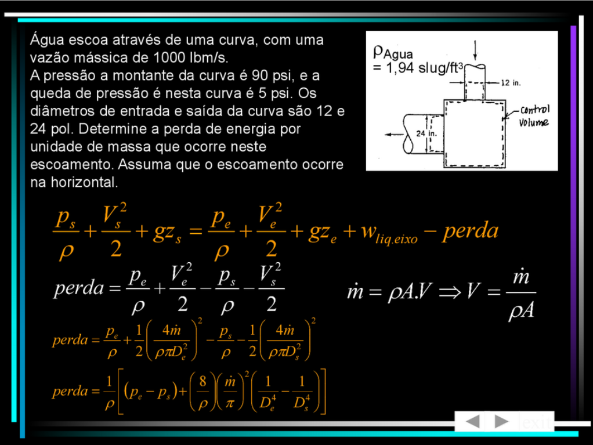

## Slide 53

> **Em linguagem simples:** Começamos o capítulo de **tubulações**  -  tubos reais com curvas, válvulas, bombas e atrito nas paredes. Bem diferente do fluido ideal de Bernoulli.

## Capítulo 8  -  Escoamento em tubulações

Exemplos de componentes:

**Entrada, curva (joelho), bomba, Tê, válvula, tubo reto, saída**

**Analogia:** Sistema hidráulico de casa ou indústria  -  cada peça afeta pressão e vazão.

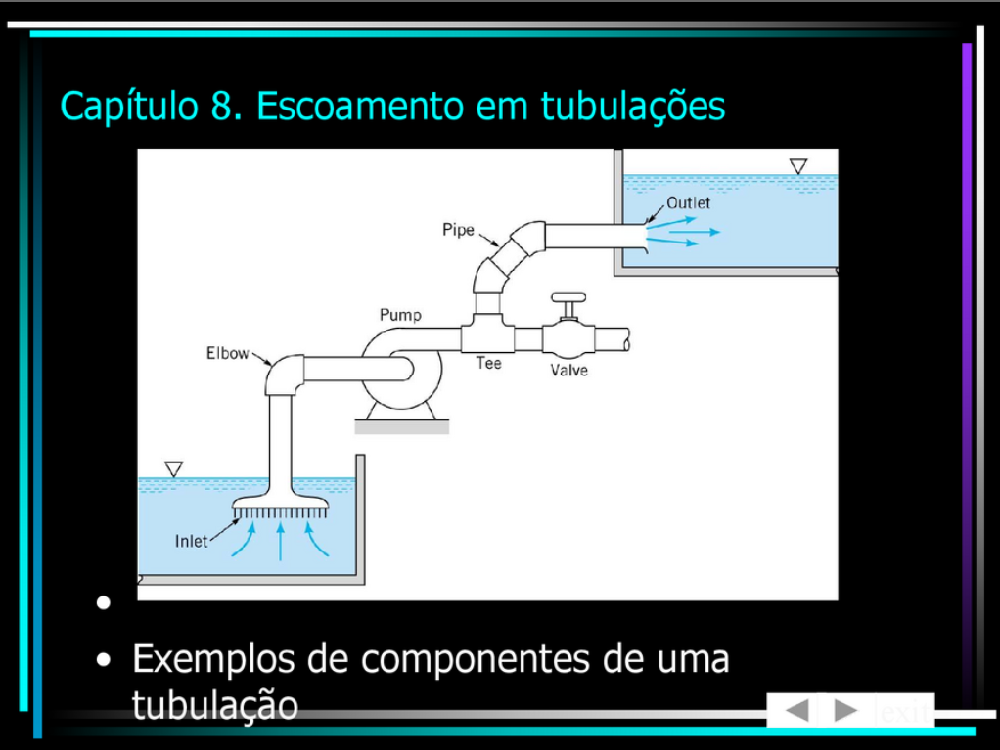

## Slide 54

> **Em linguagem simples:** Osborne Reynolds coloriu água e viu dois comportamentos: fluxo **liso e organizado** (laminar) ou **bagunçado** (turbulento). O que manda é o **número de Reynolds**.

### Escoamentos laminares e turbulentos

Experimento de Reynolds: corante em tubo com entrada suave.

Regimes observados:
* **Laminar**  -  linha de corante reta e estável
* **Transicional**  -  oscila
* **Turbulento**  -  dispersão caótica do corante

**Analogia:** Fio de fumaça parado (laminar) vs. fumaça de chaminé em vento (turbulento).

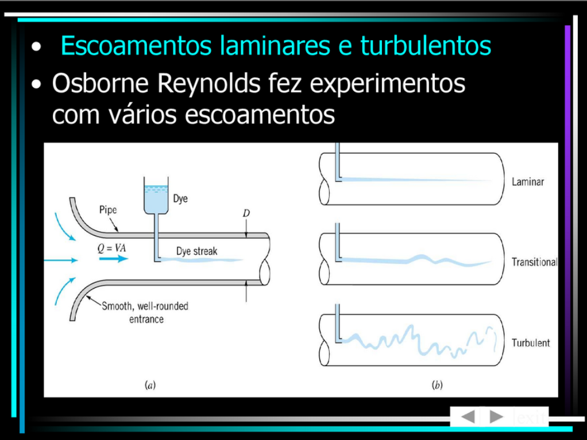

## Slide 55

> **Em linguagem simples:** Reynolds é um único número que resume: velocidade, tamanho do tubo, densidade e viscosidade. Ele diz se o fluxo será calmo ou turbulento.

### Número de Reynolds

$$\text{Re} = \frac{\rho V D}{\mu}$$

Em tubo circular:
* **Laminar:** Re < 2100
* **Transição:** 2100 < Re < 4000
* **Turbulento:** Re > 4000

**O que essa conta significa:**
* $\rho$  -  densidade; $V$  -  velocidade média; $D$  -  diâmetro
* $\mu$  -  viscosidade dinâmica ("pegajosidade")
* Re alto $\rightarrow$ inércia domina $\rightarrow$ turbulento; Re baixo $\rightarrow$ viscosidade domina $\rightarrow$ laminar

**Analogia:** Mel vs. água no mesmo tubo  -  mel (mais viscoso) tende a fluxo laminar.

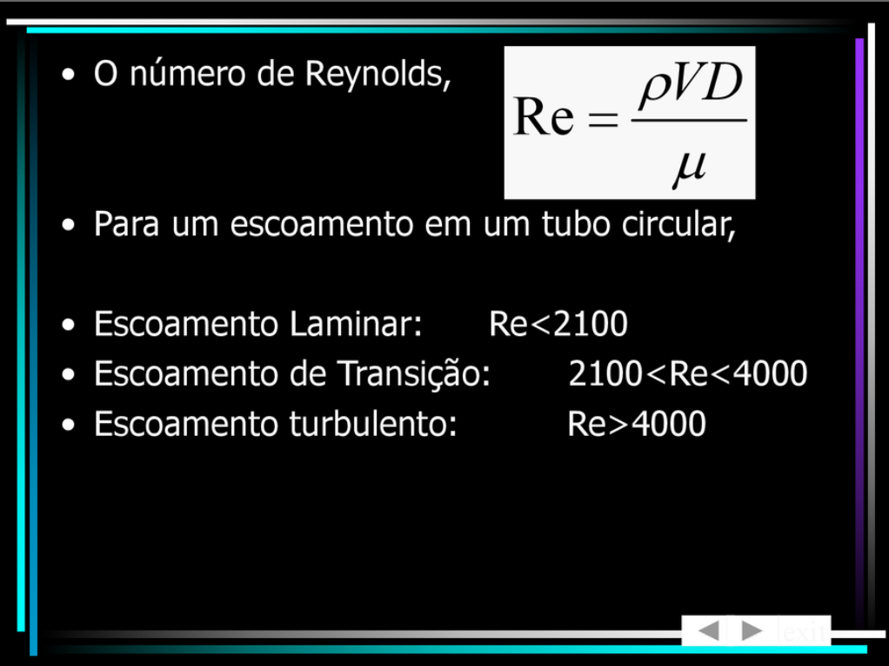

## Slide 56

> **Em linguagem simples:** Ao entrar no tubo, a velocidade não fica uniforme de imediato. Há uma **região de entrada** onde o perfil se forma; depois o **escoamento desenvolvido**  -  padrão que se repete ao longo do tubo.

### Região de entrada e escoamento desenvolvido

**Região de entrada** (comprimento $l_e$):
* Velocidade quase uniforme na entrada
* Camada limite cresce nas paredes
* Núcleo central ainda "ideal"

**Escoamento plenamente desenvolvido:**
* Perfil de velocidade não muda mais com $x$
* Laminar: perfil parabólico; turbulento: mais "achatado"

Após curva de 180$^\circ$: perfil distorce e precisa de novo comprimento para se restabelecer.

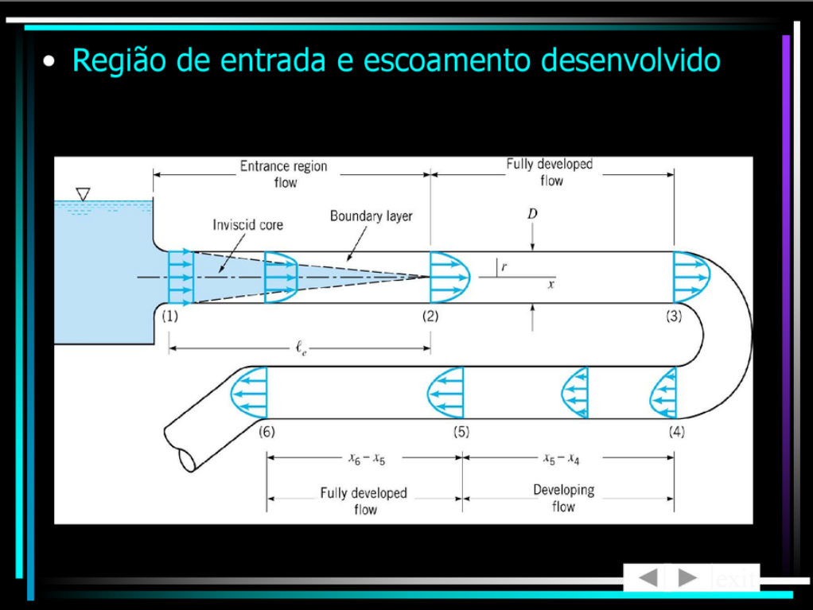

## Slide 57

> **Em linguagem simples:** Quanto de tubo precisamos até o fluxo "assentar"? Depende de Re  -  laminar precisa de trecho proporcional a Re; turbulento, menos (em relação a Re, cresce mais devagar).

### Comprimento da região de entrada

Laminar:

$$\frac{l_e}{D} = 0{,}06 \, \text{Re}$$

Turbulento:

$$\frac{l_e}{D} = 4{,}4 \, \text{Re}^{1/6}$$

**O que essa conta significa:** $l_e$  -  distância da entrada até perfil totalmente formado; $D$  -  diâmetro.

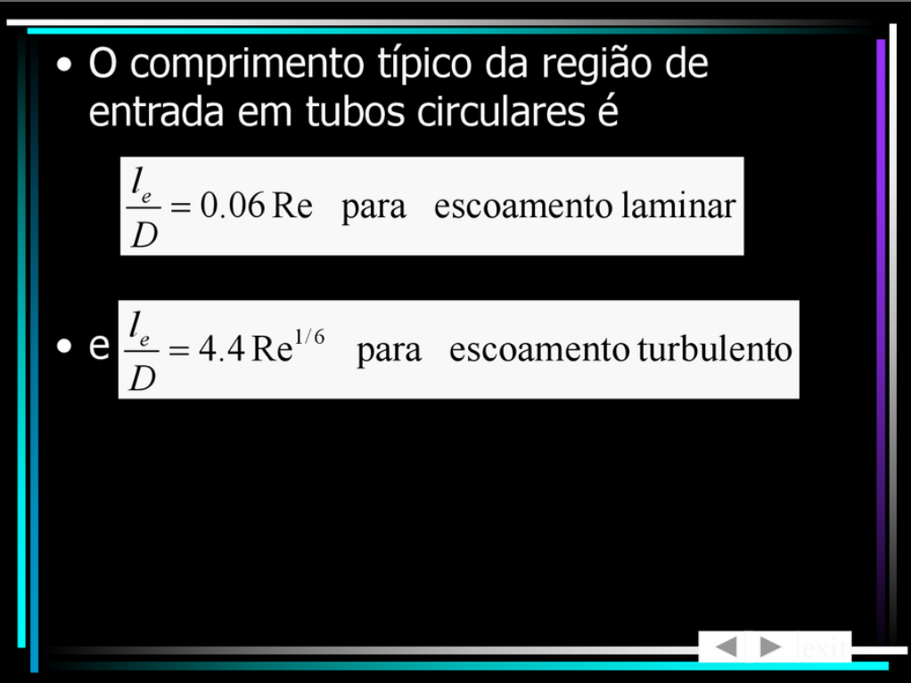

## Slide 58

> **Em linguagem simples:** No fluxo laminar desenvolvido, um cilindro imaginário de fluido fica em equilíbrio: a pressão empurra nas pontas, a parede "puxa" por atrito (cisalhamento). Isso liga queda de pressão ao esforço na parede.

### Escoamento laminar plenamente desenvolvido

Equilíbrio de forças num cilindro de fluido (raio $r$, comprimento $\ell$):

$$(p_1)\pi r^2 - (p_1 - \Delta p)\pi r^2 - (\tau)2\pi r \ell = 0$$

$$\frac{\Delta p}{\ell} = \frac{2\tau}{r}$$

**O que essa conta significa:**
* $\Delta p$  -  queda de pressão no trecho $\ell$
* $\tau$  -  tensão de cisalhamento na superfície do cilindro
* Quanto maior o atrito $\tau$, maior a queda de pressão necessária

## Slide 59

> **Em linguagem simples:** Mesma ideia do slide anterior  -  diagrama do elemento cilíndrico e forças nas faces. Reforço visual do equilíbrio entre pressão e cisalhamento.

### Reforço  -  equilíbrio no cilindro de fluido

Perfil $V = u(r)\hat{i}$; elemento de raio $r$ e comprimento $\ell$.

Forças nas faces: $p_1 \pi r^2$ (montante) e $(p_1 - \Delta p)\pi r^2$ (jusante); lateral: $\tau \cdot 2\pi r \ell$.

$$\frac{\Delta p}{\ell} = \frac{2\tau}{r}$$

**Analogia:** Empurrar um pistão num cilindro com parede pegajosa  -  precisa de mais força (pressão) para vencer o atrito lateral.

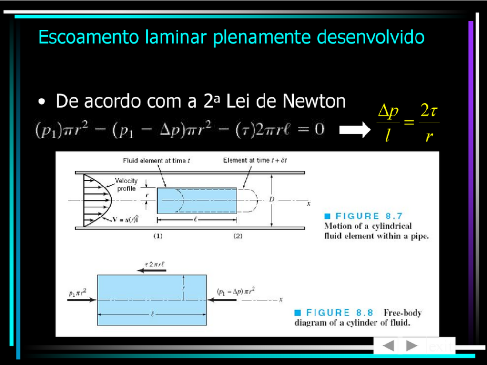

## Slide 60

> **Em linguagem simples:** O atrito na parede é zero no centro do tubo e máximo na parede. Para fluidos **newtonianos** (como água), a tensão é proporcional ao gradiente de velocidade  -  isso permite achar o perfil parabólico.

### Perfil de velocidade laminar

Relação entre cisalhamento e posição:

$$\tau = \frac{2\tau_W r}{D}$$

Com $\tau = -\mu \frac{du}{dr}$ (lei de Newton para fluidos):

$$u = -\left(\frac{\Delta p}{4\mu l}\right)r^2 + C_1$$

**O que essa conta significa:**
* $\tau_W$  -  cisalhamento na parede
* $\mu$  -  viscosidade; $du/dr$  -  quão rápido a velocidade muda do centro à parede
* Perfil parabólico: máximo no centro, zero na parede

## Slide 61

> **Em linguagem simples:** Repetição do desenvolvimento do perfil laminar  -  mesma física: equilíbrio de forças + lei da viscosidade $\rightarrow$ velocidade em forma de parábola.

### Reforço  -  de $\tau$ ao perfil $u(r)$

$$\frac{\Delta p}{l} = \frac{4\tau_W}{D}$$

$$\tau = -\mu \frac{du}{dr}$$

$$u = -\left(\frac{\Delta p}{4\mu l}\right)r^2 + C_1$$

Condições de contorno: $u = 0$ na parede ($r = R$); máximo no eixo.

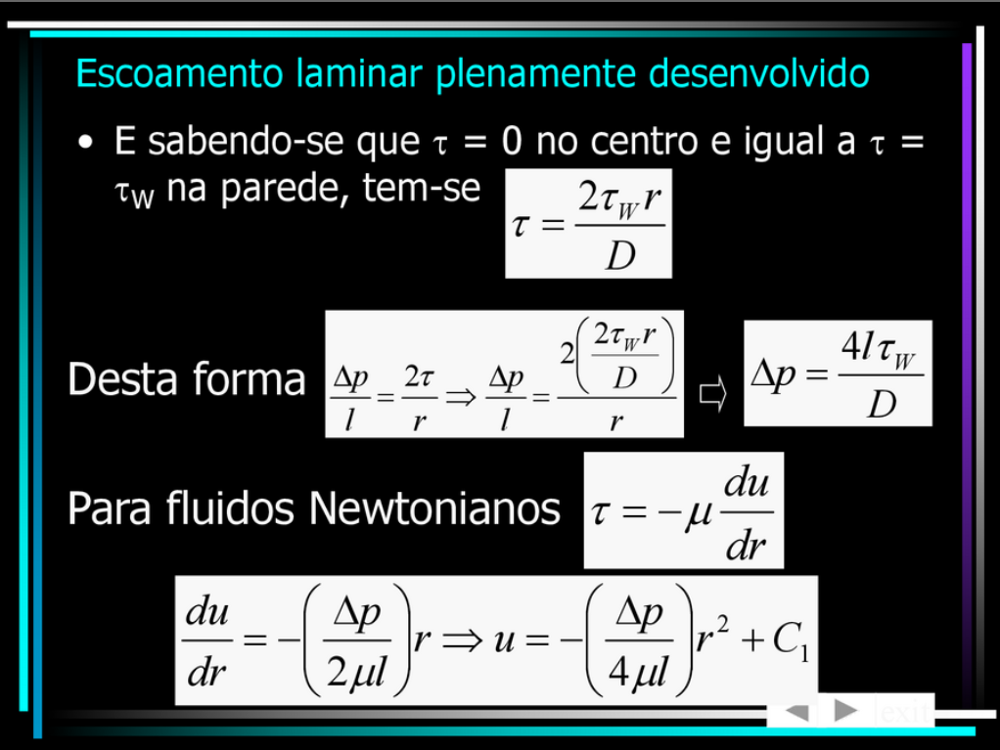

## Slide 62

> **Em linguagem simples:** Integrando o perfil parabólico, obtemos a **vazão** e a **velocidade média**  -  equações de **Hagen-Poiseuille**, muito usadas para fluxo lento em tubos finos (laminar).

### Hagen-Poiseuille (laminar)

Perfil de velocidade:

$$u = \left( \frac{\Delta p D^2}{16 \mu l} \right) \left[ 1 - \left( \frac{2r}{D} \right)^2 \right]$$

Vazão e velocidade média:

$$Q = \frac{\pi \Delta p D^4}{128 \mu l}$$

$$\bar{V} = \frac{Q}{A} = \frac{\Delta p D^2}{32 \mu l}$$

**O que essa conta significa:**
* $Q \propto D^4$  -  dobrar o diâmetro aumenta a vazão **16 vezes** (laminar)!
* $\Delta p$  -  diferença de pressão entre as extremidades; $l$  -  comprimento do tubo

**Analogia:** Canudo fino vs. grosso para sorver  -  o fino exige muito mais esforço (sucção = $\Delta p$).

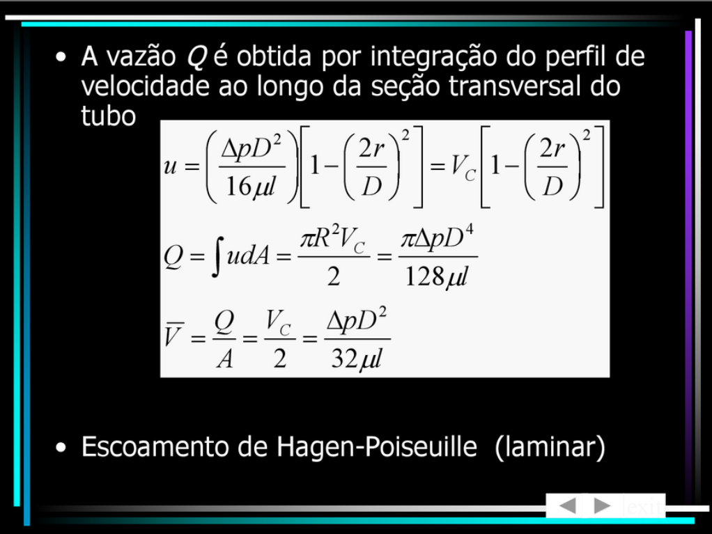

## Slide 63

> **Em linguagem simples:** Se o tubo está **inclinado**, a gravidade ajuda ou atrapalha o fluxo. Subida consome parte da pressão disponível; descida ajuda.

### Tubulação inclinada

Força do peso: $W\sin\theta = \gamma \pi r^2 l \sin\theta$

$$\bar{V} = \frac{(\Delta p - \gamma l \sin \theta)R^2}{8\mu l}$$

$$Q = \frac{\pi (\Delta p - \gamma l \sin \theta)R^4}{8\mu l}$$

**O que essa conta significa:**
* $\theta$  -  ângulo de inclinação
* $\gamma l \sin \theta$  -  "pressão" equivalente da coluna inclinada
* Subida ($\sin\theta > 0$): precisa de mais $\Delta p$ para mesma vazão

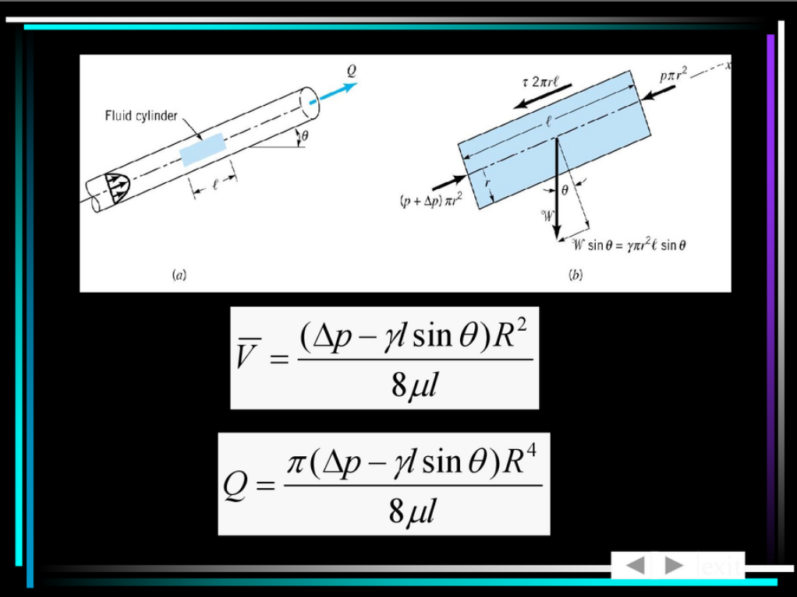

## Slide 64

> **Em linguagem simples:** Turbulento é o fluxo comum em tubos de água e óleo. É caótico, difícil de prever ponto a ponto, mas podemos trabalhar com **médias no tempo**.

### Escoamento turbulento desenvolvido

* Mais complexo e menos "exato" que o laminar
* Porém é o **mais comum** na engenharia

Transição: $2100 < \text{Re} < 4000$; Turbulento: Re > 4000

Velocidade média no tempo:

$$\bar{u} = \frac{1}{T} \int_{t_0}^{t_0+T} u(x, y, z, t) \, dt$$

**O que essa conta significa:** $u(t)$ oscila rapidamente; $\bar{u}$ é o valor "suave" que usamos nos cálculos.

**Analogia:** Corrente de rio agitada  -  velocidade varia a cada instante, mas há uma média clara.

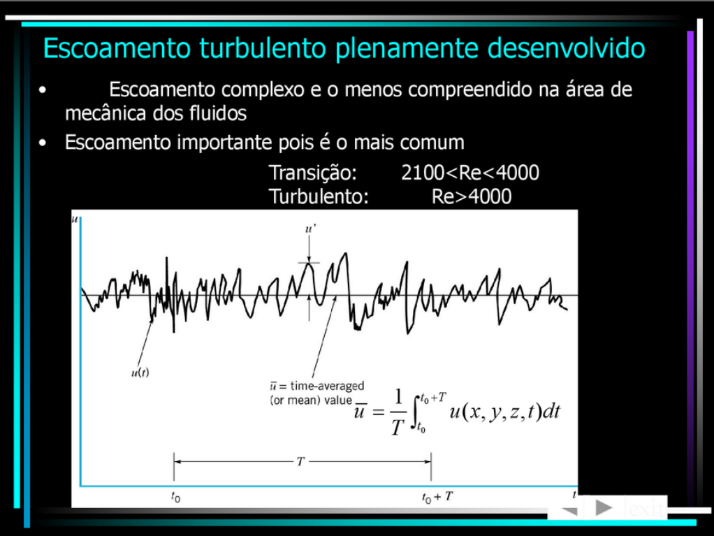

## Slide 65

> **Em linguagem simples:** Não existe fórmula exata simples para o perfil turbulento. Usamos **equações empíricas** (ajustadas a experimentos): o perfil é mais "uniforme" no centro que o parabólico laminar.

### Perfil de velocidade turbulento

Modelo de potência:

$$\frac{\bar{u}}{V_c} = \left( 1 - \frac{r}{R} \right)^{1/n}$$

$n$ depende de Re; $R = D/2$.

Perto da parede: **subcamada viscosa**; rugosidade $\epsilon$ afeta o atrito.

**O que essa conta significa:** $V_c$  -  velocidade no centro; $n$ maior $\rightarrow$ perfil mais "achatado".

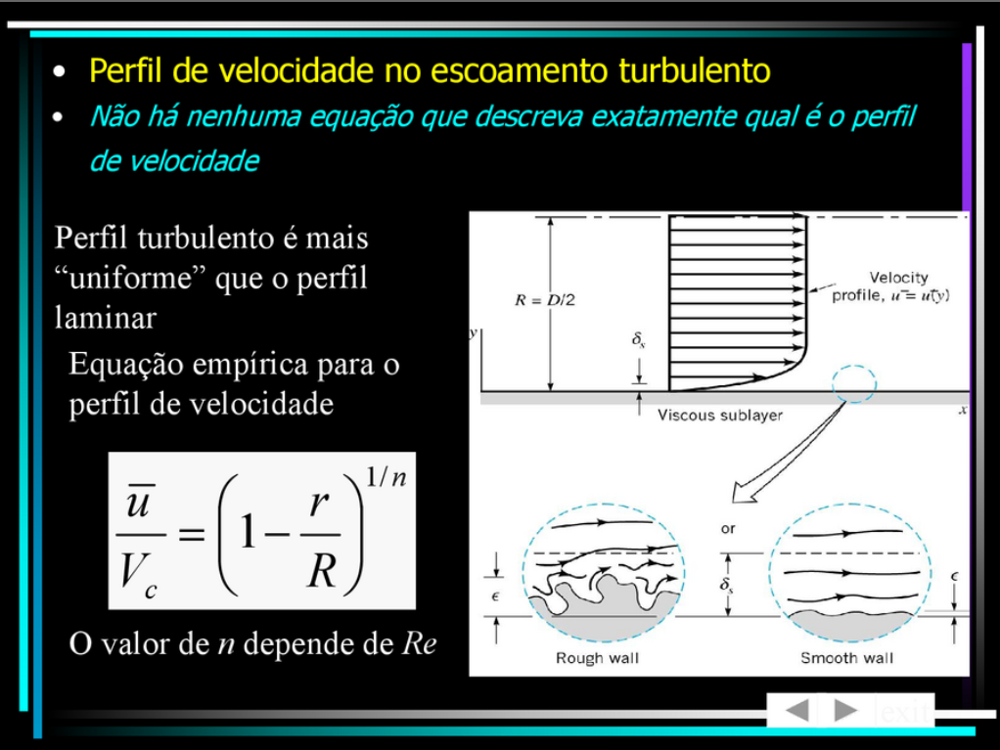

## Slide 66

> **Em linguagem simples:** Comparando laminar (parábola) e turbulento (potência), o turbulento transporta mais vazão para mesma velocidade no centro  -  a média fica mais próxima do máximo.

### Perfis laminar vs. turbulento

Integrando o perfil de potência:

$$\bar{V} = V_c \frac{2n^2}{(n+1)(2n+1)}$$

Exemplos: $n = 6 \Rightarrow Q = 0{,}79 \, A_R V_c$; $n = 10 \Rightarrow Q = 0{,}87 \, A_R V_c$

**O que essa conta significa:** No turbulento, a velocidade média é uma fração maior da velocidade central que no laminar ($\bar{V} = V_c/2$).

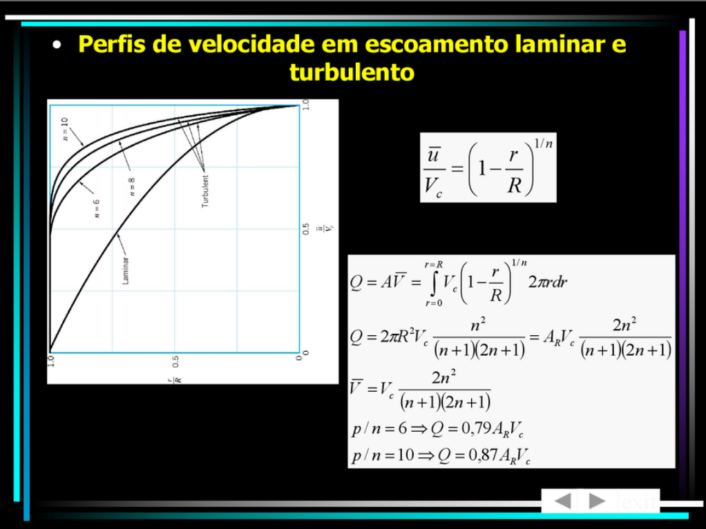

## Slide 67

> **Em linguagem simples:** Em tubos longos, a pressão **cai** por causa do atrito. Experimentalmente, essa queda depende de velocidade, diâmetro, comprimento, rugosidade e viscosidade  -  empacotados no **fator de atrito** $f$.

### Perda de carga em tubulação

Variáveis relevantes:

$$\Delta p = f(V, D, l, \varepsilon, \mu, \rho)$$

Para escoamento horizontal:

$$\Delta p = f_{atrito} \frac{l}{D} \frac{\rho V^2}{2}$$

**O que essa conta significa:**
* $f_{atrito}$  -  fator de atrito de Darcy (adimensional)
* $l/D$  -  tubo mais longo ou mais fino $\rightarrow$ mais perda
* $\rho V^2/2$  -  pressão dinâmica (energia cinética por volume)

**Analogia:** Mangueira muito longa  -  água chega fraca na ponta.

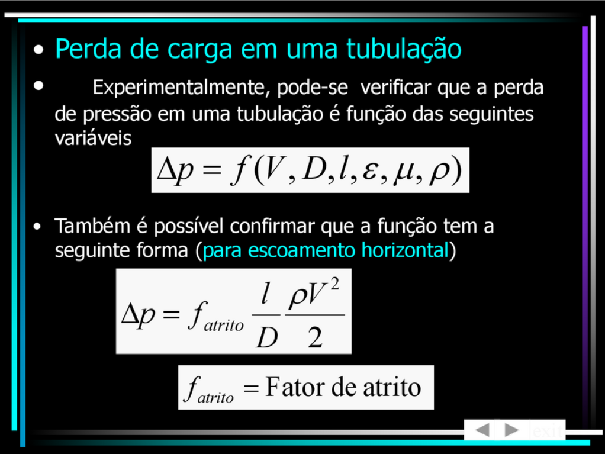

## Slide 68

> **Em linguagem simples:** O fator $f$ muda conforme o regime: laminar tem fórmula exata; turbulento depende de Re e da rugosidade da parede.

### Como obter o fator de atrito

**Laminar:**

$$f_{atrito} = \frac{64}{\text{Re}}$$

**Re alto (turbulento rugoso):** $f \approx f(\varepsilon/D)$

**Re moderado:** $f = f(\text{Re}, \varepsilon/D)$

**O que essa conta significa:** $\varepsilon$  -  altura típica das "asperezas" internas do tubo.

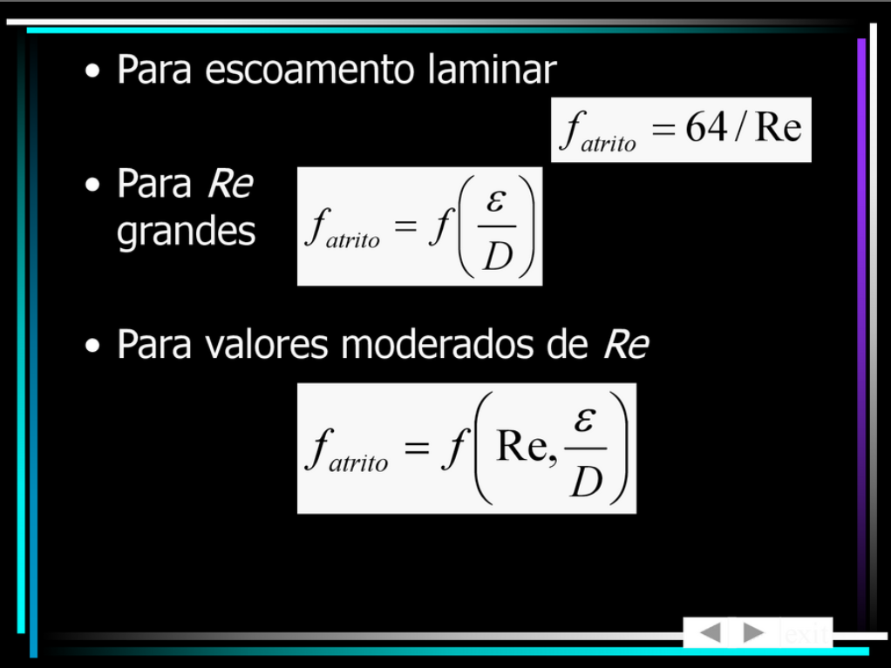

## Slide 69

> **Em linguagem simples:** A **equação de Colebrook** calcula $f$ no turbulento  -  mas não isola $f$ numa linha; resolve-se por tentativa (iteração) ou lendo o **diagrama de Moody**.

### Equação de Colebrook

$$\frac{1}{\sqrt{f_{atrito}}} = -2{,}0 \log \left( \frac{\varepsilon / D}{3{,}7} + \frac{2{,}51}{\text{Re} \sqrt{f_{atrito}}} \right)$$

* Válida fora do laminar
* **Implícita**  -  precisa de iteração ou gráfico (Moody)

**Analogia:** Equação que diz "eu dependo de mim mesma"  -  calculadora ou gráfico resolve.

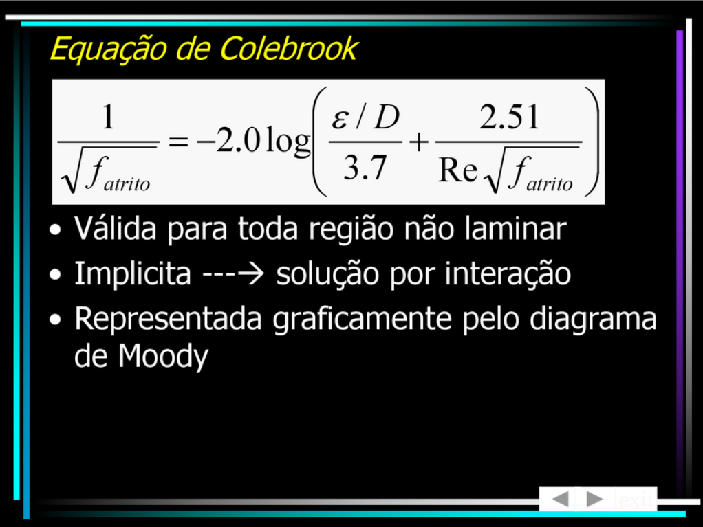

## Slide 70

> **Em linguagem simples:** O **diagrama de Moody** é um gráfico prático: entra com Re e rugosidade relativa $\varepsilon/D$, sai com $f$. Tabela dá valores típicos de $\varepsilon$ para cada material.

### Diagrama de Moody

$$\text{Re} = \frac{\rho V D}{\mu}$$

**Rugosidade equivalente $\varepsilon$ (mm)**  -  exemplos:

| Tubo | $\varepsilon$ (mm) |
|------|-------------------|
| Aço rebitado | 0,9 - 9,0 |
| Concreto | 0,3 - 3,0 |
| Ferro fundido | 0,26 |
| Aço comercial | 0,045 |
| Plástico, vidro | 0,0 (liso) |

Regiões: laminar, transição, turbulento liso, turbulento rugoso.

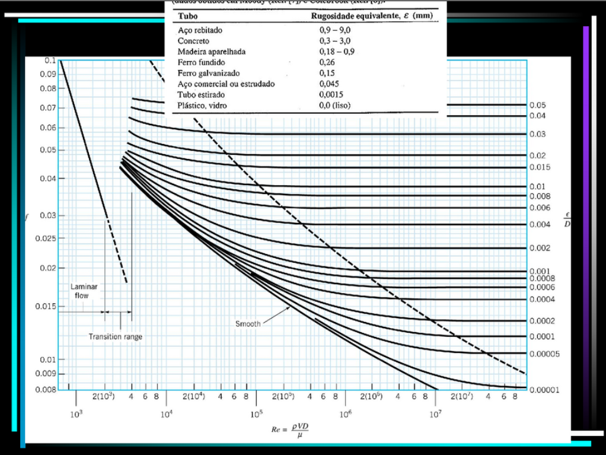

## Slide 71

> **Em linguagem simples:** O fator $f$ entra na **equação de energia mecânica** (Bernoulli estendida). Perda de carga $h_L$ é energia convertida em calor por atrito  -  em metros de coluna d'água.

### Como usar o fator de atrito

Bernoulli estendida:

$$\frac{p_1}{\gamma} + \frac{V_1^2}{2g} + z_1 + h_{eixo} = \frac{p_2}{\gamma} + \frac{V_2^2}{2g} + z_2 + h_L$$

Perda de carga:

$$h_L = f_{atrito} \frac{l}{D} \frac{V^2}{2g}$$

Com variação de cota:

$$p_1 - p_2 = \gamma(z_2 - z_1) + \gamma h_L$$

**O que essa conta significa:** $h_{eixo}$  -  energia adicionada por bomba; $h_L$  -  energia perdida por atrito.

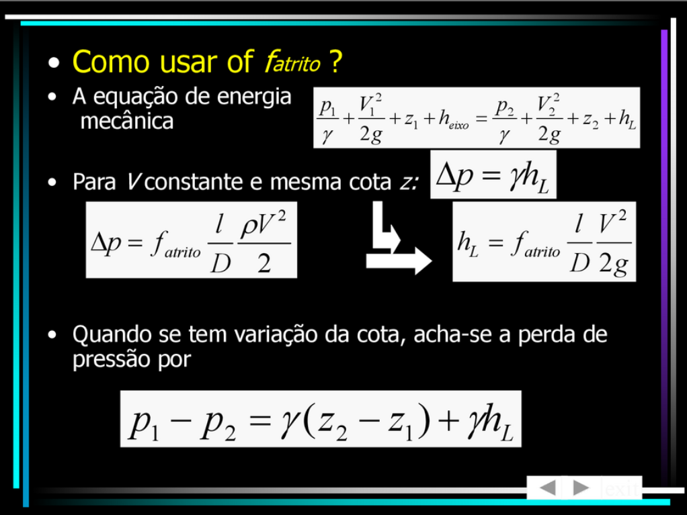

## Slide 72

> **Em linguagem simples:** Além do atrito no tubo reto, **válvulas, curvas e Tês** causam perdas extras  -  chamadas perdas **localizadas**, com coeficiente $K_L$.

### Perdas de carga localizadas

Maiores perdas: atrito no tubo longo.

Também: válvulas, curvas, bifurcações, entradas.

$$K_L = \frac{h_L}{V^2 / 2g} = \frac{\Delta p}{\frac{1}{2} \rho V^2}$$

$$h_L = K_L \frac{V^2}{2g}; \quad \Delta p = K_L \frac{1}{2} \rho V^2$$

**O que essa conta significa:** $K_L$  -  "quantas velocidades-head de energia se perdem" naquele componente.

**Analogia:** Curva fechada na estrada  -  freia o carro além do atrito do asfalto reto.

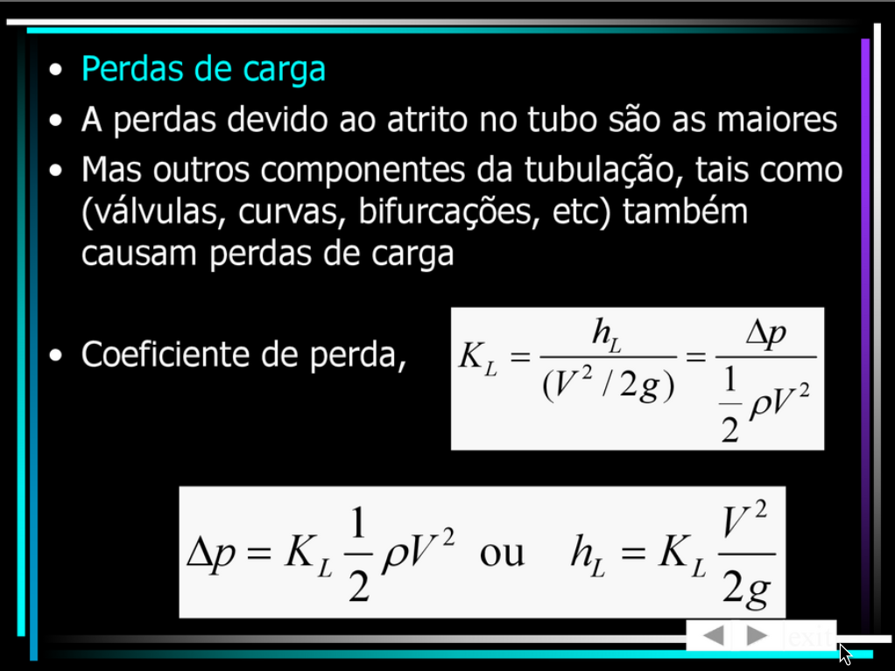

## Slide 73

> **Em linguagem simples:** Cada tipo de **entrada** no tubo tem um $K_L$ diferente. Entrada bem arredondada perde pouco; entrada "de canto vivo" perde muito mais.

### Coeficientes $K_L$  -  entradas

* (a) Reentrante: $K_L = 0{,}8$
* (b) Aresta viva: $K_L = 0{,}5$
* (c) Ligeiramente arredondada: $K_L = 0{,}2$
* (d) Bem arredondada: $K_L = 0{,}04$

**Analogia:** Entrar num corredor  -  bater de frente na parede (aresta viva) vs. curva suave de entrada.

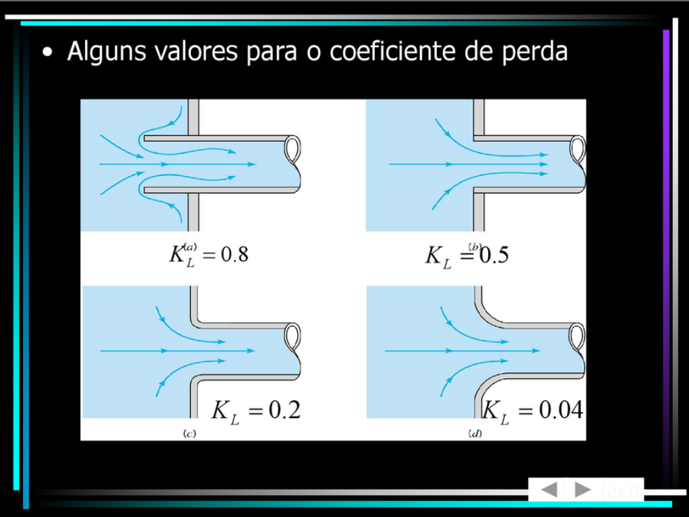

## Slide 74

> **Em linguagem simples:** Quando o tubo **estreita de repente**, há perda de energia. Quanto maior a redução de área, maior o $K_L$ (até ~0,5).

### Perda na contração súbita

$$h_L = K_L \frac{V_2^2}{2g}$$

$K_L$ depende de $A_2/A_1$: $\approx 0{,}5$ quando $A_2/A_1 \to 0$; $0$ quando áreas iguais.

**O que essa conta significa:** Usa velocidade **na seção menor** ($V_2$).

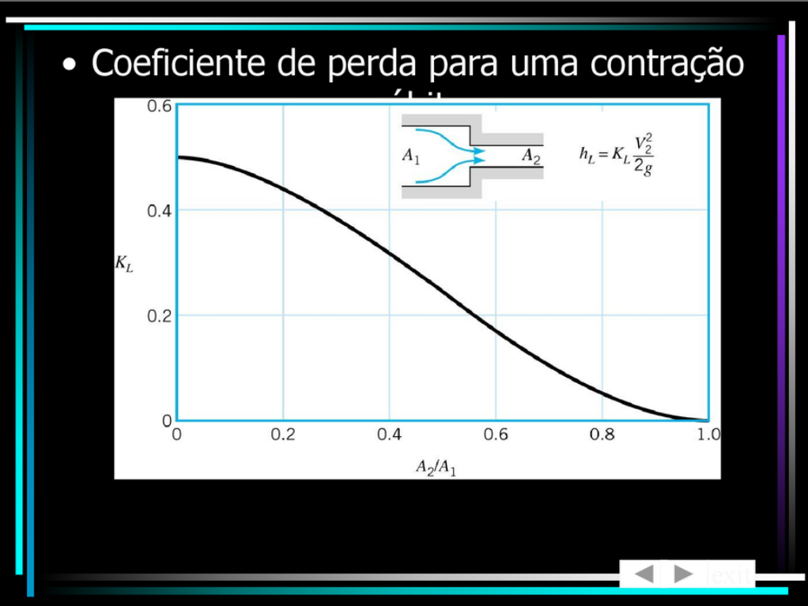

## Slide 75

> **Em linguagem simples:** **Alargamento súbito** é pior que estreitamento  -  o fluido "separa" e turbulência consome energia. $K_L$ pode chegar perto de 1.

### Perda na expansão súbita

$$h_L = K_L \frac{V_1^2}{2g}$$

$K_L \approx 1{,}0$ quando $A_1/A_2 \to 0$; $0$ quando áreas iguais.

**O que essa conta significa:** Usa velocidade **na seção maior anterior** ($V_1$).

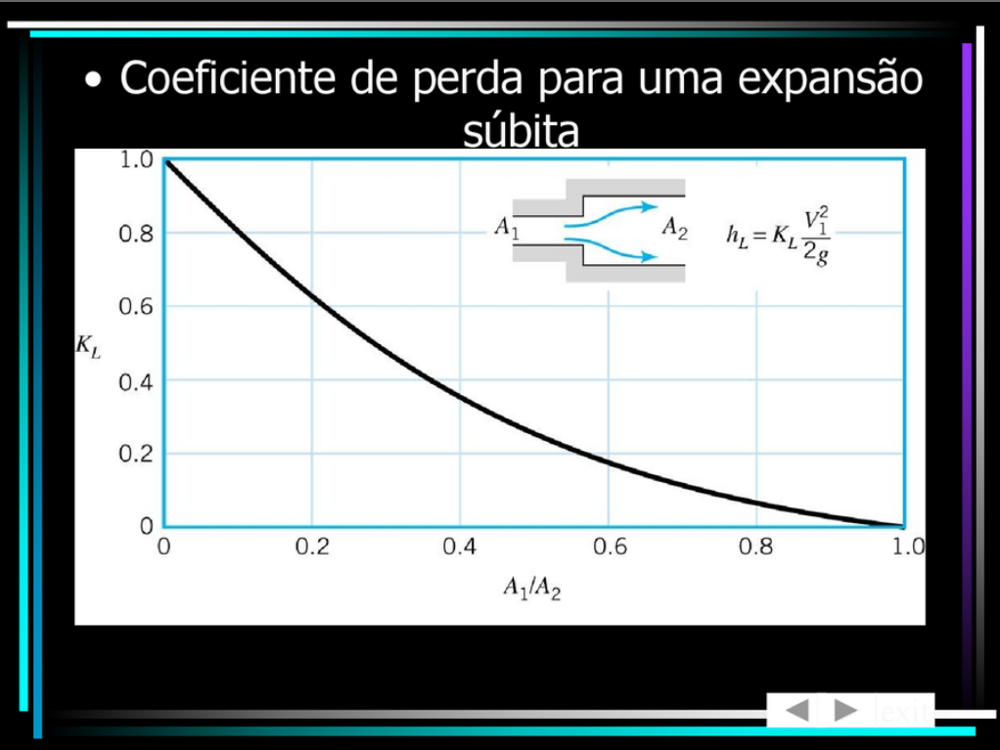

## Slide 76

> **Em linguagem simples:** Tubos não são sempre redondos (retangulares, anulares). Definimos um **diâmetro hidráulico** $D_h$ que "equivale" a um tubo circular para os cálculos.

### Tubos não circulares

$$D_h = \frac{4A}{P}$$

$A$  -  área da seção; $P$  -  perímetro molhado (contato com o fluido).

**O que essa conta significa:** Canal retangular largo e raso tem $D_h \approx 2 \times$ profundidade (aproximação útil).

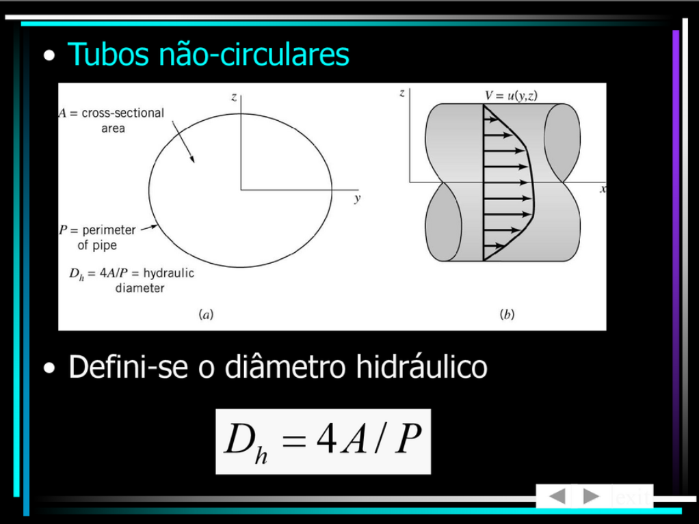

## Slide 77

> **Em linguagem simples:** Nos cálculos de perda e Reynolds para seções estranhas, troque $D$ por $D_h$ e use a mesma fórmula de tubo circular.

### Uso do diâmetro hidráulico

$$h_L = f_{atrito} \frac{l}{D_h} \frac{V^2}{2g}$$

$$\text{Re}_h = \frac{\rho V D_h}{\mu}$$

Rugosidade relativa: $\varepsilon / D_h$

**O que essa conta significa:** $V$  -  velocidade média na seção real ($Q/A$).

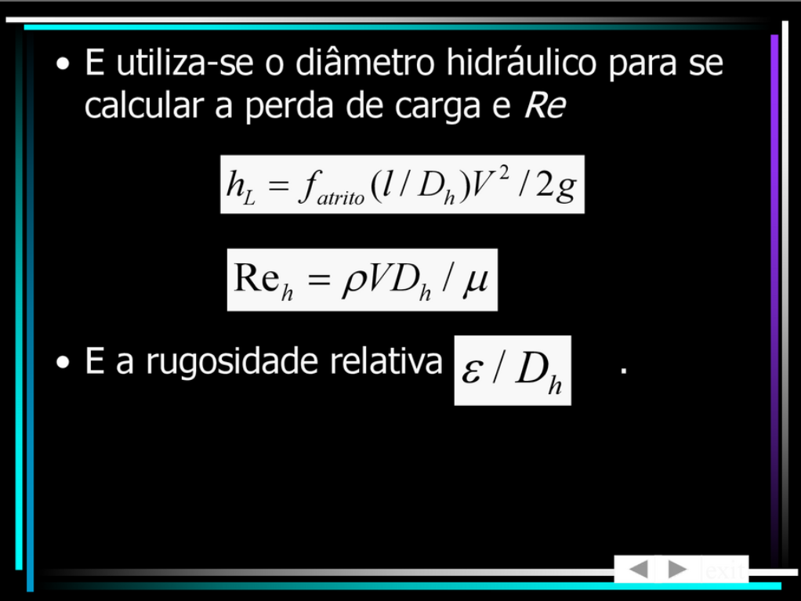

## Slide 78

> **Em linguagem simples:** Uma válvula com $K_L = 5$ causa a mesma perda que um certo comprimento de tubo reto  -  o **comprimento equivalente** liga os dois jeitos de calcular.

### Equivalência $K_L$ $\leftrightarrow$ comprimento de tubo

$$f_{atrito} \frac{l}{D} \frac{V^2}{2g} = K_L \frac{V^2}{2g}$$

$$f_{atrito} \frac{l}{D} \equiv K_L$$

**O que essa conta significa:** Curva pode ser "equivalente" a 30 diâmetros de tubo reto, por exemplo.

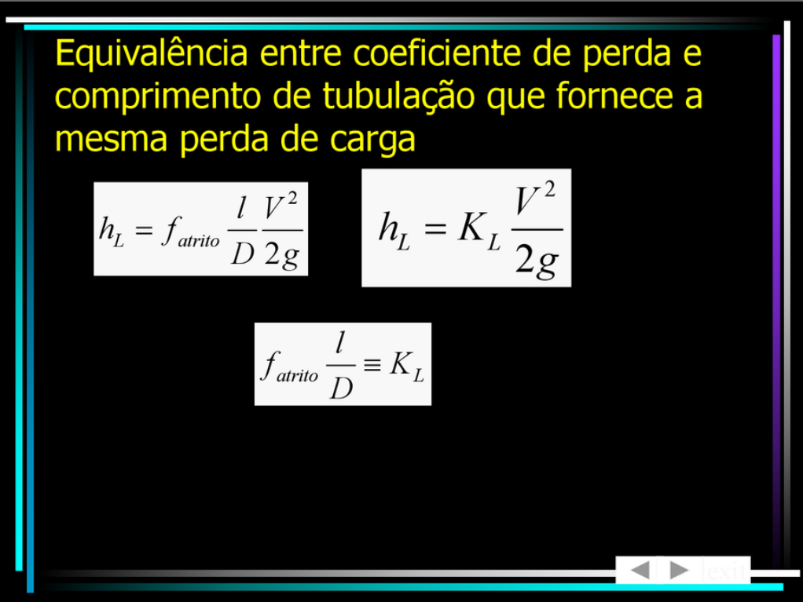

## Slide 79

> **Em linguagem simples:** Problemas de tubulação caem em três tipos: conhece vazão e acha perda de pressão; conhece pressão e acha vazão; ou conhece perda e vazão e dimensiona o tubo.

### Tipos de problema

a) **Tipo 1:** $Q$ ou $V$ conhecido $\rightarrow$ achar $\Delta P$

b) **Tipo 2:** $\Delta P$ conhecido $\rightarrow$ achar $Q$

c) **Tipo 3:** $h_L$ e $Q$ conhecidos $\rightarrow$ achar área/diâmetro

**Analogia:** Tipo 2 é como abrir a torneira e ver quanta água sai dado a pressão da rede.

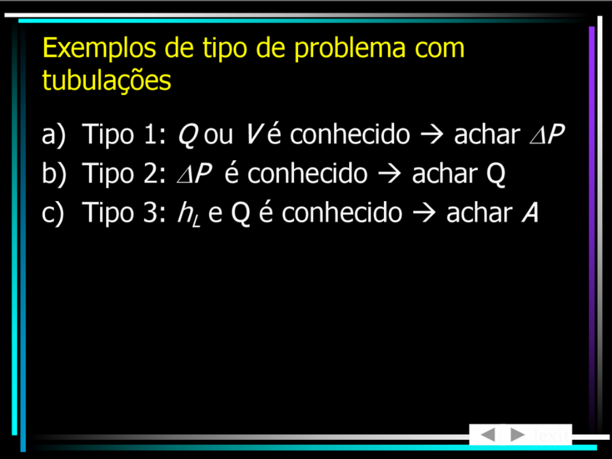

## Slide 81

> **Em linguagem simples:** Exemplo numérico completo: bomba fornece energia; somam-se perdas por atrito ($f L/D$) e localizadas ($\sum K_L$); resolve-se $Q$ iterativamente com Re e $f$ do Moody.

### Exemplo  -  circuito com bomba

Bernoulli estendida com $h_{eixo} = h_L$:

$$\frac{\dot{W}}{\dot{Q}\gamma} = \left( f \frac{L}{D} + \sum K_L \right) \frac{V^2}{2g}$$

$$\dot{Q} = \sqrt[3]{\frac{\dot{W} \pi^2 D^4}{8 \left( f \frac{L}{D} + \sum K_L \right) \rho}}$$

Resultado do exemplo: $\dot{Q} \approx 1{,}45 \times 10^{-3}$ m$^3$/s; Re $\approx 5{,}9 \times 10^4$; $f \approx 0{,}038$.

**O que essa conta significa:** $\dot{W}$  -  potência da bomba; soma $fL/D + \sum K_L$  -  resistência total do circuito.

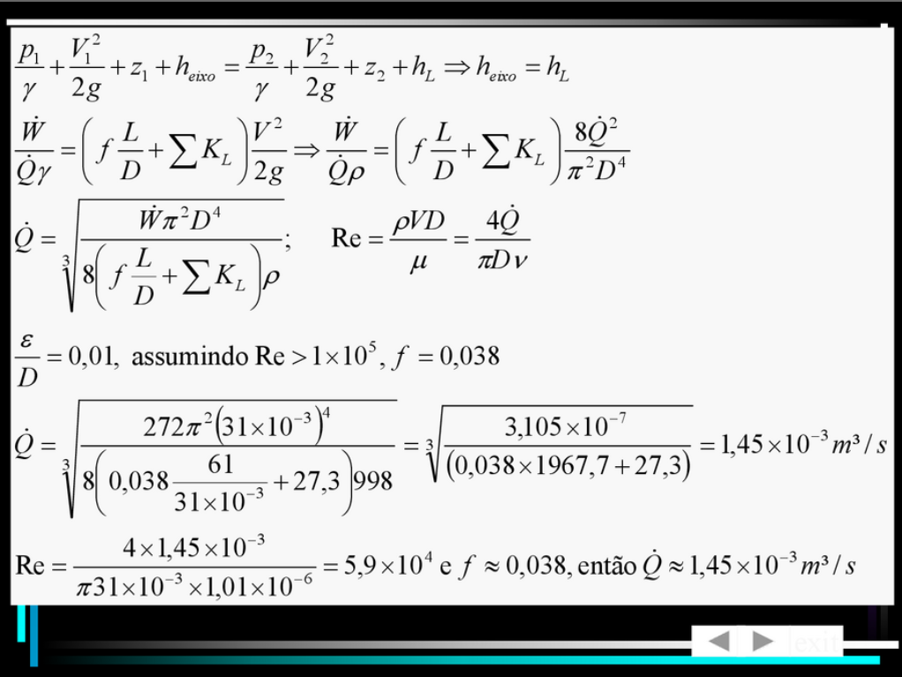

## Slide 82

> **Em linguagem simples:** Leitura prática do Moody: com Re = $10^5$ e $\varepsilon/D \approx 0{,}01$, o fator de atrito fica em torno de $f \approx 0{,}038$  -  usado no exemplo anterior.

### Exemplo no diagrama de Moody

Re = $10^5$, $\varepsilon/D \approx 0{,}01$ $\rightarrow$ $f \approx 0{,}038$

**Analogia:** Usar tabela ou gráfico em vez de resolver Colebrook na mão.

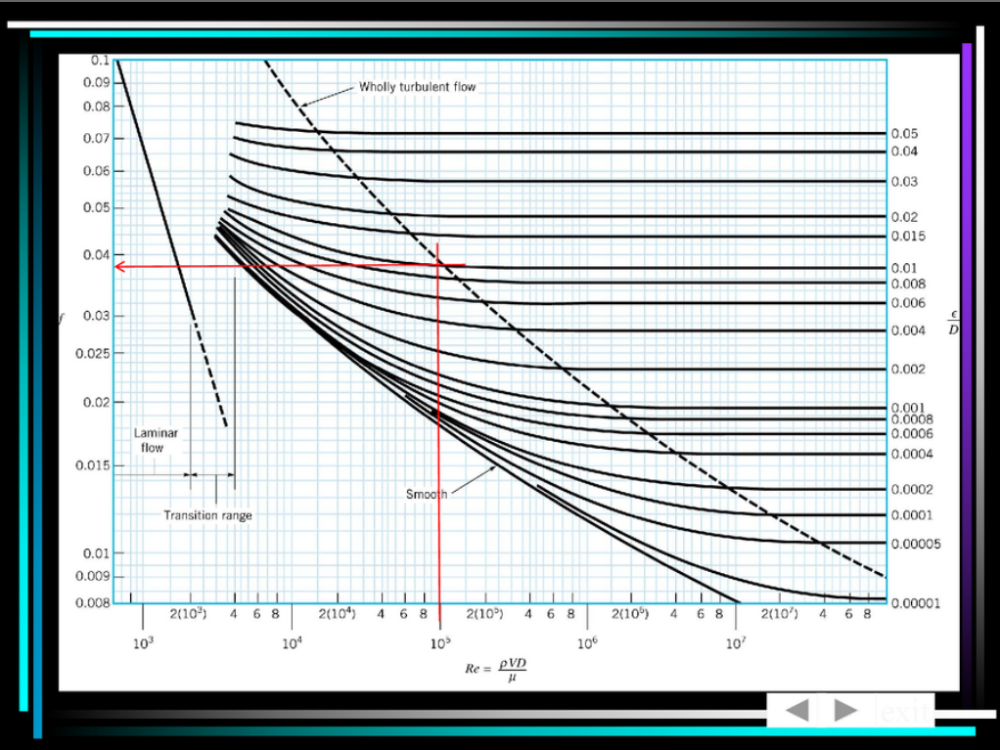

## Formulário  -  Parte 3

> **Em linguagem simples:** Este formulário reúne as fórmulas principais da Parte 3. Cada bloco abaixo traz a fórmula e uma explicação do que ela serve e quando usar.

### Equações diferenciais do movimento (Cauchy e Euler)

$$\sigma_n = \lim_{\delta A \to 0} \frac{\delta F_n}{\delta A}; \quad \tau_i = \lim_{\delta A \to 0} \frac{\delta F_i}{\delta A}$$

**Explicação:** Definem tensão normal ($\sigma$) e de cisalhamento ($\tau$)  -  força por área em um ponto.

$$\rho g_x + \frac{\partial \sigma_{xx}}{\partial x} + \cdots = \rho \left( \frac{\partial u}{\partial t} + u \frac{\partial u}{\partial x} + \cdots \right)$$

**Explicação:** Equações de **Cauchy**  -  movimento geral com viscosidade. Muitas incógnitas.

$$\rho g_x - \frac{\partial p}{\partial x} = \rho \left( \frac{\partial u}{\partial t} + u \frac{\partial u}{\partial x} + \cdots \right)$$

**Explicação:** Equações de **Euler**  -  caso sem viscosidade; só pressão e gravidade aceleram o fluido.

---

### Bernoulli (ao longo de linha de corrente)

$$p + \frac{1}{2} \rho V^2 + \gamma z = C$$

$$\frac{p}{\gamma} + \frac{V^2}{2g} + z = C$$

**Explicação:** Soma de pressão + velocidade + altura (em energia) é **constante** na mesma linha de corrente. Forma com $\gamma$ dá "cargas" em metros.

$$p_1 + \frac{1}{2}\rho V_1^2 + \gamma z_1 = p_2 + \frac{1}{2}\rho V_2^2 + \gamma z_2$$

**Explicação:** Compare **dois pontos** no mesmo fio de fluxo.

---

### Movimento normal à linha de corrente

$$-\gamma \frac{dz}{dn} - \frac{dp}{dn} = \frac{\rho V^2}{\mathcal{R}}$$

**Explicação:** Em **curvas**, pressão varia para fornecer aceleração centrípeta. $\mathcal{R}$ = raio de curvatura.

---

### Pressão estática, dinâmica e de estagnação

$$p_2 = p_1 + \frac{1}{2} \rho V_1^2$$

**Explicação:** Onde o fluxo **para** (estagnação), pressão sobe pela energia cinética.

$$V = \sqrt{\frac{2(p_3 - p_4)}{\rho}}$$

**Explicação:** **Tubo de Pitot**  -  diferença de pressão $\rightarrow$ velocidade.

---

### Continuidade e medição de vazão

$$A_1 V_1 = A_2 V_2$$

**Explicação:** Mesma vazão volumétrica em todo tubo incompressível  -  estreita acelera.

$$Q = A_2 \sqrt{\frac{2(P_1 - P_2)}{\rho[1 - (A_2 / A_1)^2]}}$$

**Explicação:** **Venturi/orifício**  -  $\Delta P$ medida $\rightarrow$ vazão $Q$.

$$V_2 = \sqrt{2gh}$$

**Explicação:** **Torricelli**  -  jato livre de tanque; $h$ = altura da superfície ao orifício.

---

### Restrições de Bernoulli

$$Ma = V/c; \quad c = \sqrt{kRT}; \quad Ma < 0{,}3$$

**Explicação:** Gás só tratado como incompressível se velocidade << velocidade do som.

---

### Reynolds e regiões de escoamento

$$\text{Re} = \frac{\rho V D}{\mu}$$

**Explicação:** Número adimensional  -  decide laminar (< 2100) ou turbulento (> 4000).

$$\frac{l_e}{D} = 0{,}06 \, \text{Re} \quad \text{(laminar)}; \quad \frac{l_e}{D} = 4{,}4 \, \text{Re}^{1/6} \quad \text{(turbulento)}$$

**Explicação:** Comprimento até o perfil de velocidade "assentar" após a entrada.

---

### Escoamento laminar (Hagen-Poiseuille)

$$Q = \frac{\pi \Delta p D^4}{128 \mu l}; \quad \bar{V} = \frac{\Delta p D^2}{32 \mu l}$$

**Explicação:** Vazão em tubo laminar  -  $\Delta p$ empurra fluido viscoso; $D^4$ mostra sensibilidade ao diâmetro.

$$\bar{V} = \frac{(\Delta p - \gamma l \sin \theta)R^2}{8\mu l}$$

**Explicação:** Tubo **inclinado**  -  gravidade entra como $\gamma l \sin\theta$.

---

### Escoamento turbulento  -  perfil de potência

$$\frac{\bar{u}}{V_c} = \left( 1 - \frac{r}{R} \right)^{1/n}$$

**Explicação:** Aproximação empírica do perfil; $n$ depende de Re.

---

### Darcy-Weisbach e fator de atrito

$$\Delta p = f_{atrito} \frac{l}{D} \frac{\rho V^2}{2}$$

$$h_L = f_{atrito} \frac{l}{D} \frac{V^2}{2g}$$

**Explicação:** Perda de pressão/carga por **atrito** em tubo reto.

$$f_{atrito} = \frac{64}{\text{Re}} \quad \text{(laminar)}$$

**Explicação:** Fórmula exata para laminar  -  não precisa de Moody.

$$\frac{1}{\sqrt{f_{atrito}}} = -2{,}0 \log \left( \frac{\varepsilon/D}{3{,}7} + \frac{2{,}51}{\text{Re} \sqrt{f_{atrito}}} \right)$$

**Explicação:** **Colebrook**  -  turbulento; use iteração ou diagrama de Moody.

---

### Bernoulli estendida e perdas localizadas

$$\frac{p_1}{\gamma} + \frac{V_1^2}{2g} + z_1 + h_{eixo} = \frac{p_2}{\gamma} + \frac{V_2^2}{2g} + z_2 + h_L$$

**Explicação:** Versão **real**  -  inclui bomba ($h_{eixo}$) e perdas ($h_L$).

$$h_L = K_L \frac{V^2}{2g}; \quad f_{atrito} \frac{l}{D} \equiv K_L$$

**Explicação:** Perdas em válvulas/curvas ($K_L$) ou comprimento equivalente de tubo.

---

### Tubos não circulares

$$D_h = \frac{4A}{P}$$

**Explicação:** Diâmetro **hidráulico**  -  substitui $D$ em Re e perda de carga.

---

### Circuitos com bomba

$$\dot{Q} = \sqrt[3]{\frac{\dot{W} \pi^2 D^4}{8 \left( f \frac{L}{D} + \sum K_L \right) \rho}}$$

$$\dot{W} = \dot{Q}(p_i - p_e)$$

**Explicação:** Relaciona potência da bomba, resistência do circuito ($fL/D + \sum K_L$) e vazão obtida.
