# Equações Integrais e Volume de Controle  -  Versão para Iniciantes

Este material é uma versão didática dos slides da Parte 4 do curso de Fenômenos de Transporte. Aqui você vai aprender, passo a passo e sem jargão pesado, como analisar fluidos (líquidos e gases) dentro de uma **região imaginária do espaço** chamada **volume de controle**. Usamos três ferramentas principais: conservação de **massa**, de **movimento** (forças) e de **energia**.

---

## Slide 1

> **Em linguagem simples:** Em vez de seguir cada gotícula de água individualmente, imaginamos uma caixa no espaço e observamos o que entra, o que sai e o que acontece dentro dela. Isso serve para calcular, por exemplo, a força que segura uma turbina eólica.

**O que vamos estudar nesta parte:**

* **Teorema do transporte de Reynolds (TTR):** a ponte que liga a análise de um "pacote fixo de fluido" (sistema) à análise de uma caixa imaginária (volume de controle).
* **Volume de controle:** uma região finita do espaço que escolhemos para fazer as contas.
* **Três leis de conservação aplicadas ao volume de controle:**
  * Equação da **continuidade** $\rightarrow$ a massa não some nem aparece do nada.
  * Equação do **momento linear** $\rightarrow$ forças externas mudam o movimento do fluido.
  * Equação da **energia** $\rightarrow$ calor e trabalho alteram a energia do fluido.

**Analogia:** Pense numa caixa d'água com entradas e saídas de canos. Você não precisa rastrear cada molécula  -  basta saber quanto entra, quanto sai e o que acontece dentro da caixa.

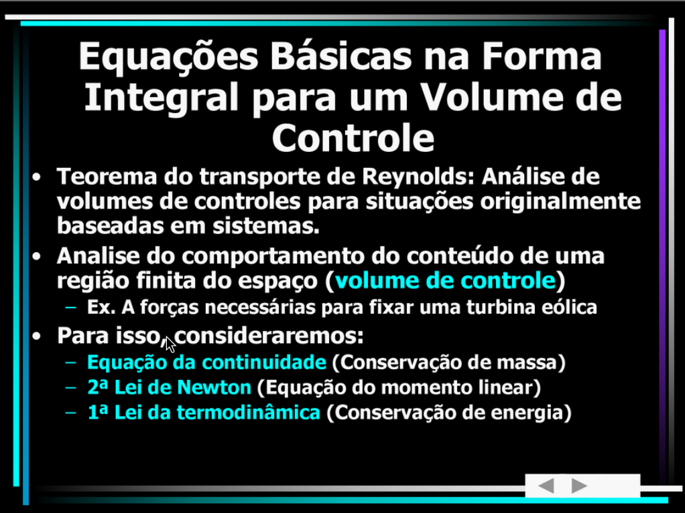

---

## Slide 2

> **Em linguagem simples:** Existem duas formas de olhar para o mesmo fluido: seguir um grupo fixo de partículas (sistema) ou olhar para uma região do espaço por onde o fluido passa (volume de controle). As leis da física foram escritas originalmente para o sistema; o TTR nos permite usar o volume de controle.

### Volume de controle (VC) e sistema (Sis)

| Conceito | O que é, em poucas palavras |
|----------|----------------------------|
| **VC (volume de controle)** | Uma região do espaço  -  como uma caixa imaginária  -  por onde a matéria pode entrar e sair. |
| **Sis (sistema)** | Um conjunto fixo de matéria: as mesmas partículas, como um bando de pássaros voando juntos. |

**Atenção:** As leis básicas do movimento dos fluidos foram formuladas para um **sistema** (matéria fixa). Para problemas de engenharia (tubulações, bocais, turbinas), é mais prático usar o **volume de controle**.

**Analogia:** O **sistema** é como fotografar o mesmo grupo de pessoas em um corredor. O **volume de controle** é como filmar a porta do corredor  -  pessoas diferentes entram e saem, mas a região da porta é fixa.

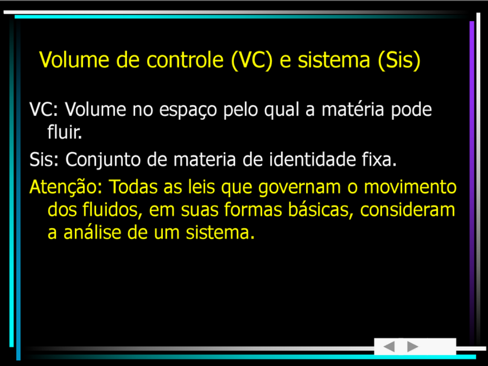

---

## Slide 3

> **Em linguagem simples:** O volume de controle pode ser fixo no espaço, fixo ou em movimento, ou até deformável (como um balão). O tipo depende do problema que você quer resolver.

### Tipos de volume de controle

* **(a) VC fixo**  -  Ex.: um trecho de tubo. A caixa não se move.
* **(b) VC fixo ou em movimento**  -  Ex.: motor a jato. A caixa pode acompanhar o aparelho.
* **(c) VC deformável**  -  Ex.: balão que enche ou esvazia. As paredes da caixa mudam de forma.

**Legenda da figura:**
* Linha tracejada azul: superfície do volume de controle
* Cinza claro: sistema no instante $t_1$
* Cinza escuro: sistema no instante $t_2 > t_1$

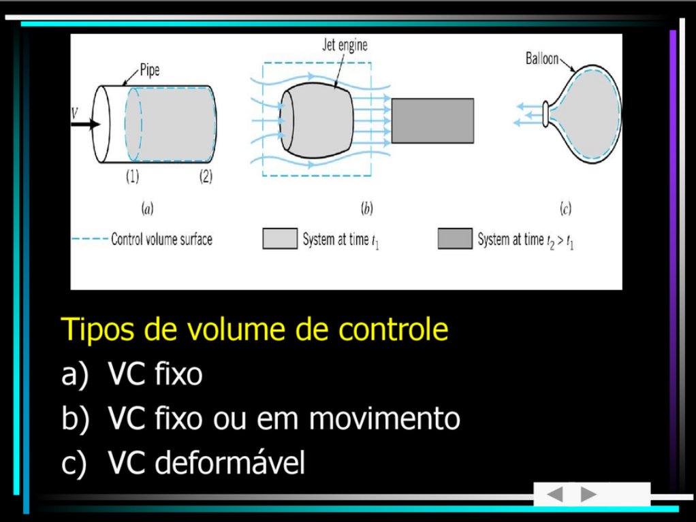

---

## Slide 4

> **Em linguagem simples:** O TTR diz como a quantidade total de qualquer propriedade (massa, energia, movimento…) muda quando passamos da visão "sistema" para a visão "volume de controle".

### Teorema do transporte de Reynolds  -  ideia inicial

**Sistema** $\ll$----->> **volume de controle**

* **B**  -  qualquer propriedade do fluido que nos interessa (massa, energia, quantidade de movimento…).
* **b**  -  quanto dessa propriedade existe **por quilograma** de fluido.
* Relação: $B = m \times b$ (propriedade total = massa $\times$ propriedade por unidade de massa).

$$B = mb$$

$$B_{sis} = \int_{sis} \rho \, b \, d\forall$$

**O que essa conta significa:**
* $B_{sis}$  -  quantidade total da propriedade dentro do sistema.
* $\rho$  -  densidade (kg/m$^3$): quantos quilos de fluido há por metro cúbico.
* $b$  -  propriedade por unidade de massa.
* $d\forall$  -  pedacinho de volume.
* A integral soma todos os pedacinhos do sistema.

**Analogia:** Se $b$ for "calorias por quilo de suco", multiplicar pela massa de cada pedacinho e somar dá o total de calorias no copo.

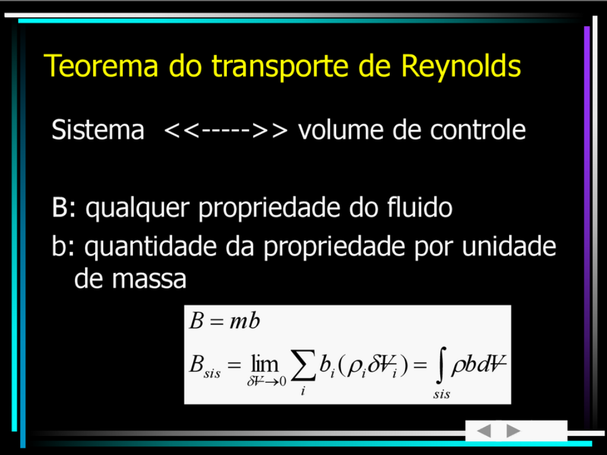

---

## Slide 5

> **Em linguagem simples:** Para entender o TTR, imagine que no instante $t$ o sistema e o volume de controle coincidem. Um pouco depois, parte do fluido que estava dentro já saiu (região II) e fluido novo entrou (região I).

### Derivação do TTR  -  passo 1

No instante $t$: **Sistema = Volume de controle** (ocupam o mesmo espaço).

No instante $t + \delta t$: **Sistema = VC - I + II**

* **Região I (Inflow):** fluido que **entrou** no VC  -  não pertence mais ao sistema original.
* **Região II (Outflow):** fluido que **saiu** do VC  -  agora faz parte do sistema.
* **CV - I:** o que sobrou do volume de controle sem a região que entrou.

**Legenda do diagrama:**
* Superfície fixa e fronteira do sistema em $t$
* Fronteira do sistema em $t + \delta t$
* Inflow (região I) / Outflow (região II)

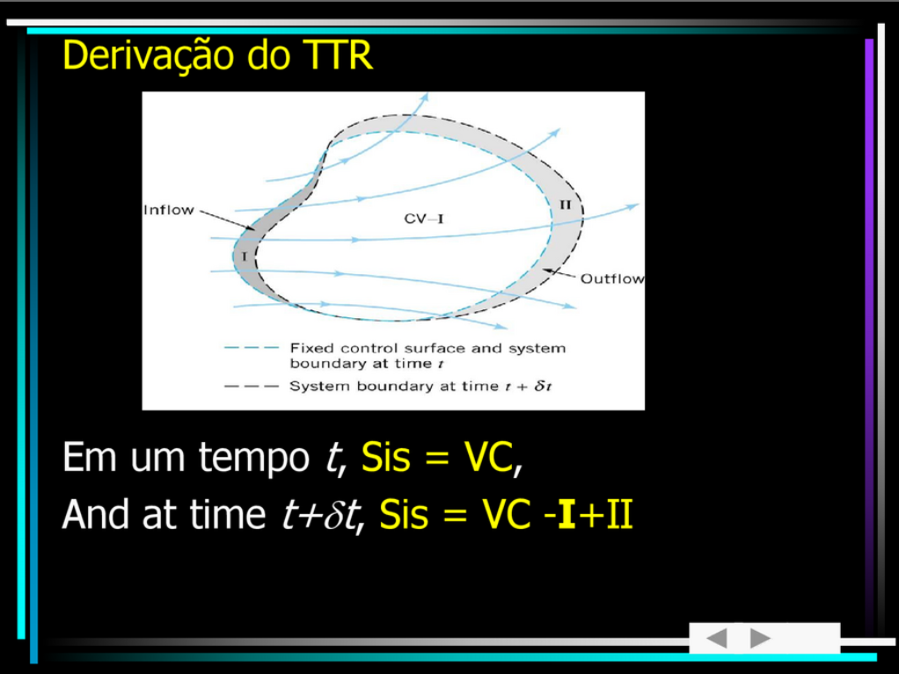

---

## Slide 6

> **Em linguagem simples:** Escrevemos quanto a propriedade B mudou no sistema e decompomos essa mudança em três partes: o que mudou dentro do VC, o que saiu e o que entrou.

### Derivação do TTR  -  passo 2

$$(1) \quad B_{Sis}(t) = B_{VC}(t)$$

$$(2) \quad B_{Sis}(t + \delta t) = B_{VC}(t + \delta t) - B_I(t + \delta t) + B_{II}(t + \delta t)$$

$$(3) \quad \frac{\delta B_{Sis}}{\delta t} = \frac{B_{VC}(t + \delta t) - B_{VC}(t)}{\delta t} - \frac{B_I(t + \delta t)}{\delta t} + \frac{B_{II}(t + \delta t)}{\delta t}$$

**O que essa conta significa:**
* Lado esquerdo: taxa de mudança de $B$ no **sistema** (seguindo as mesmas partículas).
* Primeiro termo à direita: quanto $B$ muda **dentro** do volume de controle com o tempo.
* Segundo termo: quanto $B$ **entrou** com o fluido (subtraímos porque entrou fluido que não era do sistema).
* Terceiro termo: quanto $B$ **saiu** com o fluido (somamos porque saiu fluido que era do sistema).

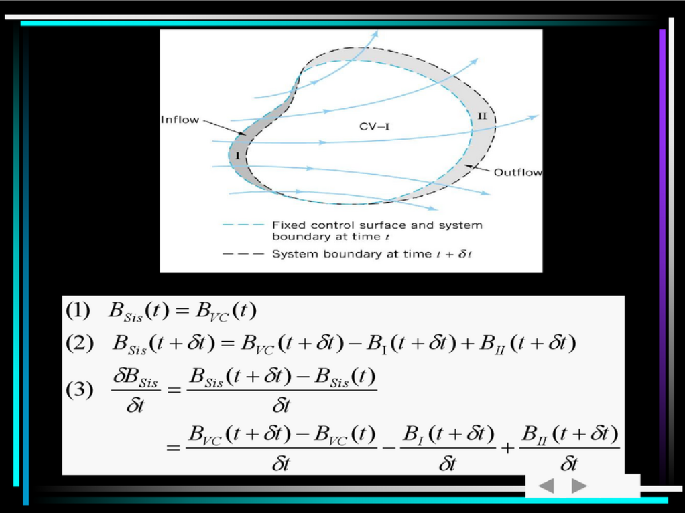

---

## Slide 7

> **Em linguagem simples:** Quando o intervalo de tempo fica muito pequeno, chegamos à forma final do TTR: a mudança no sistema é igual à mudança dentro do VC mais o que sai menos o que entra pela superfície.

### Derivação do TTR  -  passo 3 (limite $\delta t \to 0$)

$$(4) \quad \frac{\partial B_{VC}}{\partial t} = \frac{\partial}{\partial t} \int_{VC} \rho b \, d\forall$$

$$(5) \quad \dot{B}_S = \text{taxa de saída de } B \text{ pela superfície}$$

$$(6) \quad \dot{B}_E = \text{taxa de entrada de } B \text{ pela superfície}$$

**Resultado:**

$$\frac{DB_{Sis}}{Dt} = \frac{\partial B_{VC}}{\partial t} + \dot{B}_S - \dot{B}_E$$

**O que essa conta significa:**
* $\frac{DB_{Sis}}{Dt}$  -  "derivada material": como $B$ muda seguindo o sistema.
* $\frac{\partial B_{VC}}{\partial t}$  -  acúmulo (ou diminuição) de $B$ **dentro** do VC.
* $\dot{B}_S$  -  fluxo de $B$ **saindo** pela superfície.
* $\dot{B}_E$  -  fluxo de $B$ **entrando** pela superfície.

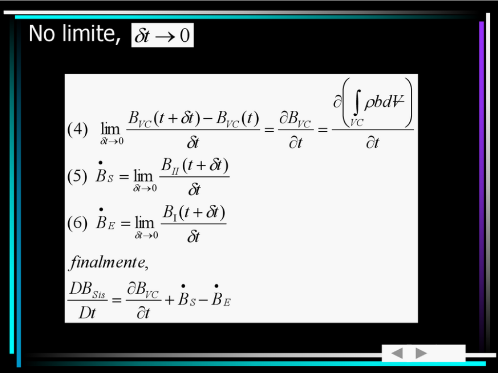

---

## Slide 8

> **Em linguagem simples:** Para calcular quanto de uma propriedade sai por segundo, multiplicamos a quantidade por unidade de volume que passa por cada pedacinho de superfície e somamos tudo.

### Taxa de saída pela superfície

Na porção de **saída** da superfície de controle:

* $\vec{V}$  -  velocidade do fluido
* $\hat{n}$  -  direção perpendicular à superfície, apontando para **fora**
* $\theta$  -  ângulo entre $\vec{V}$ e $\hat{n}$
* Só conta a componente da velocidade na direção da normal: $V \cos\theta$

$$\dot{B}_s = \int_{SC_s} \rho \, b \, \vec{V} \cdot \vec{n} \, dA$$

**O que essa conta significa:**
* $\rho \, b$  -  propriedade por unidade de volume.
* $\vec{V} \cdot \vec{n}$  -  velocidade "efetiva" na direção de saída (se o fluxo é perpendicular, é máximo; se é paralelo à parede, é zero).
* $dA$  -  área de um pedacinho da superfície.
* A integral soma todas as saídas.

**Analogia:** Como contar quantas pessoas saem por um portão por minuto: velocidade $\times$ quantidade por pessoa $\times$ área do portão.

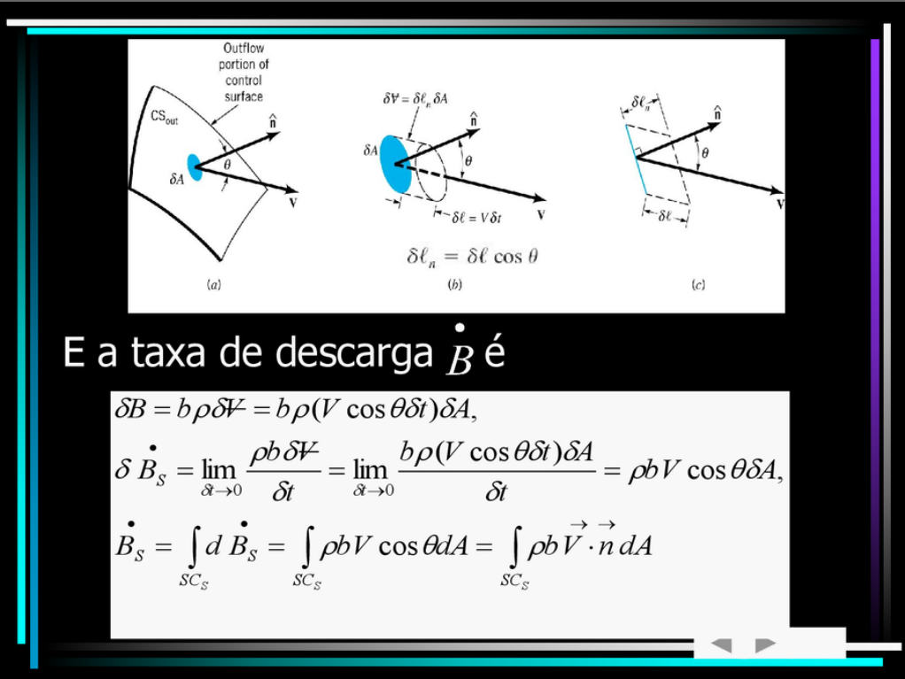

---

## Slide 9

> **Em linguagem simples:** A entrada funciona igual à saída, mas com sinal oposto. Juntando entrada e saída, obtemos um único integral sobre toda a superfície.

### Taxa de entrada e forma unificada

$$\dot{B}_E = - \int_{SC_E} \rho \, b \, \vec{V} \cdot \vec{n} \, dA$$

$$\dot{B}_S - \dot{B}_E = \int_{SC} \rho \, b \, \vec{V} \cdot \vec{n} \, dA$$

**O que essa conta significa:**
* Na **entrada**, $\vec{V}$ aponta para dentro, então $\vec{V} \cdot \vec{n}$ é negativo  -  por isso aparece o sinal de menos na fórmula de $\dot{B}_E$.
* O integral sobre **toda** a superfície $SC$ já trata entrada e saída automaticamente pelos sinais.

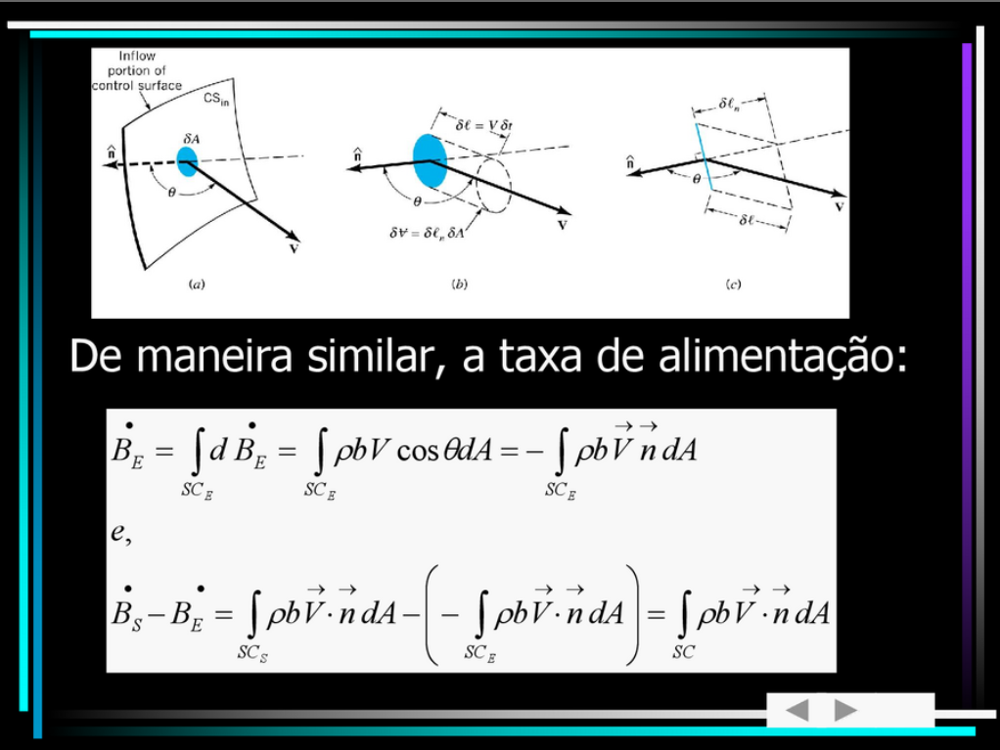

---

## Slide 10

> **Em linguagem simples:** Esta é a forma final e mais usada do TTR para volumes de controle fixos e que não mudam de forma. É a receita mestra para derivar continuidade, momento e energia.

### Forma geral do TTR (VC fixo e não deformável)

$$\frac{DB_{sys}}{Dt} = \frac{\partial}{\partial t} \int_{VC} \rho \, b \, d\forall + \int_{SC} \rho \, b \, \vec{V} \cdot \vec{n} \, dA$$

**Em palavras:**

> Mudança da propriedade no sistema = acúmulo dentro do VC + fluxo líquido pela superfície

**O que cada parte faz:**
1. **Integral de volume**  -  o que está se acumulando ou diminuindo dentro da caixa.
2. **Integral de superfície**  -  o que está entrando e saindo pelas "portas" da caixa.

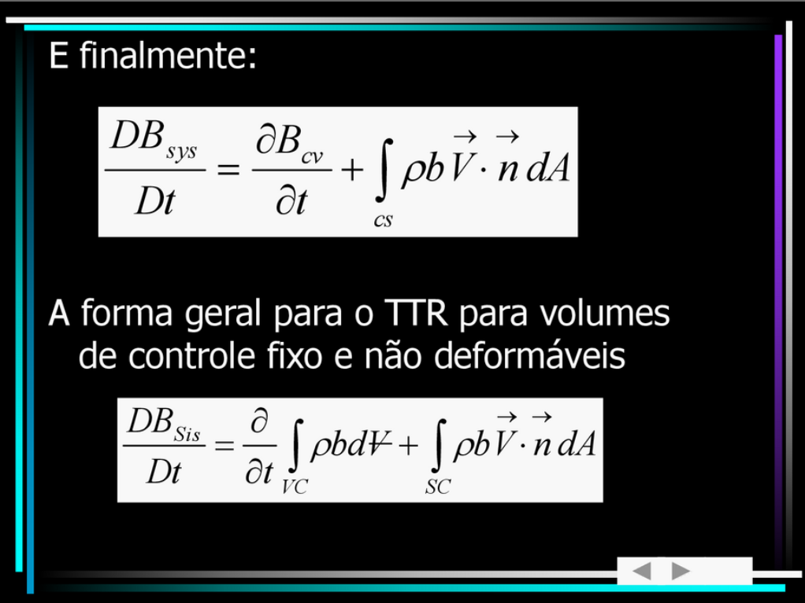

---

## Slide 11

> **Em linguagem simples:** O TTR é uma frase só: o que muda no fluido que você está seguindo equivale ao que muda dentro da caixa mais o que cruza as paredes da caixa.

### Interpretação física

$$\frac{DB_{sis}}{Dt} = \frac{\partial}{\partial t} \int_{VC} \rho \, b \, d\forall + \int_{SC} \rho \, b \, \vec{V} \cdot \vec{n} \, dA$$

**Tradução direta:**

A taxa de variação de qualquer propriedade extensiva $B$ em um **sistema** é igual a:

* a taxa de variação de $B$ **dentro** do volume de controle, **mais**
* o fluxo líquido de $B$ através da superfície do volume de controle.

**Analogia:** O saldo da sua conta = o que você guardou em casa + o que entrou pelo correio - o que você enviou.

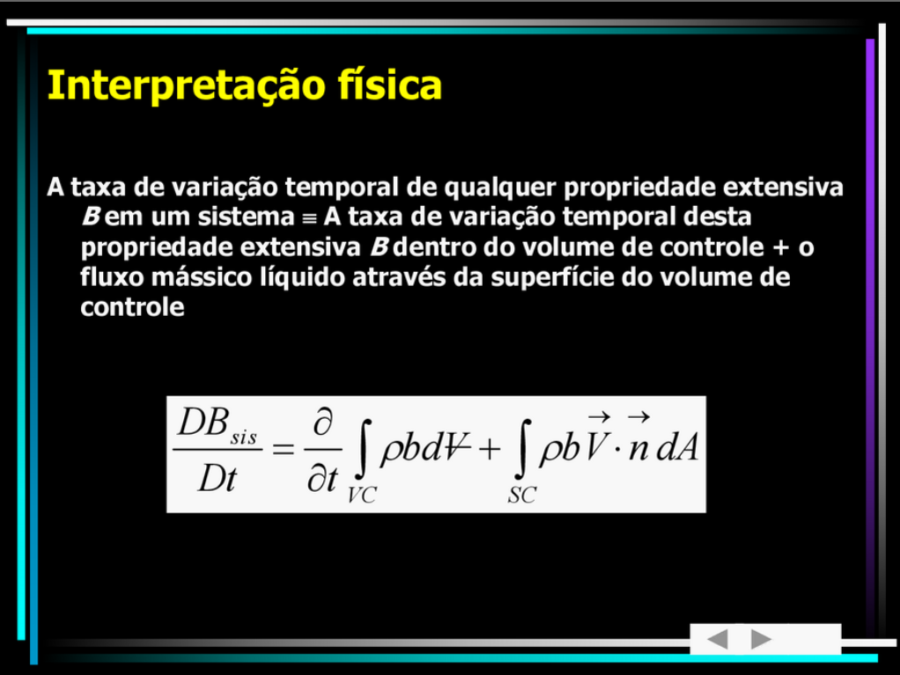

---

## Slide 12

> **Em linguagem simples:** Você pode desenhar o volume de controle de várias formas  -  nenhuma está "errada", mas algumas facilitam muito a conta. A dica é fazer a superfície cortar o escoamento de forma simples, de preferência perpendicular a ele.

### Como escolher o volume de controle

* Qualquer região do espaço pode ser um volume de controle.
* Nenhuma escolha é errada, mas algumas são **muito mais convenientes**.

**Exemplo  -  escoamento em tubo (Fig. 4.12):**

* **(a)** Superfície passa pela seção (1) $\rightarrow$ fácil de medir velocidade e pressão.
* **(b)** Ponto (1) fica fora do VC $\rightarrow$ difícil obter a propriedade na seção.
* **(c)** Superfícies inclinadas ao escoamento $\rightarrow$ integrais mais complicadas.

**Dica prática:** Coloque as "cortes" do volume de controle **perpendiculares** ao fluxo, onde as propriedades são conhecidas ou uniformes.

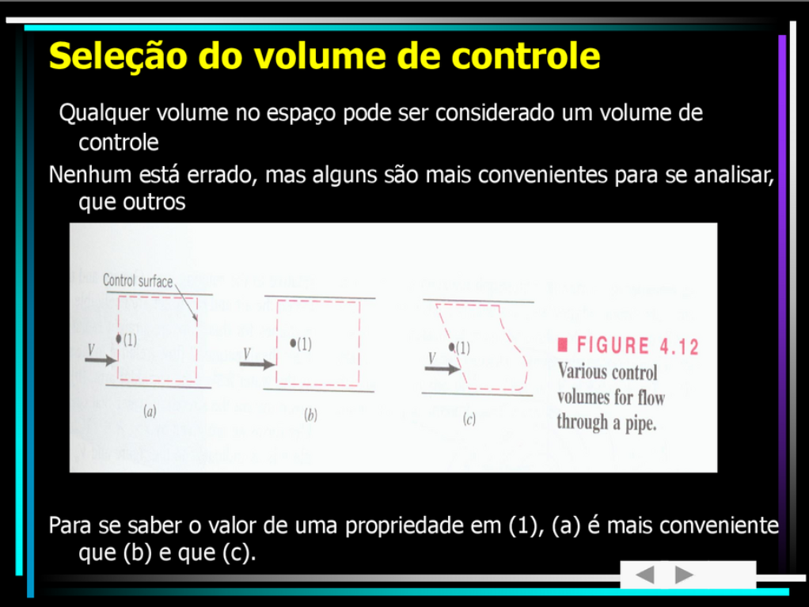

---

## Slide 14

> **Em linguagem simples:** Este desenho mostra como o fluido que entra e sai desloca a fronteira do sistema ao longo do tempo. Em 0,2 s, diferentes quantidades de fluido cruzam cada seção.

### Exemplo visual  -  sistema vs. volume de controle

**Dados do problema (Fig. P4.56):**
* Seção (1): $V_1 = 2$ m/s, diâmetro $0{,}5$ m
* Seção (2): $V_2 = 1$ m/s, diâmetro $0{,}6$ m
* Seção (3): $V_3 = 2{,}5$ m/s, diâmetro $0{,}8$ m

Em $\Delta t = 0{,}2$ s, o fluido percorre:
* Seção (1): entra $0{,}4$ m ($V_1 \Delta t$)
* Seção (2): entra $0{,}2$ m ($V_2 \Delta t$)
* Seção (3): sai $0{,}5$ m ($V_3 \Delta t$)

**O que observar:** A linha tracejada (sistema em $t = 20{,}2$ s) não coincide mais com o volume de controle  -  o sistema "andou" com o fluido.

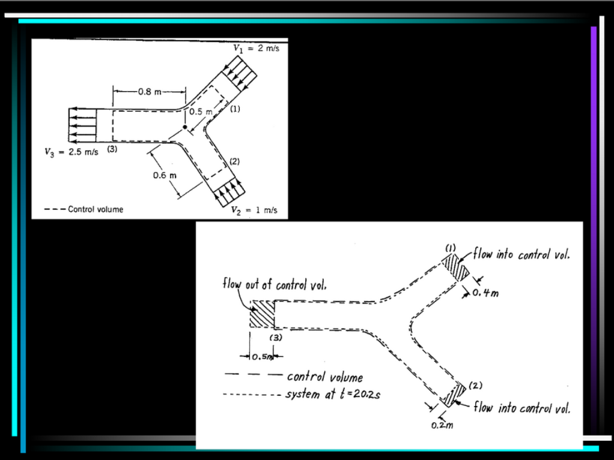

---

## Slide 15

> **Em linguagem simples:** A equação da continuidade é a lei da conservação de massa: a massa total de um sistema fechado não muda. Não se cria nem se destrói matéria.

### Equação da continuidade  -  começo da derivação

Um **sistema** é um conjunto de conteúdo fixo (as mesmas partículas).

Portanto, a massa do sistema não varia:

$$\frac{DM_{sis}}{Dt} = 0$$

A massa do sistema é:

$$M_{sis} = \int_{sis} \rho \, d\forall$$

**O que essa conta significa:**
* $M_{sis}$  -  massa total dentro do sistema (kg).
* $\rho$  -  densidade em cada ponto.
* A integral soma a massa de todos os pedacinhos de volume.

**Analogia:** Um saco fechado de bolas de gude  -  não entra nem sai nada, a massa total é constante.

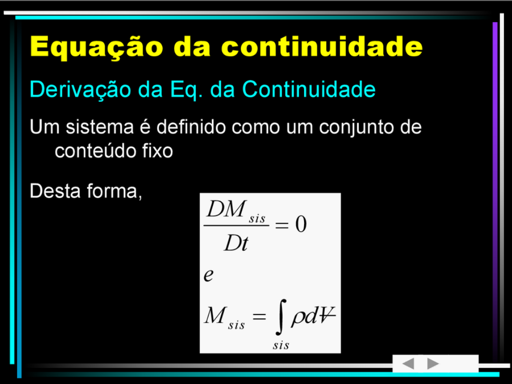

---

## Slide 16

> **Em linguagem simples:** Aplicando o TTR à massa (com $b = 1$), chegamos à continuidade para volume de controle: o que acumula dentro mais o que entra/sai pela superfície é zero.

### Equação da continuidade  -  forma integral

Pelo TTR, com $b = 1$ (propriedade = massa por unidade de massa):

$$\frac{\partial}{\partial t} \int_{VC} \rho \, d\forall + \int_{SC} \rho \, \vec{V} \cdot \vec{n} \, dA = 0$$

**Em palavras:**

> A taxa de acúmulo de massa dentro do VC + o fluxo líquido de massa pela superfície = 0

**O que isso quer dizer na prática:**
* Se entra mais massa do que sai, a massa **dentro** do VC **aumenta**.
* Se sai mais do que entra, a massa **dentro** **diminui**.
* Em regime permanente (estacionário), o acúmulo é zero: **tudo que entra, sai**.

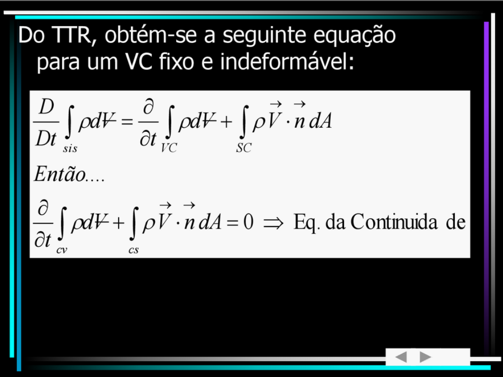

---

## Slide 17

> **Em linguagem simples:** A vazão mássica é quantos quilos de fluido passam por segundo. A velocidade média é a velocidade "típica" na seção, útil quando o perfil de velocidade não é uniforme.

### Vazão mássica e velocidade média

$$\dot{m} = \rho \, \dot{Q} = \rho \, A \, \overline{V}$$

$$\overline{V} = \frac{\int_{A} \vec{V} \cdot \vec{n} \, dA}{A} \quad \text{(densidade constante)}$$

**O que essa conta significa:**
* $\dot{m}$  -  vazão mássica (kg/s): massa que passa por segundo.
* $\dot{Q}$  -  vazão volumétrica (m$^3$/s): volume que passa por segundo.
* $A$  -  área da seção (m$^2$).
* $\overline{V}$  -  velocidade média na seção (m/s).
* A integral na definição de $\overline{V}$ faz a média ponderada das velocidades na área.

**Analogia:** Na rodovia, a velocidade média não é a mesma que a velocidade do carro mais rápido  -  é a média de todos os carros na faixa.

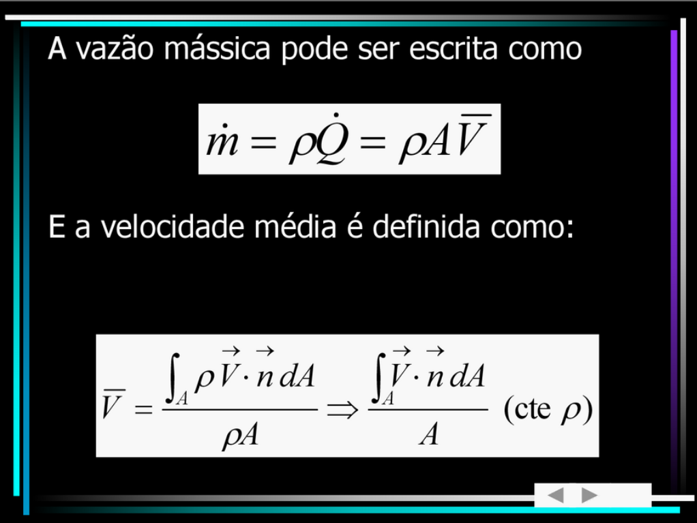

---

## Slide 19

> **Em linguagem simples:** Se a densidade dentro do VC muda com o tempo, é porque entra e sai massa em quantidades diferentes. Esta conta liga entradas, saídas e a variação da densidade.

### Continuidade  -  caso com acúmulo

$$\frac{\partial M_{VC}}{\partial t} = \dot{M}_E - \dot{M}_S$$

$$\frac{\partial \rho}{\partial t} = \frac{\rho_E \dot{Q}_E - \rho_S A_S V_S}{\forall_{VC}}$$

**O que essa conta significa:**
* $\frac{\partial M_{VC}}{\partial t}$  -  massa está se acumulando (ou diminuindo) dentro do VC.
* $\dot{M}_E$, $\dot{M}_S$  -  taxas de entrada e saída de massa.
* Se $\rho$ não é uniforme no VC, a densidade local muda conforme o balanço de massa.

**Referência:** Na atmosfera padrão ao nível do mar (101,3 kPa, $15^\circ$C), o ar tem densidade $\rho \approx 1{,}225$ kg/m$^3$.

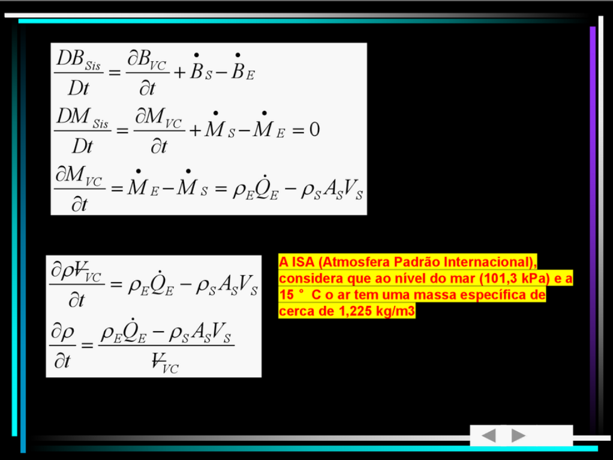

---

## Slide 21

> **Em linguagem simples:** A segunda lei de Newton aplicada a fluidos diz: a força total sobre o fluido muda a quantidade de movimento (massa $\times$ velocidade). É o equivalente a "força = massa $\times$ aceleração", mas para um volume de fluido.

### Equação da quantidade de movimento  -  derivação

A quantidade de movimento de um pedacinho de fluido:

$$\delta q = \vec{V} \, \rho \, d\forall$$

A **2ª Lei de Newton** para o sistema:

$$\frac{D}{Dt} \int_{sis} \vec{V} \, \rho \, d\forall = \sum F_{sis}$$

**O que essa conta significa:**
* $\vec{V} \, \rho \, d\forall$  -  quantidade de movimento do pedacinho (kg·m/s).
* $\sum F_{sis}$  -  soma de todas as forças externas sobre o sistema (pressão, peso, reações…).
* Lado esquerdo: como a quantidade de movimento total muda com o tempo.

**Analogia:** Empurrar um carrinho de supermercado cheio  -  quanto mais pesado e rápido, mais força precisa para mudar a direção ou a velocidade.

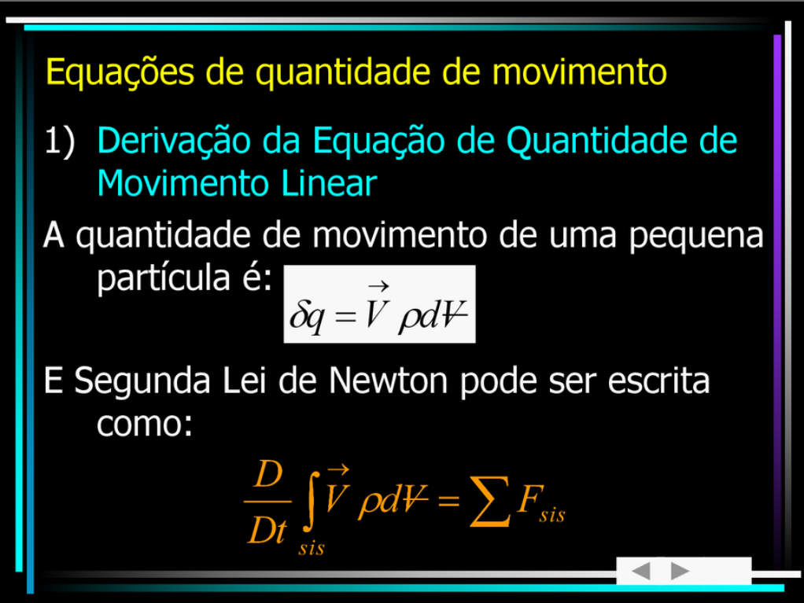

---

## Slide 22

> **Em linguagem simples:** No instante em que sistema e volume de controle coincidem, as forças externas são as mesmas nos dois. O diagrama mostra todas as forças que agem no fluido e nas paredes.

### Forças externas no sistema e no VC

Se Sis e VC coincidem num instante: $\sum F_{sis} = \sum F_{VCC}$

O diagrama mostra forças $\mathbf{F}_A$, $\mathbf{F}_B$, … $\mathbf{F}_G$ atuando no sistema e no volume de controle coincidente.

**Tipos comuns de força em problemas de fluidos:**
* **Pressão** nas seções de entrada e saída
* **Peso** do fluido e do equipamento
* **Força de fixação** (ancoragem)  -  o que queremos calcular muitas vezes
* **Reação** entre fluido e parede

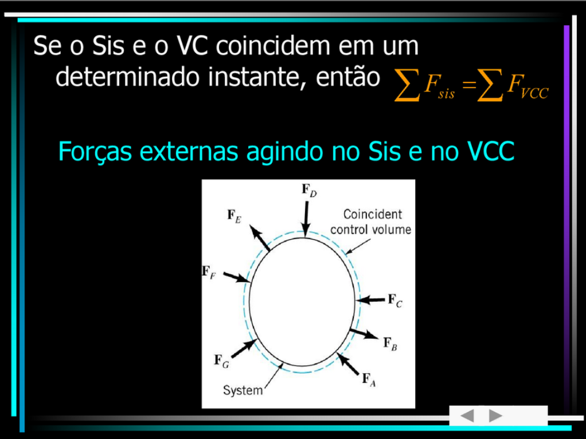

---

## Slide 23

> **Em linguagem simples:** Aplicando o TTR à quantidade de movimento, obtemos a equação do momento para volume de controle: forças externas = mudança do movimento dentro + fluxo de movimento que entra e sai.

### Equação da quantidade de movimento linear (VC fixo)

$$\frac{\partial}{\partial t} \int_{VC} \vec{V} \, \rho \, d\forall + \int_{SC} \vec{V} \, \rho \, \vec{V} \cdot \vec{n} \, dA = \sum F_{VCC}$$

**O que essa conta significa:**
* 1º termo  -  acúmulo de quantidade de movimento **dentro** do VC.
* 2º termo  -  fluxo de quantidade de movimento pela superfície (o fluido leva movimento ao entrar e ao sair).
* Lado direito  -  soma das forças externas sobre o **conteúdo** do VC.

**Em regime permanente** o 1º termo é zero e a equação fica mais simples.

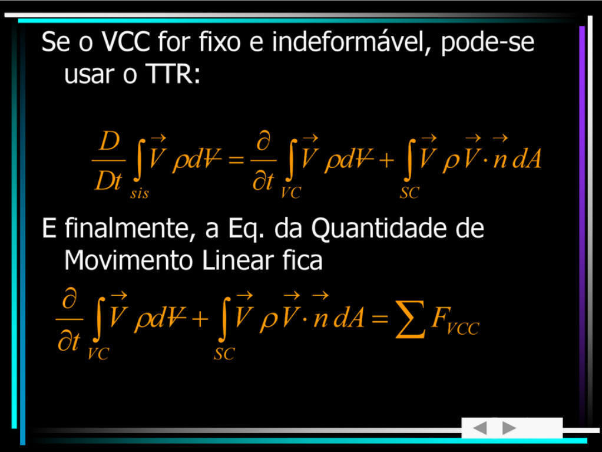

---

## Slide 24

> **Em linguagem simples:** Vamos calcular a força necessária para segurar um bocal cônico enquanto água sai por ele. É um exemplo clássico de aplicação da equação do momento.

### Aplicação  -  bocal cônico

**Enunciado:** Encontre a força para manter o bocal parado.

**Dados:**
* $\dot{Q} = 0{,}6$ L/s
* Massa do bocal $M = 0{,}1$ kg
* $D_1 = 16$ mm (entrada), $D_2 = 5$ mm (saída)
* $H = 30$ mm
* $p_1 = 464$ kPa (pressão manométrica na entrada)

O bocal é vertical: água entra embaixo e sai em cima (ou vice-versa, conforme o desenho).

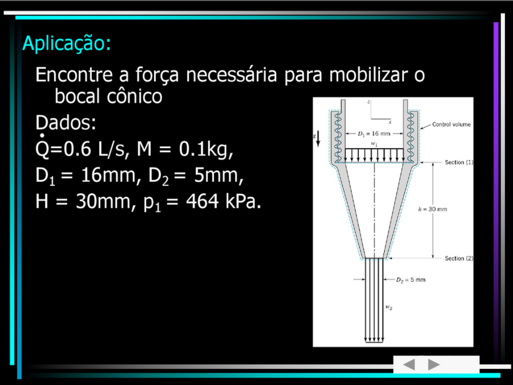

---

## Slide 25

> **Em linguagem simples:** Escolhemos como volume de controle o bocal mais a água dentro dele. Na direção vertical, somamos todas as forças e igualamos à mudança de quantidade de movimento.

### Bocal  -  montagem da equação na direção $z$

**Volume de controle:** o bocal + a água dentro do bocal.

A pressão atmosférica se cancela em todas as direções (trabalhamos com pressão **manométrica**).

Em regime **estacionário**, na direção $z$:

$$\int_{SC} w \, \rho \, \vec{V} \cdot \vec{n} \, dA = F_A - W_n - p_1 A_1 - W_w + p_2 A_2$$

**Legenda:**
* $F_A$  -  força de fixação que segura o bocal
* $W_n$  -  peso do bocal
* $W_w$  -  peso da água dentro do bocal
* $p_1 A_1$, $p_2 A_2$  -  forças de pressão nas seções (1) e (2)
* $w_1$, $w_2$  -  componentes da velocidade na direção $z$

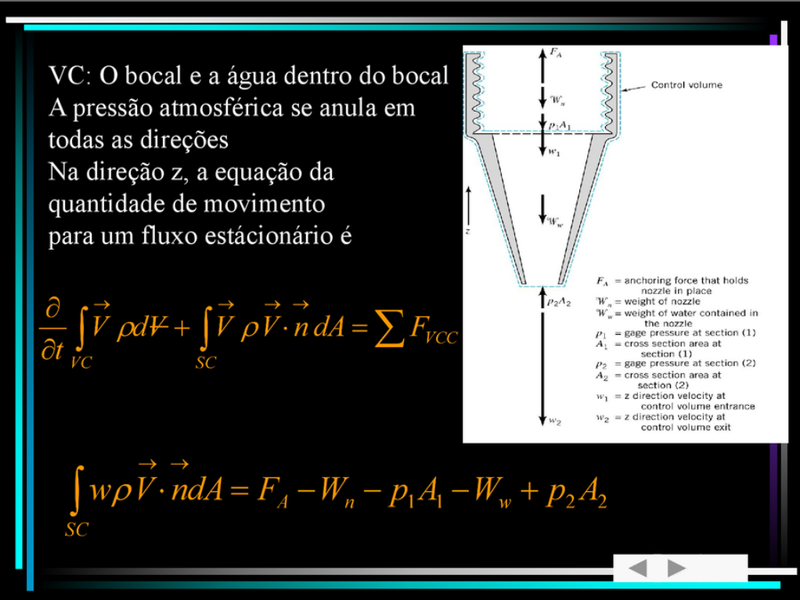

---

## Slide 26

> **Em linguagem simples:** Cuidado com os sinais! Velocidade e vazão têm direção. Depois de montar a conta e usar a continuidade ($\dot{m}$ igual na entrada e saída), isolamos a força de fixação.

### Bocal  -  resolução e sinais

**Regras de sinal:**
* Velocidade $w$ é **positiva** na direção positiva do eixo.
* O vetor normal $\vec{n}$ aponta **para fora** da superfície de controle.

Da continuidade: $\dot{m}_1 = \dot{m}_2 = \dot{m}$

**Força de fixação:**

$$F_A = \dot{m}(w_1 - w_2) + W_n + p_1 A_1 + W_w - p_2 A_2$$

Neste caso, na saída: $p_2 = 0$ (jato livre  -  pressão manométrica nula).

**O que essa conta significa:**
* $\dot{m}(w_1 - w_2)$  -  mudança de quantidade de movimento do jato
* Os demais termos  -  pesos e pressões que também precisam ser equilibrados

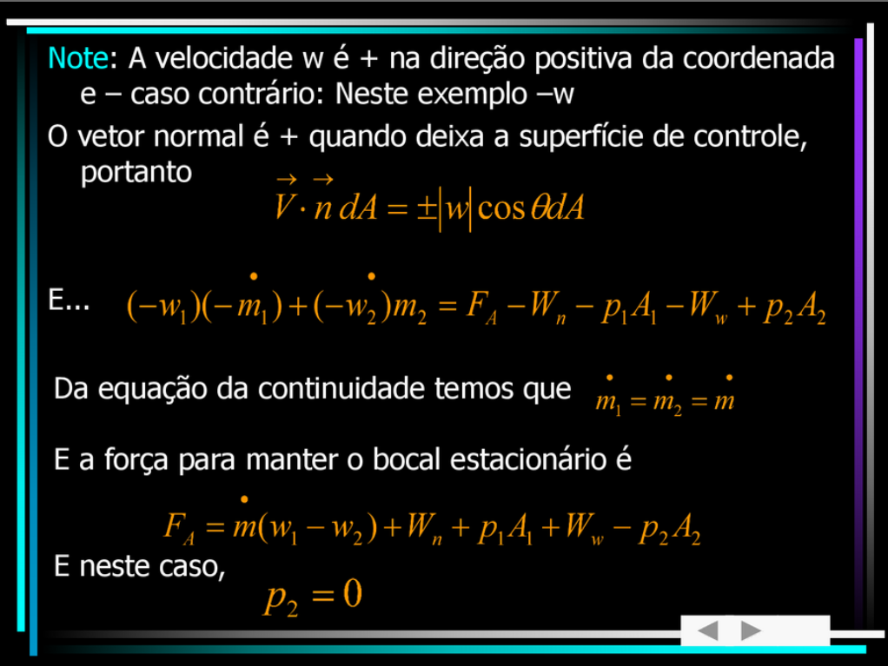

---

## Slide 27

> **Em linguagem simples:** Três dicas importantes: a integral é simples quando a velocidade é uniforme na seção; a quantidade de movimento é vetorial (tem direção); e os sinais importam muito.

### Comentários (1 a 3)

1. Se a velocidade é **uniforme** na seção, a integral vira multiplicação simples.
2. A quantidade de movimento é **vetorial**  -  analise cada direção ($x$, $y$, $z$) separadamente.
3. **Sinais algébricos:**
   * **Vazão mássica:** entrada = negativa, saída = positiva (convenção com $\vec{n}$ para fora).
   * **Velocidade:** positiva na direção positiva do eixo, negativa na direção oposta.

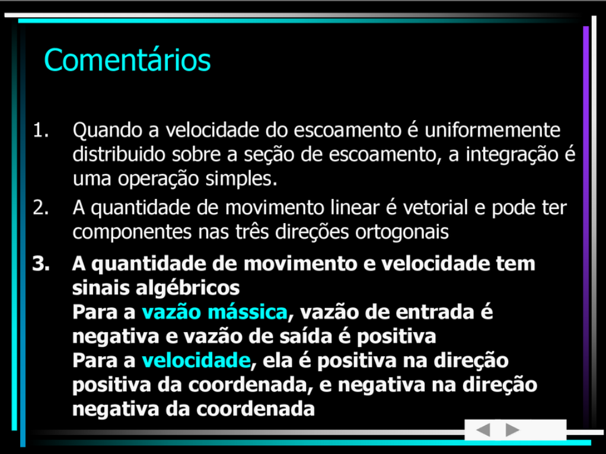

---

## Slide 28

> **Em linguagem simples:** Mais quatro dicas: em regime permanente nada acumula dentro; jatos livres têm pressão atmosférica na saída; cuide da pressão atmosférica; e forças têm sinal conforme a direção.

### Comentários (4 a 7)

4. **Regime estacionário (permanente):** $\frac{\partial}{\partial t} \int_{VC} \vec{V} \rho \, d\forall = 0$  -  nada se acumula dentro do VC.

5. **Jato livre subsônico:** na saída, $p_{man} = 0$ (pressão atmosférica).

6. Forças de pressão atmosférica devem ser analisadas com cuidado  -  muitas vezes se cancelam.

7. **Forças externas:** positivas na direção positiva do eixo, negativas no sentido oposto.

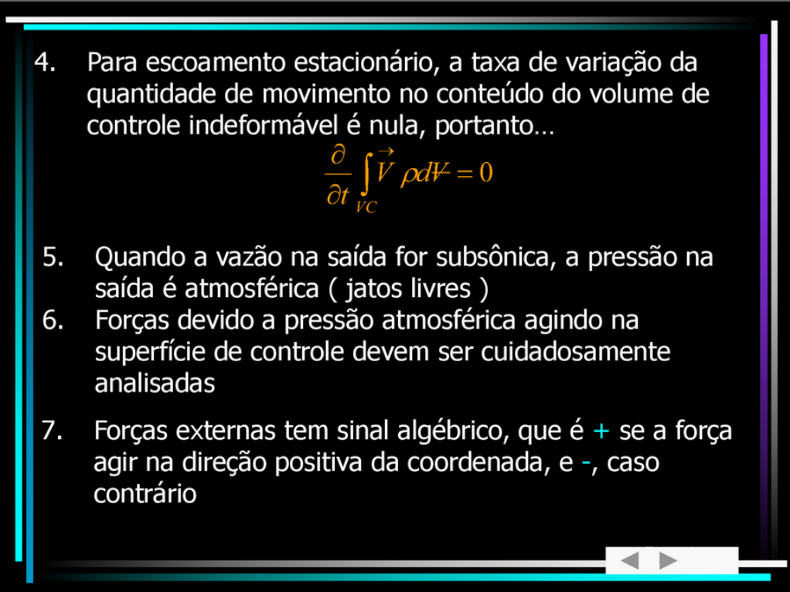

---

## Slide 29

> **Em linguagem simples:** Só entram forças externas e de campo (como gravidade). A força para segurar um equipamento pode vir da mudança de movimento do jato, da pressão, do atrito ou do peso do fluido.

### Comentários (8 e 9)

8. Além da gravidade, só forças **externas** sobre o conteúdo do VC entram na equação. Se o VC inclui só o fluido, inclua também a reação do bocal sobre a água.

9. A força para **fixar** um objeto pode ser reação a:
   * Mudança na quantidade de movimento (direção ou magnitude do jato)
   * Forças de pressão
   * Forças de atrito
   * Peso do fluido

**Analogia:** Segurar uma mangueira de jardim  -  ela puxa sua mão porque a água muda de direção e velocidade.

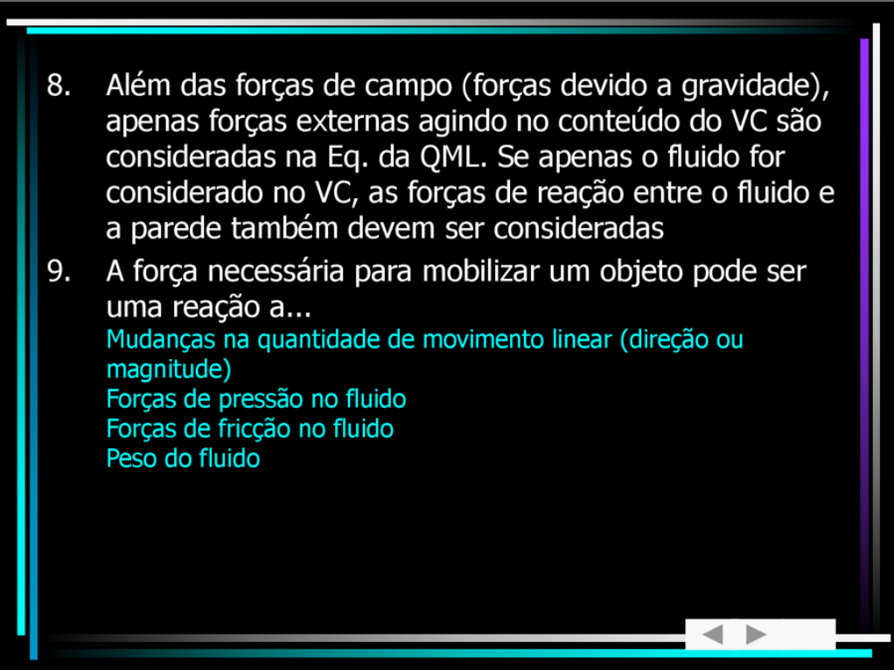

---

## Slide 30

> **Em linguagem simples:** Você pode escolher o VC de formas diferentes: só o bocal, só a água, ou os dois juntos. Cada escolha muda quais forças aparecem, mas o resultado final deve ser o mesmo.

### Comentários (10)  -  escolha do VC

O VC pode ser:
* **(c)** Só o bocal  -  aparecem $F_A$, $W_n$, reação $R_z$ do fluido.
* **(d)** Só a água  -  aparecem pressões, peso da água, reação $R_z$ do bocal.

$$R_z \equiv \text{interação entre bocal e água}$$

**Dica:** $R_z$ é a mesma em módulo nos dois casos, mas com papéis trocados (ação e reação).

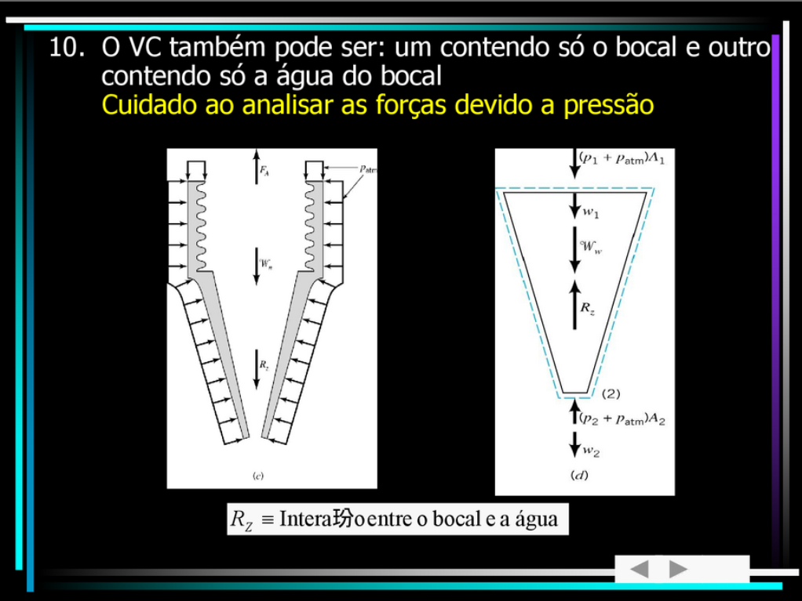

---

## Slide 31

> **Em linguagem simples:** Um jato horizontal bate numa placa inclinada e desvia. A força na placa vem da mudança da componente horizontal da quantidade de movimento.

### Exemplo  -  jato defletido ($\theta = 30^\circ$)

**Dados:** $A_1 = 0{,}06$ m$^2$, $V_1 = 4$ m/s, deflexão $\theta = 30^\circ$. Calcular $F_x$.

$$F_x = \rho \, A \, V^2 \, (1 - \cos\theta)$$

**Resultado:** $F_x = 128{,}6$ N

**O que essa conta significa:**
* O jato chega com quantidade de movimento horizontal $\rho V^2 A$.
* Ao sair inclinado, parte desse movimento vira direção vertical.
* A diferença $(1 - \cos\theta)$ é o que a placa precisa absorver na direção $x$.

**Analogia:** Segurar um chuveirinho que desvia a água  -  quanto mais inclinado, mais forte você precisa segurar.

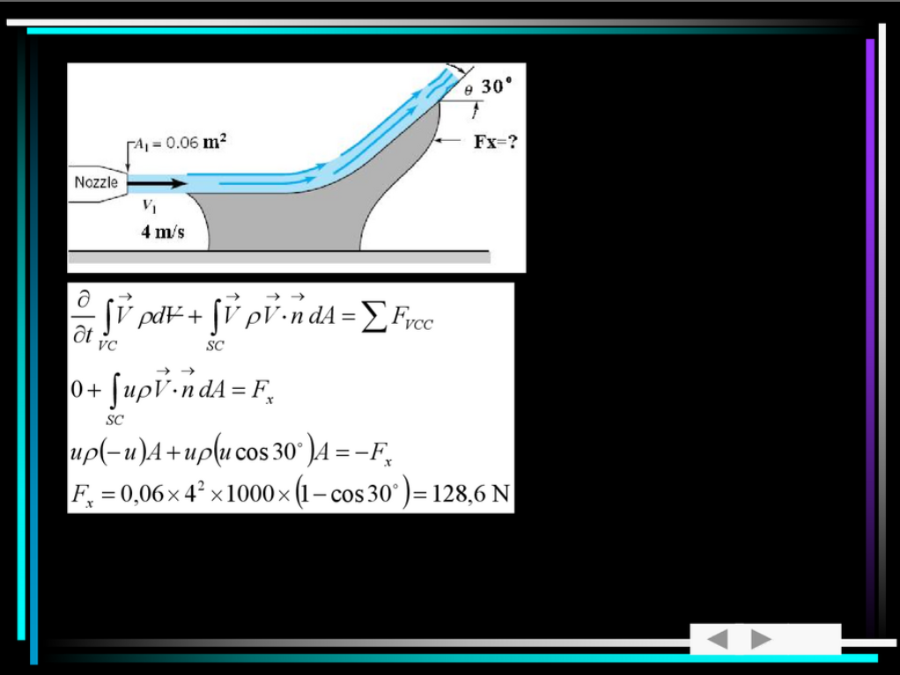

---

## Slide 33

> **Em linguagem simples:** Este exemplo combina equilíbrio de momentos (para achar uma reação) com a equação do momento (para achar a velocidade do jato). É um problema em duas etapas.

### Exemplo  -  bloco e jato (equilíbrio + momento)

**Passo 1  -  equilíbrio de momentos em $O$:**

$$R_x = \frac{W \, l_W}{l_{R_x}} = 0{,}90 \text{ N}$$

**Passo 2  -  equação do momento na direção $x$:**

$$u = \sqrt{\frac{R_x}{A \, \rho}} \quad \Rightarrow \quad V_1 = 3{,}39 \text{ m/s}$$

**Vazão:**

$$\dot{Q} = A_1 V_1 = 2{,}66 \times 10^{-4} \text{ m}^3/\text{s}$$

**O que essa conta significa:**
* Primeiro usamos estática (momentos) para achar a força do jato no bloco.
* Depois usamos a conservação de movimento para relacionar força, área, densidade e velocidade.

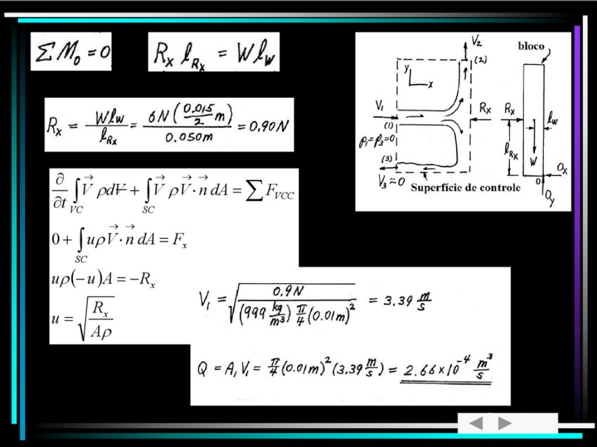

---

## Slide 34

> **Em linguagem simples:** Um jet ski é empurrado para frente porque joga água para trás com força. Quanto mais água e mais rápido o jato, maior o empuxo.

### Exemplo  -  jet ski (empuxo = 1335 N)

**Condições:** jato de descarga com diâmetro 89 mm; seção de alimentação com área $0{,}016$ m$^2$; ângulo $30^\circ$.

$$\rho \, \dot{Q}^2 \left( \frac{1}{A_s} - \frac{\cos 30^\circ}{A_e} \right) = F_x$$

$$\dot{Q} = \sqrt{\frac{A_s \, A_e \, F_x}{\rho \, (A_e - A_s \cos 30^\circ)}}$$

**O que essa conta significa:**
* $F_x$  -  empuxo desejado (força para mover o jet ski).
* $\dot{Q}$  -  vazão de água que a bomba precisa jogar para trás.
* Quanto menor a saída em relação à entrada, maior a velocidade do jato e o empuxo.

**Analogia:** Igual empurrar um barco jogando água para trás com um balde  -  quanto mais água e mais rápido, mais o barco anda.

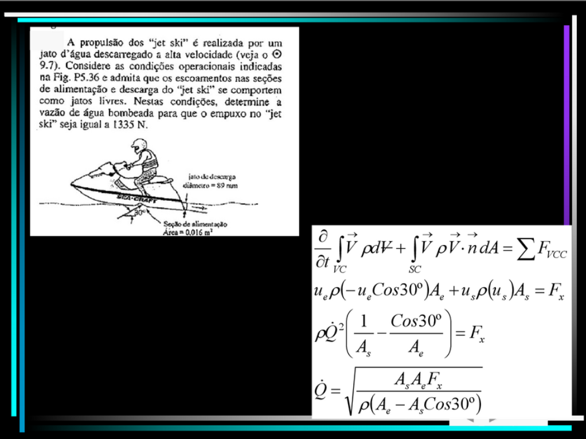

---

## Slide 36

> **Em linguagem simples:** Escoamento curvo em um canal gera forças nas paredes. Decompomos em direção $x$ e $y$ e somamos os efeitos de pressão, peso e mudança de movimento.

### Exemplo  -  escoamento curvo (forças por metro de largura)

**Direção $x$:** $F_x' \approx 3003$ N/m

**Direção $y$:** $F_y' \approx 41875$ N/m

**Força resultante:** $F' \approx 41983$ N/m

**O que fazer em problemas assim:**
1. Escolha o VC ao longo do trecho curvo.
2. Monte a equação do momento separadamente em $x$ e $y$.
3. Some pressão hidrostática, peso e termos de inércia do fluxo.
4. Combine os resultados com o teorema de Pitágoras se precisar da força total.

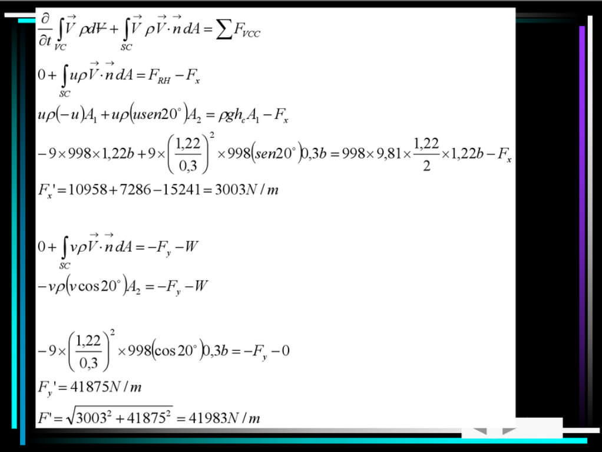

---

## Slide 37

> **Em linguagem simples:** Um tanque é enchido por jatos verticais que saem de orifícios abaixo do nível da água. A força horizontal para segurar o tanque vem da diferença entre os dois jatos.

### Exemplo  -  tanque com jatos (P5.56)

**Dados:**
* Jato esquerdo: área $1250$ mm$^2$, $1$ m abaixo do nível
* Jeto direito: área $625$ mm$^2$, $2$ m abaixo do nível
* Nível constante, tanque sobre superfície sem atrito

$$-u_1 \rho (u_1) A_1 + u_2 \rho (u_2) A_2 = F_x$$

$$u = \sqrt{2 g h} \quad \text{(Torricelli)}$$

**O que essa conta significa:**
* Cada jato leva quantidade de movimento horizontal para fora.
* Como os orifícios e alturas são diferentes, os jatos não se cancelam.
* $F_x$ é a força para manter o tanque parado.

**Analogia:** Dois chuveiros apontando para lados opostos com potências diferentes  -  o carrinho se move se você não segurar.

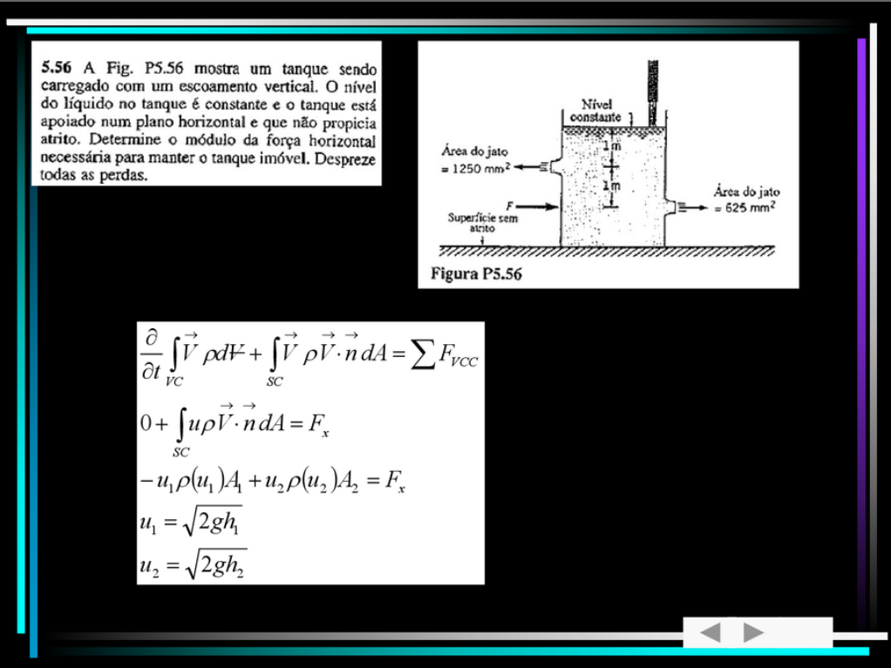

---

## Slide 38

> **Em linguagem simples:** Quatro dispositivos com jatos: alguns se movem para a direita, outros para a esquerda. A direção depende de qual jato domina (entrada vs. saída, áreas diferentes).

### Exemplo  -  qual dispositivo se move para onde?

**(a) Tubo em C**  -  jato de saída domina $\rightarrow$ move para a **esquerda**.

**(b) Recipiente que expande**  -  entrada maior que saída $\rightarrow$ move para a **direita**.

**(c) Tubo em L**  -  só saída $\rightarrow$ move para a **esquerda**.

**(d) Recipiente que contrai**  -  depende das áreas; geralmente a saída menor acelera o jato e domina.

**Fórmula útil (b e d):**

$$\rho \, \dot{Q}^2 \left( \frac{A_e - A_s}{A_s \, A_e} \right) = F_x$$

**Como raciocinar:** compare a quantidade de movimento que **entra** com a que **sai**. O dispositivo se move no sentido oposto ao jato mais "forte".

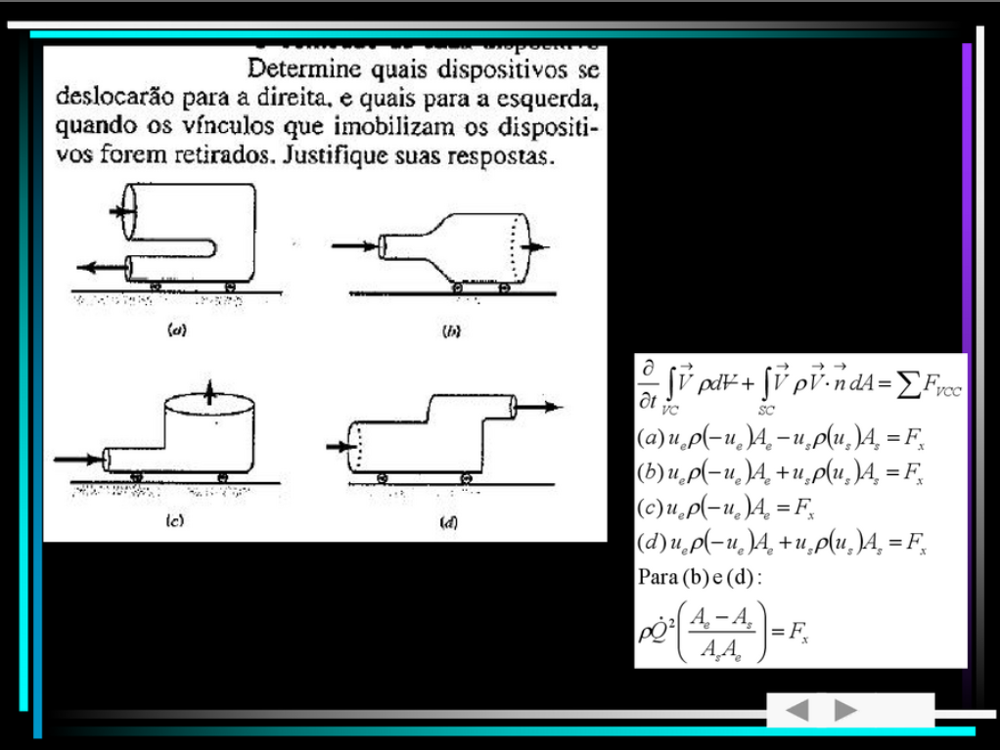

---

## Slide 39

> **Em linguagem simples:** A equação da energia é a primeira lei da termodinâmica para fluidos: a energia total muda por causa de calor transferido e trabalho realizado.

### Equação da energia  -  derivação

**1ª Lei da Termodinâmica para um sistema:**

$$\frac{D}{Dt} \int_{sis} e \, \rho \, d\forall = \dot{Q}_{liq.e} + \dot{W}_{liq.e}$$

**Energia total por unidade de massa:**

$$e = \bar{u} + g z + \frac{V^2}{2}$$

**O que essa conta significa:**
* $\bar{u}$  -  energia interna (ligada à temperatura).
* $g z$  -  energia de posição (altura).
* $\frac{V^2}{2}$  -  energia cinética por unidade de massa.
* $\dot{Q}_{liq.e}$  -  calor líquido recebido pelo sistema.
* $\dot{W}_{liq.e}$  -  trabalho líquido recebido pelo sistema.

**Analogia:** Sua conta de energia pessoal: salário (trabalho) + presente (calor) - gastos = mudança no que você tem.

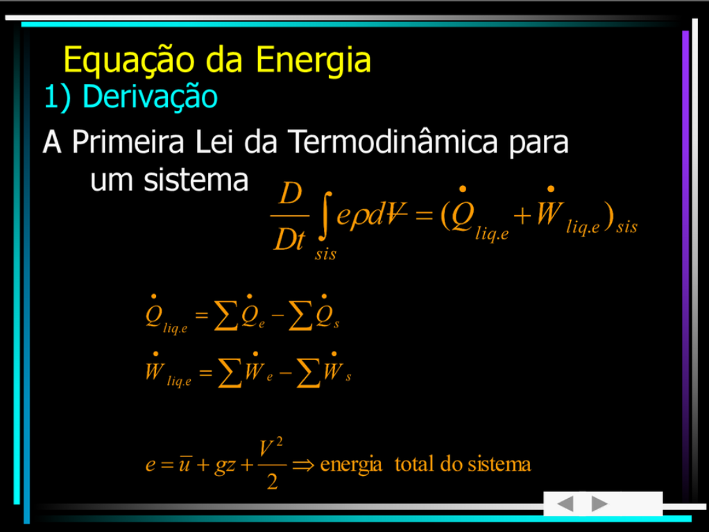

---

## Slide 40

> **Em linguagem simples:** Aplicando o TTR à energia, a mudança de energia no sistema equivale ao acúmulo dentro do VC mais o fluxo de energia que entra e sai, igual a calor mais trabalho.

### Equação da energia  -  forma para VC

$$\frac{\partial}{\partial t} \int_{VC} e \, \rho \, d\forall + \int_{SC} e \, \rho \, \vec{V} \cdot \vec{n} \, dA = \dot{Q}_{liq.e} + \dot{W}_{liq.e}$$

**Convenções de sinal:**
* **Calor** entrando no VC $\rightarrow$ **positivo**; saindo $\rightarrow$ **negativo**.
* **Trabalho** feito **pelo ambiente** sobre o VC $\rightarrow$ **positivo**; feito **pelo VC** sobre o ambiente $\rightarrow$ **negativo**.

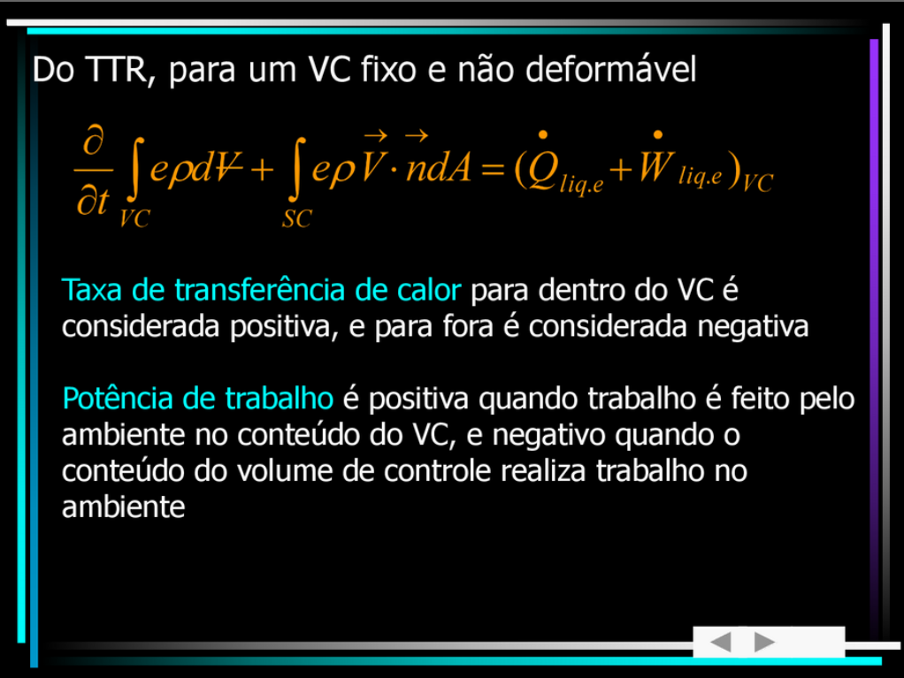

---

## Slide 41

> **Em linguagem simples:** Trabalho pode ser transferido por eixos girando (bombas, turbinas) ou por pressão empurrando o fluido nas seções de entrada e saída.

### Trabalho de eixo e trabalho de pressão

**Trabalho de eixo:**

$$\dot{W}_{eixo} = T_{eixo} \, \omega$$

**Trabalho de tensão normal (pressão):**

$$\dot{W}_{tensão} = \int_{SC} -p \, \vec{V} \cdot \vec{n} \, dA$$

**O que essa conta significa:**
* $T_{eixo}$  -  torque no eixo (N·m); $\omega$  -  velocidade angular (rad/s).
* A pressão faz trabalho quando empurra o fluido através da superfície  -  por isso entra $p \vec{V} \cdot \vec{n}$.

**Analogia:** Bomba = motor girando o eixo; pressão = empurrar o fluido como um êmbolo.

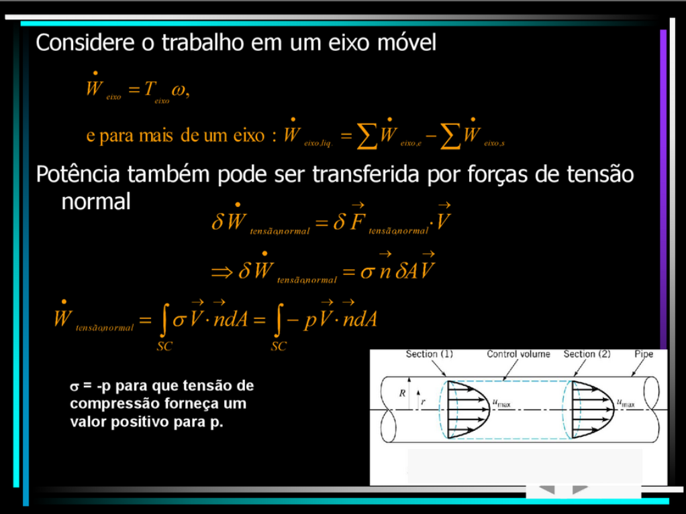

---

## Slide 42

> **Em linguagem simples:** Substituindo o trabalho de pressão na equação da energia, aparece o termo $p/\rho$ junto com energia cinética e potencial  -  a base para Bernoulli e a equação da energia mecânica.

### Equação da energia  -  forma expandida

$$\frac{\partial}{\partial t} \int_{VC} e \rho \, d\forall + \int_{SC} \left( \bar{u} + \frac{p}{\rho} + \frac{V^2}{2} + g z \right) \rho \, \vec{V} \cdot \vec{n} \, dA = \dot{Q}_{liq,e} + \dot{W}_{liq,e}$$

**O que essa conta significa:**
* $\frac{p}{\rho}$  -  trabalho de fluxo por unidade de massa (energia de "empurrar" o fluido).
* O termo entre parênteses é a **energia total de fluxo** por unidade de massa.
* O integral de superfície representa energia que entra e sai com o fluido.

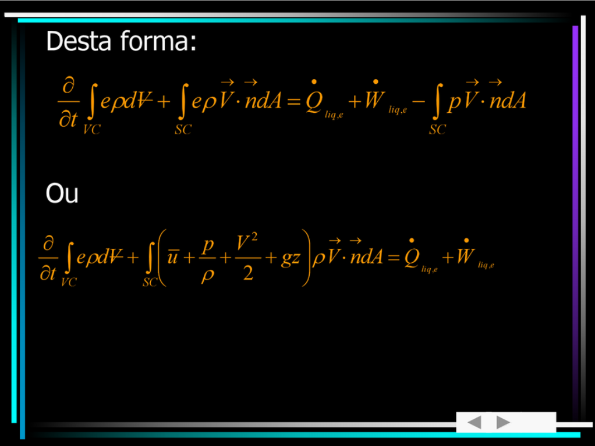

---

## Slide 43

> **Em linguagem simples:** Para problemas simples (fluxo permanente, uma entrada e uma saída, propriedades uniformes), a equação da energia vira uma conta algébrica direta.

### Equação da energia  -  caso simplificado

**Hipóteses:**
* Escoamento **estacionário**
* Uma corrente entrando e uma saindo
* Propriedades **uniformes** em cada seção

$$\dot{m} \left[ \bar{u}_s - \bar{u}_e + \left(\frac{p}{\rho}\right)_s - \left(\frac{p}{\rho}\right)_e + \frac{V_s^2 - V_e^2}{2} + g(z_s - z_e) \right] = \dot{Q}_{liq,e} + \dot{W}_{liq,e}$$

**O que essa conta significa:**
* $\dot{m}$  -  mesma vazão mássica na entrada ($s$) e saída ($e$).
* Cada colchete é a **diferença de energia** entre saída e entrada.
* Calor e trabalho líquidos aparecem do lado direito.

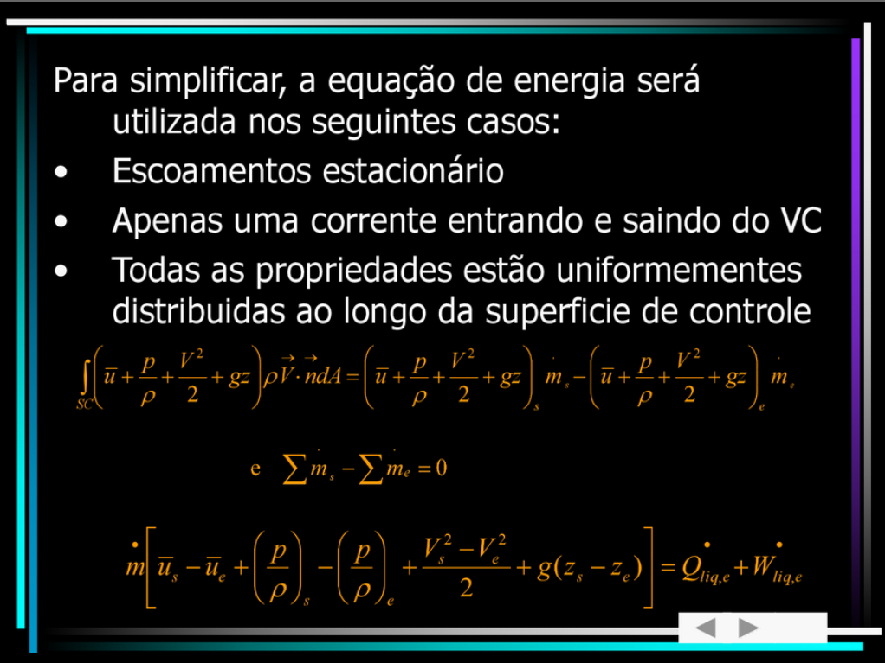

---

## Slide 44

> **Em linguagem simples:** Usando a entalpia ($h = u + p/\rho$), a equação fica mais compacta. É a forma que usamos na maioria dos exercícios de engenharia.

### Equação da energia  -  forma com entalpia

Definição de **entalpia específica:**

$$\bar{h} = \bar{u} + \frac{p}{\rho}$$

**Equação simplificada:**

$$\dot{m} \left[ \bar{h}_s - \bar{h}_e + \frac{V_s^2 - V_e^2}{2} + g(z_s - z_e) \right] = \dot{Q}_{liq,e} + \dot{W}_{liq,e}$$

**O que essa conta significa:**
* $\bar{h}$  -  energia interna + trabalho de fluxo, por kg.
* A diferença $\bar{h}_s - \bar{h}_e$ resume parte térmica e de pressão.
* Somam-se ainda as diferenças de energia cinética e potencial.

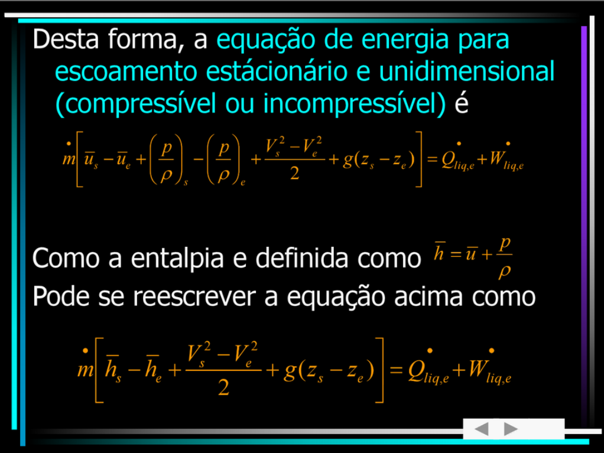

---

## Slide 45

> **Em linguagem simples:** Bernoulli é um caso especial: sem calor, sem trabalho de eixo e sem atrito, a soma pressão + velocidade + altura (por unidade de massa) se conserva ao longo do fluxo.

### Equação de Bernoulli

Para escoamento **estacionário**, **incompressível**, **sem trabalho de eixo** e **sem atrito**:

$$\frac{p_s}{\rho} + \frac{V_s^2}{2} + g z_s = \frac{p_e}{\rho} + \frac{V_e^2}{2} + g z_e$$

**O que essa conta significa:**
* $\frac{p}{\rho}$  -  energia de pressão por kg.
* $\frac{V^2}{2}$  -  energia cinética por kg.
* $g z$  -  energia potencial por kg.
* A soma dos três é **constante** entre duas seções (sem perdas).

**Analogia:** Tobogã de água  -  quanto mais alto e parado, mais pressão; quanto mais baixo e rápido, mais velocidade.

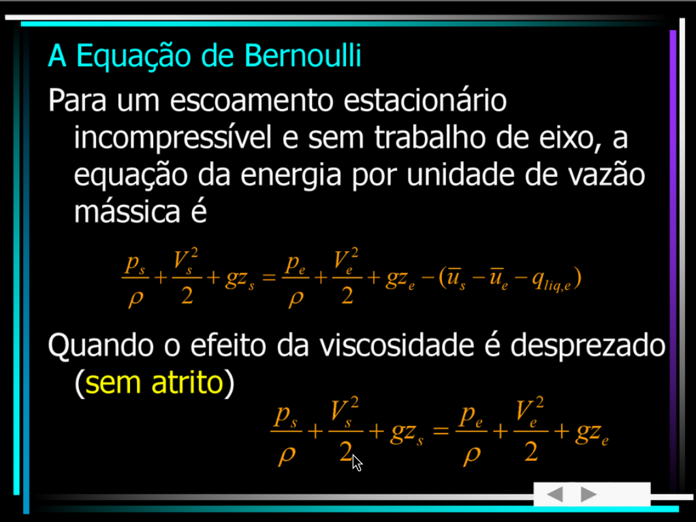

---

## Slide 46

> **Em linguagem simples:** Com atrito, parte da energia vira calor e a soma de Bernoulli não se conserva  -  aparece uma "perda". Sem atrito, a diferença de energia interna menos calor é zero.

### Bernoulli com e sem atrito

**Sem atrito:**

$$\bar{u}_s - \bar{u}_e - q_{liq,e} = 0$$

**Com atrito:**

$$\bar{u}_s - \bar{u}_e - q_{liq,e} > 0$$

**O que isso quer dizer:**
* Sem atrito: toda energia mecânica se transforma em movimento ou pressão  -  nada se "perde".
* Com atrito: parte vira calor (energia interna)  -  a soma mecânica diminui.

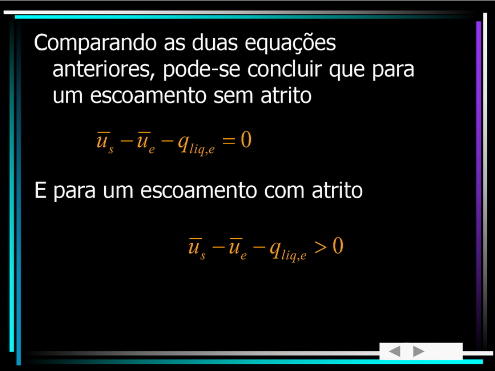

---

## Slide 47

> **Em linguagem simples:** A "perda" é energia útil que virou calor por causa do atrito. Na equação de Bernoulli estendida, subtraímos essa perda do lado da saída.

### Perda de energia (head loss)

$$\bar{u}_s - \bar{u}_e - q_{liq,e} = \text{perda}$$

$$\frac{p_s}{\rho} + \frac{V_s^2}{2} + g z_s = \frac{p_e}{\rho} + \frac{V_e^2}{2} + g z_e - \text{perda}$$

**O que essa conta significa:**
* **Perda**  -  energia mecânica que deixou de estar disponível (dissipada por atrito).
* Na prática, tubos longos, válvulas e curvas aumentam a perda.

**Analogia:** Escorregar num escorregador molhado vs. num escorregador rugoso  -  no rugoso você chega mais devagar (perdeu energia com atrito).

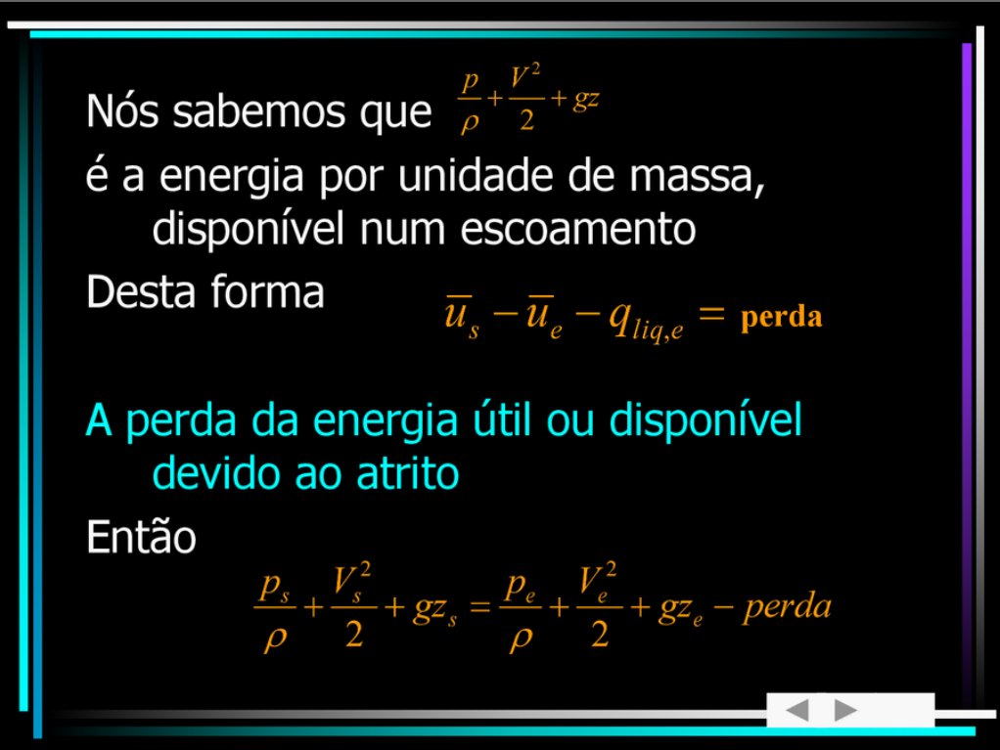

---

## Slide 48

> **Em linguagem simples:** Se há bomba ou turbina no circuito, entra um termo de trabalho de eixo. Essa é a Bernoulli estendida ou equação da energia mecânica.

### Equação da energia mecânica (Bernoulli estendida)

$$\frac{p_s}{\rho} + \frac{V_s^2}{2} + g z_s = \frac{p_e}{\rho} + \frac{V_e^2}{2} + g z_e + w_{liq,e} - \text{perda}$$

**Nomes equivalentes:**
* **Equação da energia mecânica**
* **Equação de Bernoulli estendida**

**O que essa conta significa:**
* $w_{liq,e}$  -  trabalho líquido **por unidade de massa** (positivo se a bomba entrega energia ao fluido).
* **Perda**  -  energia dissipada por atrito.

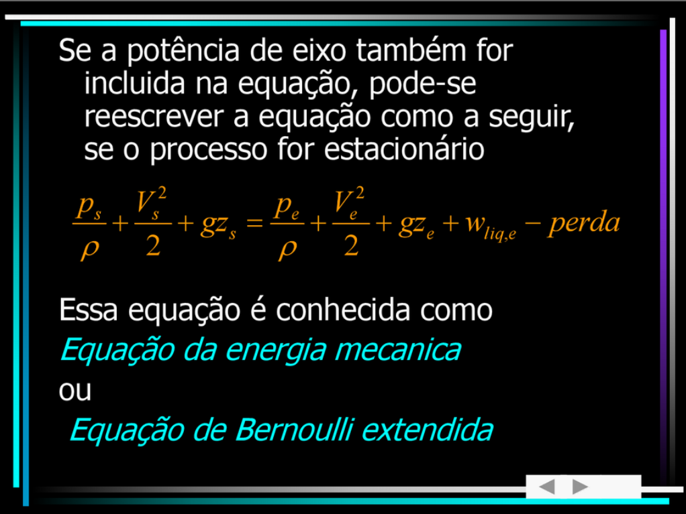

---

## Slide 49

> **Em linguagem simples:** Dividindo tudo por $g$, as energias viram "alturas" (metros de coluna d'água)  -  formato muito usado por engenheiros hidráulicos.

### Forma em "cargas" (dividindo por $g$)

$$\frac{p_{out}}{\gamma} + \frac{V_{out}^2}{2g} + z_{out} = \frac{p_{in}}{\gamma} + \frac{V_{in}^2}{2g} + z_{in} + h_{eixo} - h_L$$

**Definições:**
* $\gamma = \rho g$  -  peso específico (N/m$^3$)
* $h_{eixo} = \dot{W}_{liq,e} / (\gamma \dot{Q})$  -  **carga de eixo** (m)
* $h_b = h_{eixo}$  -  carga da **bomba**
* $h_T = -h_{eixo}$  -  carga da **turbina**
* $h_L = \text{perda} / g$  -  **perda de carga** (m)

**O que essa conta significa:**
* Cada termo tem unidade de **metros**  -  "equivalente a uma coluna d'água dessa altura".
* Mais fácil de visualizar em instalações hidráulicas.

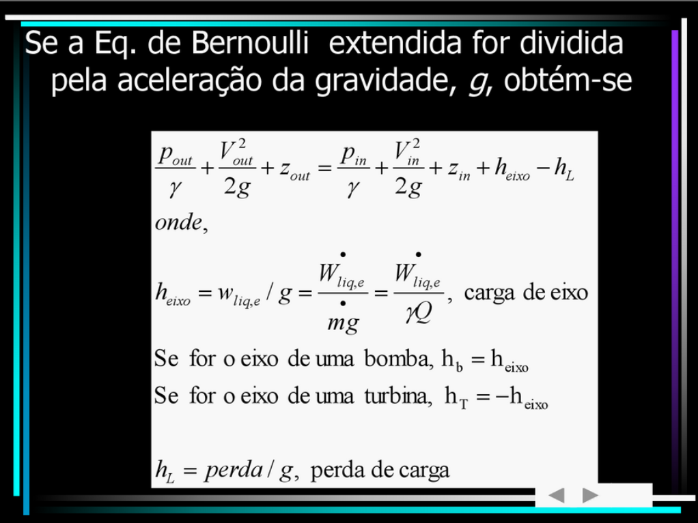

---

## Slide 51

> **Em linguagem simples:** Um jato bate numa placa com um furo inclinado e se divide em dois. Usamos Bernoulli para achar velocidades e continuidade + momento para achar forças e áreas.

### Exemplo  -  jato em placa com furo (solução)

**Bernoulli entre 0 e 1, e entre 0 e 2:** $V_1 = V_2 = V_0$

**Continuidade:** $V_0 A_0 = V_1 A_1 + V_2 A_2$

**Momento:** sistema de equações com componentes $x$ e $y$ envolvendo $N \sin\alpha$, $N \cos\alpha$ e áreas.

**Resultado numérico (do slide):**
* $N = 126{,}8$ N
* $A_1 = 0{,}0071$ m$^2$
* $A_2 = 0{,}0009$ m$^2$

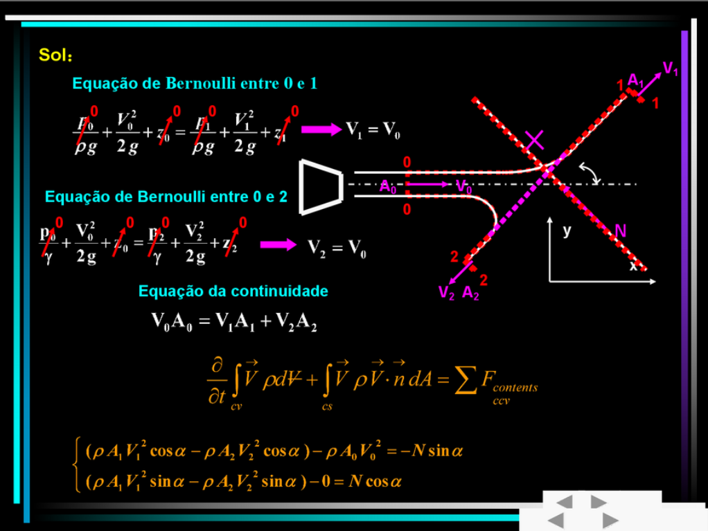

---

## Slide 52

> **Em linguagem simples:** Continuação do exemplo anterior com as contas numéricas detalhadas. Três equações (duas de momento + continuidade) para três incógnitas.

### Exemplo  -  jato em placa (cálculos)

Sistema resolvido:

$$\begin{cases}
N = 126{,}8 \text{ N} \\
A_1 = 0{,}0071 \text{ m}^2 \\
A_2 = 0{,}0009 \text{ m}^2
\end{cases}$$

**Estratégia de resolução:**
1. Bernoulli $\rightarrow$ velocidades iguais nas seções.
2. Continuidade $\rightarrow$ relação entre áreas.
3. Momento em $x$ e $y$ $\rightarrow$ força normal $N$ e áreas $A_1$, $A_2$.

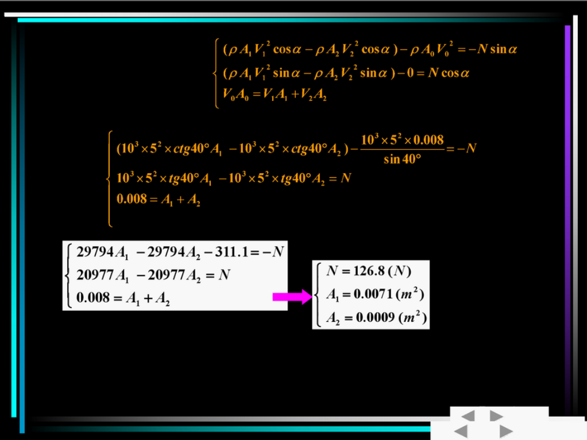

---

## Slide 54

> **Em linguagem simples:** Uma bomba eleva óleo entre dois diâmetros diferentes. O manômetro mede a diferença de pressão. Usamos a equação da energia mecânica para achar a potência da bomba.

### Exemplo  -  bomba e manômetro (P5.122)

**Elementos:** óleo, bomba, tubos de 305 mm e 152 mm, manômetro com coluna de 914 mm.

$$\frac{p_s}{\gamma} + \frac{V_s^2}{2g} + z_s = \frac{p_e}{\gamma} + \frac{V_e^2}{2g} + z_e + h_{eixo} - h_L$$

**O que fazer:**
1. Escrever Bernoulli estendida entre entrada e saída.
2. Incluir $h_{eixo}$ (bomba) e $h_L$ (perdas  -  aqui podem ser zero).
3. Usar o manômetro para $p_s - p_e$.

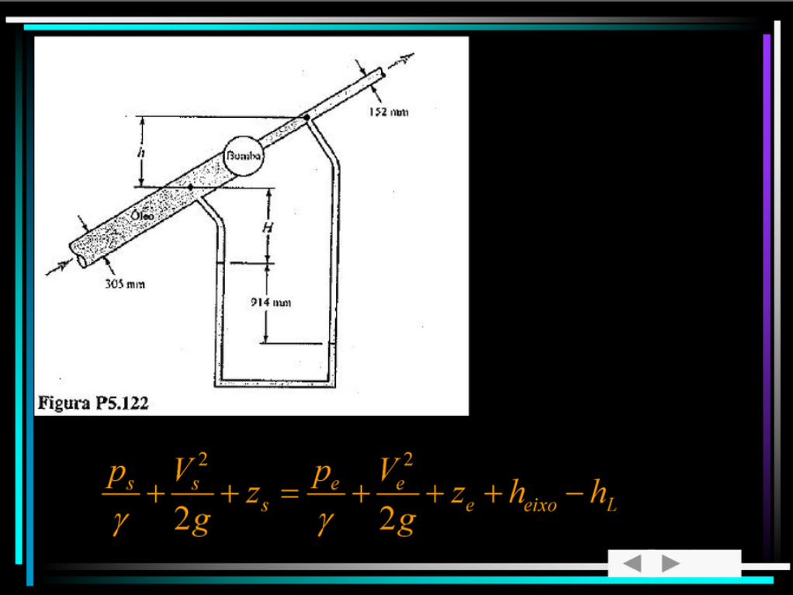

---

## Slide 55

> **Em linguagem simples:** Desenvolvemos a fórmula da potência da bomba em função da vazão, pressões, diâmetros e alturas. É a ferramenta para calcular quantos watts a bomba precisa entregar.

### Potência da bomba  -  dedução

$$h_{eixo} = \frac{\dot{W}_{liq,e}}{\gamma \dot{Q}}$$

$$\dot{Q} = A \cdot V$$

Com $h_L = 0$:

$$\dot{W}_{liq,e} = \dot{Q}(p_s - p_e) + \frac{8 \rho \dot{Q}^3}{\pi^2} \left( \frac{1}{D_s^4} - \frac{1}{D_e^4} \right) + \gamma \dot{Q}(z_s - z_e)$$

**O que essa conta significa:**
* 1º termo  -  trabalho para vencer a diferença de pressão.
* 2º termo  -  trabalho para acelerar o fluido (diâmetros diferentes).
* 3º termo  -  trabalho para elevar o fluido (diferença de altura).

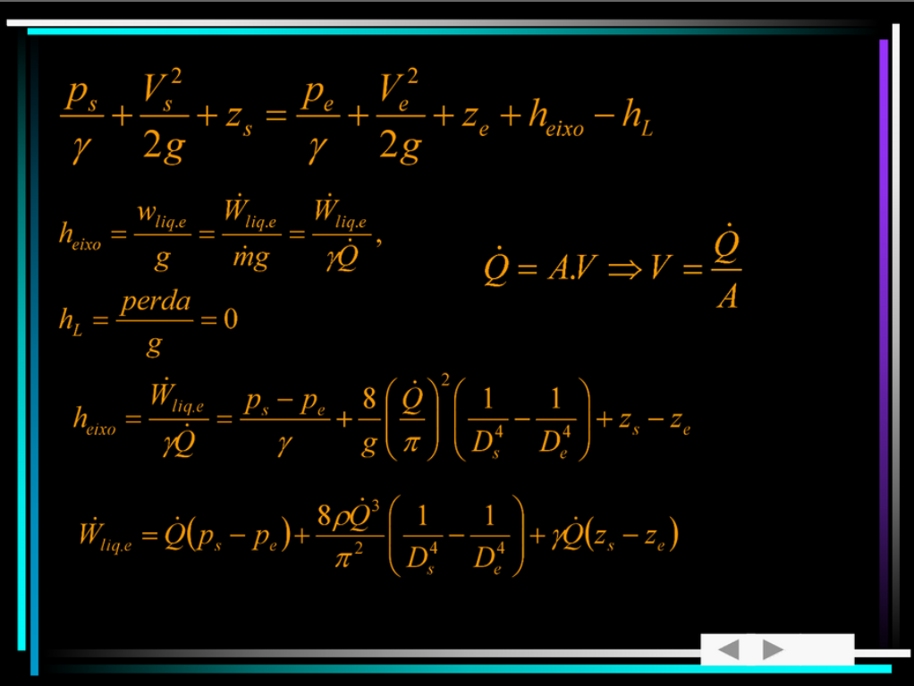

---

## Slide 56

> **Em linguagem simples:** O manômetro com mercúrio mede a pressão na linha de referência. Igualando as pressões em dois pontos, achamos $p_s - p_e$ e simplificamos a potência da bomba.

### Manometria no exemplo da bomba

Na linha de referência do manômetro:

$$p_s - p_e = 0{,}914 \, (\gamma_{merc} - \gamma_{oleo}) - \gamma_{oleo} h$$

**Potência simplificada:**

$$\dot{W}_{liq,e} = \dot{Q} \cdot 0{,}914 \cdot (\gamma_{merc} - \gamma_{oleo}) + \frac{8 \rho \dot{Q}^3}{\pi^2} \left( \frac{1}{D_s^4} - \frac{1}{D_e^4} \right)$$

**O que essa conta significa:**
* O termo com $(\gamma_{merc} - \gamma_{oleo})$ vem da leitura do manômetro.
* O termo com $\dot{Q}^3$ vem da mudança de velocidade entre tubos de diâmetros diferentes.
* Note que o termo $\gamma_{oleo} h$ se cancelou.

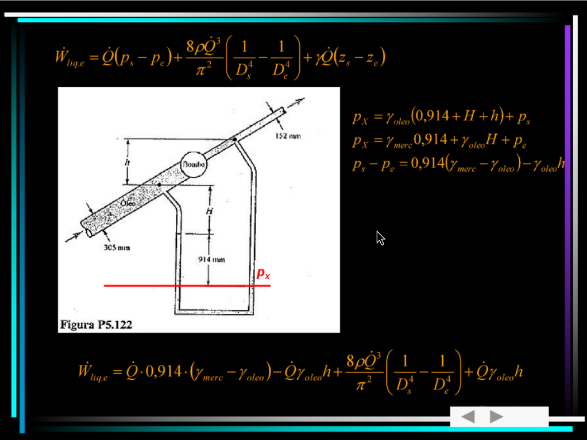

---

## Slide 57

> **Em linguagem simples:** Verificação de unidades: cada termo da potência da bomba deve sair em watts (J/s ou N·m/s). Conferir dimensões é um bom hábito para pegar erros de conta.

### Verificação dimensional da potência

$$\left[\frac{N \cdot m}{s}\right] = \left[\frac{N \cdot m}{s}\right] + \left[\frac{N \cdot m}{s}\right]$$

**Termos:**
* $\dot{Q} \cdot \Delta h \cdot \gamma$ $\rightarrow$ (m$^3$/s) $\times$ (m) $\times$ (N/m$^3$) = N$\cdot$m/s (ok)
* $\rho \dot{Q}^3 / D^4$ $\rightarrow$ (kg/m$^3$)(m$^9$/s$^3$)(1/m$^4$) = kg$\cdot$m$^2$/s$^3$ = N$\cdot$m/s (ok)

**Dica:** Sempre confira se o resultado final está em **watts** (potência).

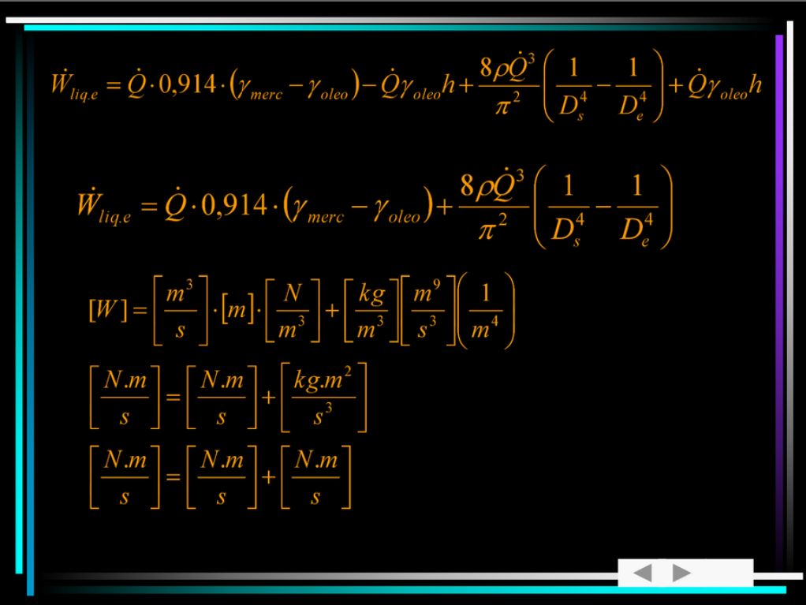

---

## Formulário  -  Parte 4 (com explicações para iniciantes)

Abaixo estão as fórmulas principais desta parte, agrupadas por assunto. Cada uma vem com uma explicação em linguagem simples.

---

### Teorema do transporte de Reynolds (TTR)

| Fórmula | O que significa |
|---------|-----------------|
| $B = m b$ | Propriedade total = massa $\times$ propriedade por kg |
| $B_{sis} = \int_{sis} \rho b \, d\forall$ | Soma da propriedade em todo o sistema |
| $\frac{DB_{Sis}}{Dt} = \frac{\partial B_{VC}}{\partial t} + \dot{B}_S - \dot{B}_E$ | Mudança no sistema = acúmulo no VC + saída - entrada |
| $\frac{DB_{Sis}}{Dt} = \frac{\partial}{\partial t}\int_{VC} \rho b \, d\forall + \int_{SC} \rho b \vec{V}\cdot\vec{n}\, dA$ | Forma integral completa do TTR |
| $\int_{SC} \rho b \vec{V}\cdot\vec{n}\, dA$ | Fluxo líquido da propriedade pela superfície |

**Ideia central:** O TTR é a "ponte" que permite usar volume de controle em vez de seguir partículas.

---

### Equação da continuidade (conservação de massa)

| Fórmula | O que significa |
|---------|-----------------|
| $\frac{DM_{sis}}{Dt} = 0$ | Massa de um sistema fechado não muda |
| $\frac{\partial}{\partial t}\int_{VC} \rho \, d\forall + \int_{SC} \rho \vec{V}\cdot\vec{n}\, dA = 0$ | O que acumula dentro + o que entra/sai = 0 |
| $\dot{m} = \rho \dot{Q} = \rho A \overline{V}$ | Quilos por segundo = densidade $\times$ vazão volumétrica |
| $\overline{V} = \frac{\int_A \vec{V}\cdot\vec{n}\, dA}{A}$ | Velocidade média na seção |

**Ideia central:** Tudo que entra tem que sair (em regime permanente) ou acumular dentro.

---

### Equação da quantidade de movimento

| Fórmula | O que significa |
|---------|-----------------|
| $\frac{D}{Dt}\int_{sis} \vec{V}\rho\, d\forall = \sum F_{sis}$ | Forças mudam o movimento do fluido |
| $\frac{\partial}{\partial t}\int_{VC} \vec{V}\rho\, d\forall + \int_{SC} \vec{V}\rho \vec{V}\cdot\vec{n}\, dA = \sum F_{VCC}$ | Forma para volume de controle |
| $F_A = \dot{m}(w_1 - w_2) + W_n + p_1 A_1 + W_w - p_2 A_2$ | Força para segurar um bocal |
| $F_x = \rho A V^2 (1 - \cos\theta)$ | Força de um jato defletido |
| $\rho \dot{Q}^2 \left(\frac{1}{A_s} - \frac{\cos\theta}{A_e}\right) = F_x$ | Empuxo de motor a jato |
| $\rho \dot{Q}^2 \left(\frac{A_e - A_s}{A_s A_e}\right) = F_x$ | Força em dispositivos com áreas diferentes |

**Ideia central:** Força externa = mudança de movimento dentro + movimento que entra/sai com o fluido.

---

### Equação da energia

| Fórmula | O que significa |
|---------|-----------------|
| $e = \bar{u} + gz + \frac{V^2}{2}$ | Energia total por kg (interna + altura + velocidade) |
| $\bar{h} = \bar{u} + \frac{p}{\rho}$ | Entalpia = energia interna + trabalho de fluxo |
| $\dot{m}\left[\bar{h}_s - \bar{h}_e + \frac{V_s^2 - V_e^2}{2} + g(z_s - z_e)\right] = \dot{Q}_{liq,e} + \dot{W}_{liq,e}$ | Balanço de energia entre entrada e saída |
| $\dot{W}_{eixo} = T_{eixo}\,\omega$ | Potência do eixo = torque $\times$ rotação |
| $\dot{W}_{tensão} = \int_{SC} -p \vec{V}\cdot\vec{n}\, dA$ | Trabalho da pressão empurrando o fluido |

**Ideia central:** Energia não some  -  entra com calor e trabalho, sai ou acumula com o fluido.

---

### Bernoulli e energia mecânica

| Fórmula | O que significa |
|---------|-----------------|
| $\frac{p_s}{\rho} + \frac{V_s^2}{2} + gz_s = \frac{p_e}{\rho} + \frac{V_e^2}{2} + gz_e$ | Bernoulli simples (sem perdas, sem bomba) |
| $\frac{p_s}{\rho} + \frac{V_s^2}{2} + gz_s = \frac{p_e}{\rho} + \frac{V_e^2}{2} + gz_e + w_{liq,e} - \text{perda}$ | Bernoulli estendida (com bomba e perdas) |
| $\frac{p_{out}}{\gamma} + \frac{V_{out}^2}{2g} + z_{out} = \frac{p_{in}}{\gamma} + \frac{V_{in}^2}{2g} + z_{in} + h_{eixo} - h_L$ | Mesma equação em "metros de carga" |
| $h_{eixo} = \dot{W}_{liq,e}/(\gamma \dot{Q})$ | Altura equivalente que a bomba "adiciona" |
| $h_L = \text{perda}/g$ | Altura de energia perdida por atrito |
| $\bar{u}_s - \bar{u}_e - q_{liq,e} = \text{perda}$ | Perda = energia interna gerada por atrito |

**Ideia central:** Pressão, velocidade e altura se trocam entre si; atrito e bombas alteram o balanço.

---

### Fórmulas auxiliares (usadas nos exercícios)

| Fórmula | O que significa |
|---------|-----------------|
| $u = \sqrt{2gh}$ | Velocidade de saída por um orifício (Torricelli) |
| $p_s - p_e = \Delta h(\gamma_{merc} - \gamma_{fluido}) - \gamma_{fluido} h$ | Diferença de pressão lida num manômetro |
| $\dot{W}_{liq,e} = \dot{Q}(p_s - p_e) + \frac{8\rho\dot{Q}^3}{\pi^2}\left(\frac{1}{D_s^4} - \frac{1}{D_e^4}\right) + \gamma\dot{Q}(z_s - z_e)$ | Potência total da bomba |
| $\sum M_O = 0 \Rightarrow R_x = W l_W / l_{R_x}$ | Equilíbrio de momentos (estática) |
| $V_0 A_0 = V_1 A_1 + V_2 A_2$ | Continuidade com fluxo dividido |
| $\rho_{ar} \approx 1{,}225$ kg/m$^3$ | Densidade do ar em condições padrão |
| $\gamma = \rho g$ | Peso específico: peso por m$^3$ |
| $\dot{Q} = A V = \frac{\pi}{4}D^2 V$ | Vazão volumétrica em tubo circular |

---

*Fim da Parte 4  -  Versão para Iniciantes.*
