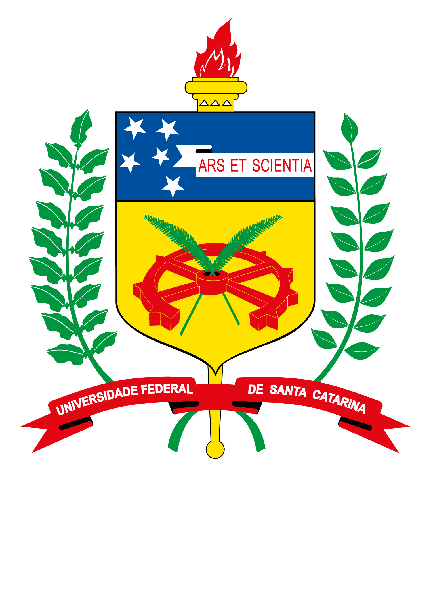

<p align="center">
  
</p>

# 🖥️ Repositório Acadêmico — Engenharia de Computação

**Trabalhos e códigos desenvolvidos durante o tempo cursando Engenharia de Computação na UFSC — Campus Araranguá.**

[](https://ararangua.ufsc.br/)
[](https://ararangua.ufsc.br/engenharia-de-computacao/)
[](http://lattes.cnpq.br/6330006464248743)

---

## 📖 Sobre a UFSC

A **Universidade Federal de Santa Catarina (UFSC)** é uma instituição pública federal fundada em **18 de dezembro de 1960**, reconhecida pela excelência em ensino, pesquisa e extensão. Além do campus sede em Florianópolis, a UFSC possui diversos campi no estado de Santa Catarina.

O **Campus Araranguá** é uma unidade da UFSC localizada no sul catarinense, oferecendo cursos de graduação e pós-graduação, com forte atuação em **pesquisa** e **extensão**. O campus conta com infraestrutura moderna e projetos que integram a universidade à região, incluindo os cursos de Engenharia de Computação, Engenharia de Energia e outras áreas das engenharias e tecnologias.

---

## 📐 Estrutura do Curso

O curso de **Engenharia de Computação** na UFSC — Campus Araranguá (currículo **655 — 2020/1**) está organizado em **10 fases (semestres)**, com disciplinas que vão dos fundamentos em matemática e física até temas avançados em sistemas embarcados, redes, inteligência artificial e projetos integradores.

### Grade curricular por semestre

<details>
<summary><strong>1ª FASE</strong></summary>

| Código | Créd. | Disciplina |
|--------|-------|------------|
| DEC0012 | 6 | Linguagem de Programação I |
| DEC7070 | 2 | Introdução à Engenharia de Computação |
| DEC7546 | 4 | Circuitos Digitais |
| FQM7001 | 4 | Pré-Cálculo |
| FQM7103 | 4 | Geometria Analítica |

</details>

<details>
<summary><strong>2ª FASE</strong></summary>

| Código | Créd. | Disciplina |
|--------|-------|------------|
| CIT7122 | 2 | Elaboração de Trabalhos Acadêmicos |
| DEC7123 | 4 | Organização e Arquitetura de Computadores I |
| DEC7532 | 4 | Linguagem de Programação II |
| DEC7549 | 4 | Laboratório de Circuitos Digitais |
| FQM7002 | 4 | Química Geral e Experimental |
| FQM7101 | 4 | Cálculo I |

</details>

<details>
<summary><strong>3ª FASE</strong></summary>

| Código | Créd. | Disciplina |
|--------|-------|------------|
| DEC0006 | 6 | Estrutura de Dados |
| DEC7511 | 4 | Microprocessadores e Microcontroladores |
| FQM7102 | 4 | Cálculo II |
| FQM7104 | 4 | Álgebra Linear |
| FQM7110 | 4 | Física A |

</details>

<details>
<summary><strong>4ª FASE</strong></summary>

| Código | Créd. | Disciplina |
|--------|-------|------------|
| DEC0009 | 4 | Engenharia de Software |
| DEC0013 | 2 | Projeto Integrador I |
| DEC7555 | 4 | Linguagem de Descrição de Hardware |
| FQM7105 | 4 | Cálculo III |
| FQM7107 | 4 | Probabilidade e Estatística |
| FQM7111 | 4 | Física B |

</details>

<details>
<summary><strong>5ª FASE</strong></summary>

| Código | Créd. | Disciplina |
|--------|-------|------------|
| DEC0008 | 2 | Planejamento e Gestão de Projetos |
| DEC7129 | 4 | Banco de Dados I |
| DEC7523 | 4 | Modelagem e Simulação |
| DEC7557 | 4 | Redes de Computadores |
| FQM7106 | 4 | Cálculo IV |
| FQM7112 | 4 | Física C |

</details>

<details>
<summary><strong>6ª FASE</strong></summary>

| Código | Créd. | Disciplina |
|--------|-------|------------|
| DEC0007 | 4 | Programação para WEB |
| DEC0014 | 4 | Inteligência Artificial e Computacional |
| DEC0020 | 4 | Sistemas Digitais Embarcados |
| DEC7142 | 4 | Cálculo Numérico em Computadores |
| DEC7504 | 4 | Análise de Sinais e Sistemas Lineares |
| FQM7335 | 4 | Laboratório de Física |

</details>

<details>
<summary><strong>7ª FASE</strong></summary>

| Código | Créd. | Disciplina |
|--------|-------|------------|
| DEC7545 | 4 | Circuitos Elétricos para Computação |
| DEC7556 | 4 | Arquitetura de Sistemas Operacionais |
| DEC7563 | 4 | Redes sem Fios |
| EES7527 | 4 | Fenômenos de Transporte |
| FQM7336 | 4 | Estática e Dinâmica |

</details>

<details>
<summary><strong>8ª FASE</strong></summary>

| Código | Créd. | Disciplina |
|--------|-------|------------|
| DEC0002 | 4 | Linguagens Formais e Autômatos |
| DEC0010 | 2 | Projeto Integrador II |
| DEC0019 | 4 | Controle Aplicado à Computação |
| DEC7547 | 4 | Laboratórios de Circuitos Elétricos |
| DEC7558 | 4 | Sistemas Distribuídos |
| DEC7562 | 4 | Sistemas Operacionais Embarcados |

</details>

<details>
<summary><strong>9ª FASE</strong></summary>

| Código | Créd. | Disciplina |
|--------|-------|------------|
| DEC0004 | 4 | Compiladores |
| DEC0015 | 2 | Tópicos Avançados em Inteligência Artificial |
| DEC0017 | 2 | Trabalho de Conclusão de Curso I |
| DEC0021 | 4 | Projeto de Sistemas Ubíquos e Embarcados |
| DEC7551 | 4 | Tópicos Especiais I |

</details>

<details>
<summary><strong>10ª FASE</strong></summary>

| Código | Créd. | Disciplina |
|--------|-------|------------|
| DEC0016 | 12 | Estágio Curricular |
| DEC0018 | 2 | Trabalho de Conclusão de Curso II |
| DEC7003 | 8 | Atividades Complementares |
| DEC7010 | 24 | Atividades Acadêmicas de Extensão |

</details>

<details>
<summary><strong>Disciplinas optativas</strong> <em>(mínimo 72 h/aula)</em></summary>

| Código | Créd. | Disciplina |
|--------|-------|------------|
| CIT7146 | 2 | Introdução à Economia na Engenharia |
| CIT7212 | 4 | Empreendedorismo |
| CIT7224 | 4 | Gestão do Conhecimento |
| CIT7226 | 4 | Plano de Negócios |
| CIT7236 | 4 | Gestão de Tecnologia |
| CIT7581 | 4 | Gestão Estratégica Orientada ao Mercado |
| CIT7582 | 4 | Gestão de Marketing |
| CIT7586 | 4 | Gestão de Projetos I |
| CIT7587 | 4 | Visualização de Dados |
| CIT7590 | 4 | Ciências, Tecnologia e Sociedade |
| CIT7594 | 4 | Relações Interétnicas |
| DEC7001 | — | Programa de Intercâmbio I |
| DEC7002 | — | Programa de Intercâmbio II |
| DEC7007 | — | Programa de Intercâmbio III |
| DEC7040 | — | Programa de Intercâmbio IV |
| DEC7134 | 4 | Banco de Dados II |
| DEC7524 | 4 | Pesquisa Operacional |
| EES7180 | 4 | Desenho Técnico |
| EES7361 | 4 | Fundamentos de Ecologia |
| FQM7331 | 4 | Fundamentos de Materiais |
| LSB7244 | 4 | Língua Brasileira de Sinais — Libras I (PCC 18h-a) |

</details>

---

## 📚 Disciplinas no repositório

Este repositório reúne projetos, listas e códigos das disciplinas já cursadas e em andamento:

| Disciplina | Conteúdo no repositório |
|------------|--------------------------|
| **Linguagem de Programação I** | Exercícios e projetos em C |
| **Linguagem de Programação II** | Projetos em C++ (RPG, Cipher, Dicionário, etc.) |
| **Estrutura de Dados** | Árvore AVL, Tabela de Espalhamento |
| **Banco de Dados** | Projetos com persistência e login |
| **Cálculo Numérico** | Métodos (Secante, Newton, Falsa Posição, Gauss-Seidel, Jacobi, LU, Eliminação Gaussiana) |
| **Cálculo 4** | Atividades da disciplina |
| **Controle Aplicado à Computação** | Atividades e materiais da disciplina |
| **Compiladores** | Materiais e atividades da disciplina |
| **Laboratório de Circuitos Elétricos** | Relatórios e experiências (1–12) |
| **Laboratório de Circuitos Digitais** | Práticas de laboratório |
| **Laboratório de Física** | Relatórios e atividades experimentais |
| **Fenômenos de Transporte** | Listas, slides e materiais da disciplina |
| **Hardware Description Language (HDL)** | Projeto final em linguagem de descrição de hardware |
| **Microprocessadores e Microcontroladores** | Práticas com microcontroladores |
| **Sistemas Digitais Embarcados** | Projetos com ESP32, Frequencímetro, trabalhos |
| **Sistemas Operacionais Embarcados** | Materiais e atividades da disciplina |
| **Arquitetura de Sistemas Operacionais** | Jantar dos Filósofos, semáforos, mutex, listas em disco, etc. |
| **Sistemas Distribuídos** | Trabalhos de pesquisa e artigos |
| **Redes sem Fio** | Pré-projeto e trabalho final |
| **Análise de Sinais** | Trabalhos (Bode, Fourier, final) |
| **Inteligência Artificial** | Materiais da disciplina |
| **Tópicos Especiais — Agentes** | Projeto final e trabalhos |
| **Projeto Integrador II** | Projeto integrador e artigos |
| **Estática e Dinâmica** | Atividades da disciplina |

---

## 🔬 Iniciação Científica

Sou **bolsista de Iniciação Científica do CNPq** (2025–2026) e participo de projetos de pesquisa na área de **eletrônica de potência**, **sistemas fotovoltaicos** e **veículos elétricos**, sob orientação do **Prof. Lenon Schmitz**.

### Projetos de pesquisa

| Período | Projeto | Situação |
|---------|---------|----------|
| **2025 – Atual** | **Estação de recarga CC para Veículos Elétricos integrada à Geração Solar Fotovoltaica** — Revisão e estudo de MPPT baseados em IA; implementação em simulação e em microcontrolador (C); testes HIL sob sombreamento parcial. | Em andamento |
| **2024 – 2025** | **Avaliação de perdas de potência em inversores de tração EV** — Ferramenta de modelagem estocástica para desempenho de inversores em veículos elétricos (bateria, inversor, motor). | Concluído |
| **2023 – 2024** | **Métodos de rastreamento de máxima potência para inversores e strings fotovoltaicas** — Integração de IA com MPPT para alcance do GMPPT sob sombreamento parcial. | Concluído |
| **2022 – 2023** | **Estudo de novas tecnologias para sistemas de gerenciamento de baterias** — Ferramenta para testes e caracterização de baterias. | Concluído |

### Projeto de extensão

| Período | Projeto | Situação |
|---------|---------|----------|
| **2022** | **Desenvolvimento de artefatos com realidade aumentada para o ensino de ciências da natureza** — Artefatos educacionais em RA para ensino fundamental e médio em escolas públicas de SC (SIGPEX/UFSC nº 202202976). | Desativado |

*Atuação anterior: Assessor de Projetos na EJEC (Empresa Júnior de Engenharia de Computação), 2021.*

---

## 📄 Produção acadêmica

### Capítulo de livro

- **DA ROSA, I. M.;** Panisson, A. R.; Schmitz, L. **A PSO-Based MPPT with Dynamic Monitoring Reset for PV Systems.** *Lecture Notes in Computer Science*, Springer Nature Switzerland, 2025, v. 15613, p. 257–272.

### Artigos em anais de congressos

1. **DA ROSA, I. M.;** RECH, T. F.; PANISSON, A. R.; SCHMITZ, L. **An Enhanced PSO-Based MPPT Method for Photovoltaic Systems Under Partial Shading.** *2025 Brazilian Power Electronics Conference (COBEP)*, Vitória, 2025.
2. **ROSA, I. M.;** SCHMITZ, L. **Ferramenta de análise de eficiência energética de inversores de tração para veículos elétricos baseada em modelagem estocástica.** *12º Simpósio de Integração Científica e Tecnológica do Sul Catarinense*, Araranguá, 2023. v. 1, p. 667–674.
3. **DA ROSA, I. M.;** SCHMITZ, L. **Evaluating Power Losses in EV Traction Inverters: A Stochastic Modeling Tool for Performance Assessment.** *2023 IEEE 8th Southern Power Electronics Conference (SPEC)*, Florianópolis, 2023.

### Apresentações em eventos

- **2025** — Apresentação do trabalho *A PSO-Based MPPT with Dynamic Monitoring Reset for PV Systems* em congresso.
- **2025** — Seminário de Iniciação Científica e Tecnológica (SIC): *Avaliação de perdas de potência em inversores de tração EV*.
- **2023** — COBEP/SPEC 2023 (IEEE): *Evaluating Power Losses in EV Traction Inverters*.
- **2023** — Simpósio de Integração Científica e Tecnológica do Sul Catarinense: *Ferramenta de análise de eficiência energética de inversores de tração*.

---

## 📁 Estrutura do repositório

```
├── Análise de sinais/
├── Arquitetura de sistemas operacionais/
├── Assets/
├── Banco de dados/
├── Cálculo 4/
├── Cálculo numérico/
├── Compiladores/
├── Controle aplicado à computação/
├── Estrutura de dados/
├── Estática e dinâmica/
├── Fenômeno de transporte/
├── Hardware Description Language/
├── Inteligência artificial/
├── Laboratório de circuitos digitais/
├── Laboratório de circuitos elétricos/
├── Laboratório de Física/
├── Linguagem de programação 1/
├── Linguagem de programação 2/
├── Microprocessadores e Microcontroladores/
├── Projeto integrador 2/
├── Redes sem fio/
├── Sistemas digitais embarcados/
├── Sistemas distribuidos/
├── Sistemas operacionais embarcados/
└── Tópicos especiais - Agentes/
```

---

## 📎 Currículo Lattes

Para mais detalhes sobre formação, projetos e produção acadêmica:

- **Lattes:** [http://lattes.cnpq.br/6330006464248743](http://lattes.cnpq.br/6330006464248743)
- **Lattes iD:** 6330006464248743

---

## 👤 Autor

**Igor de Matos da Rosa**  
Graduando em Engenharia de Computação — UFSC Campus Araranguá  
Bolsista de Iniciação Científica (CNPq) · Pesquisa em sistemas fotovoltaicos e veículos elétricos

---

<p align="center">
  <sub>Desenvolvido durante a graduação na UFSC — Campus Araranguá</sub>
</p>
