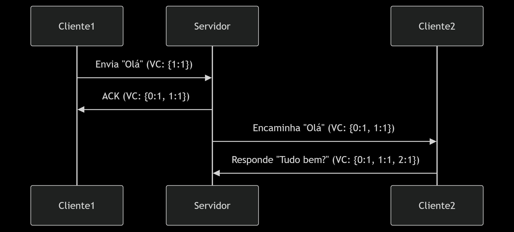
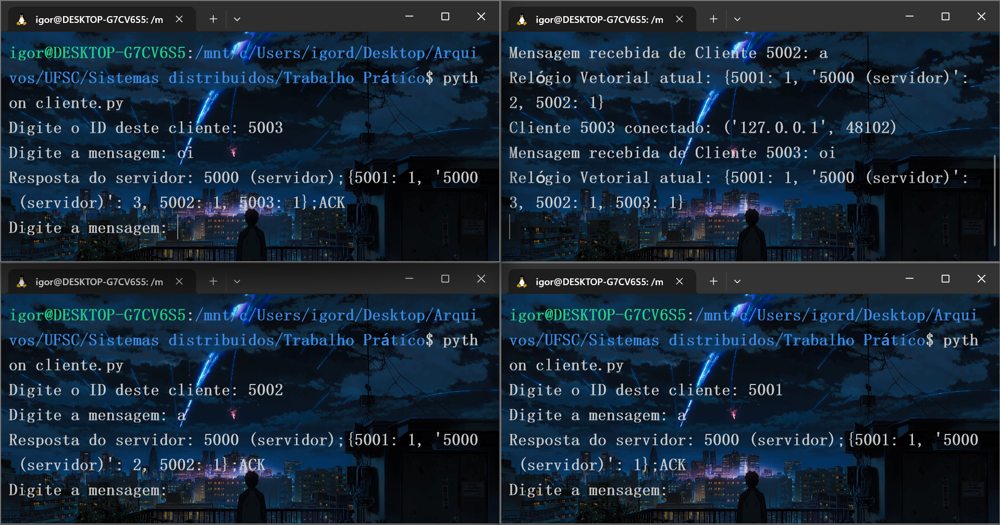

# Relógios Vetoriais em Sistemas Distribuídos

## 📌 Descrição do Projeto

Este projeto apresenta uma implementação prática de um sistema distribuído usando **Relógios Vetoriais (Vector Clocks)** para garantir a ordenação causal de eventos.

O sistema segue o modelo **cliente-servidor**, onde múltiplos clientes se conectam ao servidor, enviam mensagens e recebem respostas, tudo com controle de causalidade.

Essa implementação atende aos requisitos propostos pela disciplina de **Sistemas Distribuídos (UFSC - Araranguá)**, conforme o trabalho prático 2025.1.

## ✅ Requisitos Funcionais

- **Linguagem utilizada:** Python 3.12.3
- **Paradigma:** Concorrência e comunicação cliente-servidor via sockets TCP.
- **Bibliotecas usadas:**
  - `socket` (Comunicação em rede)
  - `threading` (Concorrência nas conexões)
  - `collections` (Estrutura de dicionário padrão para o vetor de relógios)

## ✅ Comunicação entre Cliente e Servidor

### Modelo:

- Cada cliente envia mensagens ao servidor contendo:

  - Seu **ID de processo**
  - Seu **relógio vetorial local**
  - O **conteúdo da mensagem**
- O servidor, ao receber:

  1. **Atualiza seu relógio vetorial**, comparando os valores recebidos com os locais (usando o máximo entre os vetores).
  2. **Incrementa seu próprio contador** no relógio vetorial.
  3. **Exibe a mensagem recebida** e o novo estado do vetor de relógios no terminal.
  4. **Envia o vetor de relógios atualizado de volta aos clientes**, para sincronização.

### Exemplo de fluxo:

Cliente 1: Envia mensagem "Olá!" com VC {0:1, 1:1}
Servidor: Atualiza VC para {0:2, 1:1} e envia resposta.

## ✅ Diagrama de Comunicação



Representa o fluxo de envio e recebimento de mensagens, incluindo a atualização do relógio vetorial no servidor.

## ✅ Como Executar

### 1. Iniciar o servidor:

Abra um terminal e execute:

```

python servidor.py

```

Saída esperada:

```

Servidor ouvindo em localhost:5000

```

---

### 2. Iniciar os clientes:

Abra múltiplos terminais (um para cada cliente) e execute:

```

python cliente.py

```

Ao iniciar, cada cliente solicitará um **ID único de processo** (exemplo: 1, 2, 3...).

---

### 3. Enviar mensagens:

No terminal de cada cliente, digite mensagens.
O servidor receberá, processará, atualizará o relógio vetorial e enviará de volta a resposta.

---

## ✅ Exemplo de uso



## ✅ Blocos de Código Relevantes

### Cliente - Envio de Mensagem:

```python
self.vector_clock[self.process_id] += 1
data = f"{self.process_id};{dict(self.vector_clock)};{message}"
self.sock.sendall(data.encode())
```

### Servidor - Atualização do Relógio Vetorial:

```python
for pid in received_vc:
    self.vector_clock[pid] = max(self.vector_clock[pid], received_vc[pid])
self.vector_clock[self.server_id] += 1
```

---

## ✅ Requisitos Atendidos do Trabalho:

* ✔️ Comunicação Cliente-Servidor
* ✔️ Identificação de processos por ID
* ✔️ Envio e Recebimento de mensagens com controle causal
* ✔️ Tela de exibição mostrando:

  * Mensagem enviada
  * Mensagem recebida
  * Estado do relógio vetorial
* ✔️ Exemplo de código destacado no README
* ✔️ Diagrama de comunicação (Diagrama.png)

---

## ✅ Instruções para Instalação

**Linux:**

```
sudo apt update
sudo apt install python3
```

**Windows:**

Baixe o Python em:
[https://www.python.org/downloads/](https://www.python.org/downloads/)

---

## ✅ Possíveis Extensões Futuras

* Implementar visualização gráfica dos eventos
* Adicionar logs em arquivo
* Suporte a múltiplos servidores
* Persistência de estado entre execuções

---

## ✅ Autor(es):

* Nome: Igor da Rosa, Ítalo Manzine, André Lima.

---

## ✅ Referências:

* Material da disciplina de Sistemas Distribuídos (UFSC - 2025.1)
* \[Lamport, 1978] - Time, Clocks, and the Ordering of Events in a Distributed System
* Documentação oficial de Python ([https://docs.python.org/3/library/](https://docs.python.org/3/library/))

```

```
